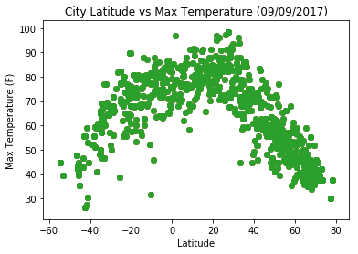
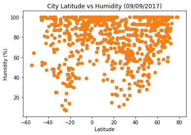
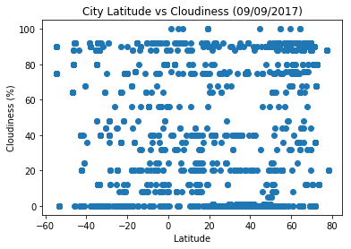
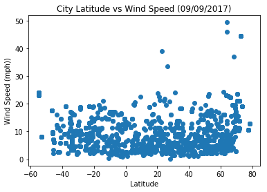

```python
# Dependencies

import requests as req
from citipy import citipy
import json
import pandas as pd
import csv
import matplotlib.pyplot as plt
from citipy import citipy
import random
```


```python
# Creating a function to generate 1500 randon floating number between two values : low and high 

def sample_floats(low, high, k=2000):
    result = []
    seen = set()
    for i in range(k):
        x = random.uniform(low, high)
        while x in seen:
            x = random.uniform(low, high)
        seen.add(x)
        result.append(x)
    return result
   
```


```python
# Calling the function created above to get 1500 values for latitudes and longitudes

latitudes = sample_floats(-90.0, 90.0)
longitudes = sample_floats(-180.0, 180.0)

```


```python
# For all the latitude and longitude values generated above we try to finf out the nearest city and its country code
# to those intersecrtion using the citipy library and store it in lists.

city_list = []
country_codes = []
for i in range(0, 2000):
    city_inst = citipy.nearest_city(latitudes[i], longitudes[i])
    city = city_inst.city_name
    country_code = city_inst.country_code
    city_list.append(city)
    country_codes.append(country_code)
print(math.ceil(len(city_list)/50))
```

    40


```python
# Create a csv list comprising of all the city and the corresponding country codes

result_file = open("ListOfCities1.csv", 'w')
result_file.write("city" +','+"country_code"+"\n")
for c,cc in zip(city_list,country_codes):
    result_file.write(str(c)+','+str(cc)+"\n")
result_file.close()
```


```python
# Creating a standard url with the api key that may be used to make api requests to get the data

api_key = "a92cbfddbac4c2223717e380f50b779f"
url = "http://api.openweathermap.org/data/2.5/weather?"
units = "imperial"
query_url = url + "appid=" + api_key + "&units=" + units + "&q="
```


```python
# Reading the csv file with city names and country codes into a panda dataframe

city_data = pd.read_csv("ListOfCities1.csv", encoding='cp1252')
city = city_data['city']
country_code = city_data['country_code']
city[0]
len(city)
```


    2000


```python
# Data retrieval via sending api requests.


p = 0
q = 50
no_of_sets = math.ceil(len(city_list)/50)
data = []
print('Begining Data Retrival')
print('---------------------------------')
with open('weather_data.json', 'w') as wd:
    for x in range(1,no_of_sets+1):
        count = 0
#       json.dump([req.get(query_url + city[i] + "," + country_code[i], params={'page': x}).json()], wd)
        for i in range(p,q):
            print("Processing record "  + str(count) + " of " + str(x) + " | " + city[i] + "," + country_code[i])
            response = req.get(query_url + city[i] + "," + country_code[i], params={'page': x})
            data.append(response.json())
            print(query_url+city[i].replace(' ', ''))
            count+=1
        p+=50
        if(q+50 > len(city)):
            q = len(city)
        else:
            q+=50


```

    Begining Data Retrival
    ---------------------------------
    Processing record 0 of 1 | zolotinka,ru
    http://api.openweathermap.org/data/2.5/weather?appid=a92cbfddbac4c2223717e380f50b779f&units=imperial&q=zolotinka
    Processing record 1 of 1 | provideniya,ru
    http://api.openweathermap.org/data/2.5/weather?appid=a92cbfddbac4c2223717e380f50b779f&units=imperial&q=provideniya
    Processing record 2 of 1 | salalah,om
    http://api.openweathermap.org/data/2.5/weather?appid=a92cbfddbac4c2223717e380f50b779f&units=imperial&q=salalah
    Processing record 3 of 1 | pevek,ru
    http://api.openweathermap.org/data/2.5/weather?appid=a92cbfddbac4c2223717e380f50b779f&units=imperial&q=pevek
    Processing record 4 of 1 | jamestown,sh
    http://api.openweathermap.org/data/2.5/weather?appid=a92cbfddbac4c2223717e380f50b779f&units=imperial&q=jamestown
    Processing record 5 of 1 | rikitea,pf
    http://api.openweathermap.org/data/2.5/weather?appid=a92cbfddbac4c2223717e380f50b779f&units=imperial&q=rikitea
    Processing record 6 of 1 | eyrarbakki,is
    http://api.openweathermap.org/data/2.5/weather?appid=a92cbfddbac4c2223717e380f50b779f&units=imperial&q=eyrarbakki
    Processing record 7 of 1 | ushuaia,ar
    http://api.openweathermap.org/data/2.5/weather?appid=a92cbfddbac4c2223717e380f50b779f&units=imperial&q=ushuaia
    Processing record 8 of 1 | urengoy,ru
    http://api.openweathermap.org/data/2.5/weather?appid=a92cbfddbac4c2223717e380f50b779f&units=imperial&q=urengoy
    Processing record 9 of 1 | andros town,bs
    http://api.openweathermap.org/data/2.5/weather?appid=a92cbfddbac4c2223717e380f50b779f&units=imperial&q=androstown
    Processing record 10 of 1 | isangel,vu
    http://api.openweathermap.org/data/2.5/weather?appid=a92cbfddbac4c2223717e380f50b779f&units=imperial&q=isangel
    Processing record 11 of 1 | mataura,pf
    http://api.openweathermap.org/data/2.5/weather?appid=a92cbfddbac4c2223717e380f50b779f&units=imperial&q=mataura
    Processing record 12 of 1 | altay,cn
    http://api.openweathermap.org/data/2.5/weather?appid=a92cbfddbac4c2223717e380f50b779f&units=imperial&q=altay
    Processing record 13 of 1 | venado tuerto,ar
    http://api.openweathermap.org/data/2.5/weather?appid=a92cbfddbac4c2223717e380f50b779f&units=imperial&q=venadotuerto
    Processing record 14 of 1 | riyadh,sa
    http://api.openweathermap.org/data/2.5/weather?appid=a92cbfddbac4c2223717e380f50b779f&units=imperial&q=riyadh
    Processing record 15 of 1 | vostok,ru
    http://api.openweathermap.org/data/2.5/weather?appid=a92cbfddbac4c2223717e380f50b779f&units=imperial&q=vostok
    Processing record 16 of 1 | mitsamiouli,km
    http://api.openweathermap.org/data/2.5/weather?appid=a92cbfddbac4c2223717e380f50b779f&units=imperial&q=mitsamiouli
    Processing record 17 of 1 | lebu,cl
    http://api.openweathermap.org/data/2.5/weather?appid=a92cbfddbac4c2223717e380f50b779f&units=imperial&q=lebu
    Processing record 18 of 1 | ushuaia,ar
    http://api.openweathermap.org/data/2.5/weather?appid=a92cbfddbac4c2223717e380f50b779f&units=imperial&q=ushuaia
    Processing record 19 of 1 | taolanaro,mg
    http://api.openweathermap.org/data/2.5/weather?appid=a92cbfddbac4c2223717e380f50b779f&units=imperial&q=taolanaro
    Processing record 20 of 1 | ust-ilimsk,ru
    http://api.openweathermap.org/data/2.5/weather?appid=a92cbfddbac4c2223717e380f50b779f&units=imperial&q=ust-ilimsk
    Processing record 21 of 1 | ndioum,sn
    http://api.openweathermap.org/data/2.5/weather?appid=a92cbfddbac4c2223717e380f50b779f&units=imperial&q=ndioum
    Processing record 22 of 1 | elliot lake,ca
    http://api.openweathermap.org/data/2.5/weather?appid=a92cbfddbac4c2223717e380f50b779f&units=imperial&q=elliotlake
    Processing record 23 of 1 | barrow,us
    http://api.openweathermap.org/data/2.5/weather?appid=a92cbfddbac4c2223717e380f50b779f&units=imperial&q=barrow
    Processing record 24 of 1 | grindavik,is
    http://api.openweathermap.org/data/2.5/weather?appid=a92cbfddbac4c2223717e380f50b779f&units=imperial&q=grindavik
    Processing record 25 of 1 | foumban,cm
    http://api.openweathermap.org/data/2.5/weather?appid=a92cbfddbac4c2223717e380f50b779f&units=imperial&q=foumban
    Processing record 26 of 1 | dwarka,in
    http://api.openweathermap.org/data/2.5/weather?appid=a92cbfddbac4c2223717e380f50b779f&units=imperial&q=dwarka
    Processing record 27 of 1 | puerto ayora,ec
    http://api.openweathermap.org/data/2.5/weather?appid=a92cbfddbac4c2223717e380f50b779f&units=imperial&q=puertoayora
    Processing record 28 of 1 | airai,pw
    http://api.openweathermap.org/data/2.5/weather?appid=a92cbfddbac4c2223717e380f50b779f&units=imperial&q=airai
    Processing record 29 of 1 | barrow,us
    http://api.openweathermap.org/data/2.5/weather?appid=a92cbfddbac4c2223717e380f50b779f&units=imperial&q=barrow
    Processing record 30 of 1 | nizhneyansk,ru
    http://api.openweathermap.org/data/2.5/weather?appid=a92cbfddbac4c2223717e380f50b779f&units=imperial&q=nizhneyansk
    Processing record 31 of 1 | albany,au
    http://api.openweathermap.org/data/2.5/weather?appid=a92cbfddbac4c2223717e380f50b779f&units=imperial&q=albany
    Processing record 32 of 1 | namibe,ao
    http://api.openweathermap.org/data/2.5/weather?appid=a92cbfddbac4c2223717e380f50b779f&units=imperial&q=namibe
    Processing record 33 of 1 | ponta do sol,pt
    http://api.openweathermap.org/data/2.5/weather?appid=a92cbfddbac4c2223717e380f50b779f&units=imperial&q=pontadosol
    Processing record 34 of 1 | hilo,us
    http://api.openweathermap.org/data/2.5/weather?appid=a92cbfddbac4c2223717e380f50b779f&units=imperial&q=hilo
    Processing record 35 of 1 | sentyabrskiy,ru
    http://api.openweathermap.org/data/2.5/weather?appid=a92cbfddbac4c2223717e380f50b779f&units=imperial&q=sentyabrskiy
    Processing record 36 of 1 | bubaque,gw
    http://api.openweathermap.org/data/2.5/weather?appid=a92cbfddbac4c2223717e380f50b779f&units=imperial&q=bubaque
    Processing record 37 of 1 | carnarvon,au
    http://api.openweathermap.org/data/2.5/weather?appid=a92cbfddbac4c2223717e380f50b779f&units=imperial&q=carnarvon
    Processing record 38 of 1 | asfi,ma
    http://api.openweathermap.org/data/2.5/weather?appid=a92cbfddbac4c2223717e380f50b779f&units=imperial&q=asfi
    Processing record 39 of 1 | kahului,us
    http://api.openweathermap.org/data/2.5/weather?appid=a92cbfddbac4c2223717e380f50b779f&units=imperial&q=kahului
    Processing record 40 of 1 | alice springs,au
    http://api.openweathermap.org/data/2.5/weather?appid=a92cbfddbac4c2223717e380f50b779f&units=imperial&q=alicesprings
    Processing record 41 of 1 | longyearbyen,sj
    http://api.openweathermap.org/data/2.5/weather?appid=a92cbfddbac4c2223717e380f50b779f&units=imperial&q=longyearbyen
    Processing record 42 of 1 | saskylakh,ru
    http://api.openweathermap.org/data/2.5/weather?appid=a92cbfddbac4c2223717e380f50b779f&units=imperial&q=saskylakh
    Processing record 43 of 1 | saskylakh,ru
    http://api.openweathermap.org/data/2.5/weather?appid=a92cbfddbac4c2223717e380f50b779f&units=imperial&q=saskylakh
    Processing record 44 of 1 | nizwa,om
    http://api.openweathermap.org/data/2.5/weather?appid=a92cbfddbac4c2223717e380f50b779f&units=imperial&q=nizwa
    Processing record 45 of 1 | necochea,ar
    http://api.openweathermap.org/data/2.5/weather?appid=a92cbfddbac4c2223717e380f50b779f&units=imperial&q=necochea
    Processing record 46 of 1 | ribeira grande,pt
    http://api.openweathermap.org/data/2.5/weather?appid=a92cbfddbac4c2223717e380f50b779f&units=imperial&q=ribeiragrande
    Processing record 47 of 1 | piacabucu,br
    http://api.openweathermap.org/data/2.5/weather?appid=a92cbfddbac4c2223717e380f50b779f&units=imperial&q=piacabucu
    Processing record 48 of 1 | madang,pg
    http://api.openweathermap.org/data/2.5/weather?appid=a92cbfddbac4c2223717e380f50b779f&units=imperial&q=madang
    Processing record 49 of 1 | albany,au
    http://api.openweathermap.org/data/2.5/weather?appid=a92cbfddbac4c2223717e380f50b779f&units=imperial&q=albany
    Processing record 0 of 2 | nuuk,gl
    http://api.openweathermap.org/data/2.5/weather?appid=a92cbfddbac4c2223717e380f50b779f&units=imperial&q=nuuk
    Processing record 1 of 2 | ushuaia,ar
    http://api.openweathermap.org/data/2.5/weather?appid=a92cbfddbac4c2223717e380f50b779f&units=imperial&q=ushuaia
    Processing record 2 of 2 | tiksi,ru
    http://api.openweathermap.org/data/2.5/weather?appid=a92cbfddbac4c2223717e380f50b779f&units=imperial&q=tiksi
    Processing record 3 of 2 | mlowo,tz
    http://api.openweathermap.org/data/2.5/weather?appid=a92cbfddbac4c2223717e380f50b779f&units=imperial&q=mlowo
    Processing record 4 of 2 | kodiak,us
    http://api.openweathermap.org/data/2.5/weather?appid=a92cbfddbac4c2223717e380f50b779f&units=imperial&q=kodiak
    Processing record 5 of 2 | bredasdorp,za
    http://api.openweathermap.org/data/2.5/weather?appid=a92cbfddbac4c2223717e380f50b779f&units=imperial&q=bredasdorp
    Processing record 6 of 2 | arraial do cabo,br
    http://api.openweathermap.org/data/2.5/weather?appid=a92cbfddbac4c2223717e380f50b779f&units=imperial&q=arraialdocabo
    Processing record 7 of 2 | perama,gr
    http://api.openweathermap.org/data/2.5/weather?appid=a92cbfddbac4c2223717e380f50b779f&units=imperial&q=perama
    Processing record 8 of 2 | mataura,pf
    http://api.openweathermap.org/data/2.5/weather?appid=a92cbfddbac4c2223717e380f50b779f&units=imperial&q=mataura
    Processing record 9 of 2 | media luna,cu
    http://api.openweathermap.org/data/2.5/weather?appid=a92cbfddbac4c2223717e380f50b779f&units=imperial&q=medialuna
    Processing record 10 of 2 | erzin,ru
    http://api.openweathermap.org/data/2.5/weather?appid=a92cbfddbac4c2223717e380f50b779f&units=imperial&q=erzin
    Processing record 11 of 2 | vila franca do campo,pt
    http://api.openweathermap.org/data/2.5/weather?appid=a92cbfddbac4c2223717e380f50b779f&units=imperial&q=vilafrancadocampo
    Processing record 12 of 2 | punta arenas,cl
    http://api.openweathermap.org/data/2.5/weather?appid=a92cbfddbac4c2223717e380f50b779f&units=imperial&q=puntaarenas
    Processing record 13 of 2 | yulara,au
    http://api.openweathermap.org/data/2.5/weather?appid=a92cbfddbac4c2223717e380f50b779f&units=imperial&q=yulara
    Processing record 14 of 2 | ocho rios,jm
    http://api.openweathermap.org/data/2.5/weather?appid=a92cbfddbac4c2223717e380f50b779f&units=imperial&q=ochorios
    Processing record 15 of 2 | albany,au
    http://api.openweathermap.org/data/2.5/weather?appid=a92cbfddbac4c2223717e380f50b779f&units=imperial&q=albany
    Processing record 16 of 2 | broken hill,au
    http://api.openweathermap.org/data/2.5/weather?appid=a92cbfddbac4c2223717e380f50b779f&units=imperial&q=brokenhill
    Processing record 17 of 2 | bluff,nz
    http://api.openweathermap.org/data/2.5/weather?appid=a92cbfddbac4c2223717e380f50b779f&units=imperial&q=bluff
    Processing record 18 of 2 | busselton,au
    http://api.openweathermap.org/data/2.5/weather?appid=a92cbfddbac4c2223717e380f50b779f&units=imperial&q=busselton
    Processing record 19 of 2 | vaini,to
    http://api.openweathermap.org/data/2.5/weather?appid=a92cbfddbac4c2223717e380f50b779f&units=imperial&q=vaini
    Processing record 20 of 2 | makakilo city,us
    http://api.openweathermap.org/data/2.5/weather?appid=a92cbfddbac4c2223717e380f50b779f&units=imperial&q=makakilocity
    Processing record 21 of 2 | necochea,ar
    http://api.openweathermap.org/data/2.5/weather?appid=a92cbfddbac4c2223717e380f50b779f&units=imperial&q=necochea
    Processing record 22 of 2 | hobyo,so
    http://api.openweathermap.org/data/2.5/weather?appid=a92cbfddbac4c2223717e380f50b779f&units=imperial&q=hobyo
    Processing record 23 of 2 | louisbourg,ca
    http://api.openweathermap.org/data/2.5/weather?appid=a92cbfddbac4c2223717e380f50b779f&units=imperial&q=louisbourg
    Processing record 24 of 2 | port lincoln,au
    http://api.openweathermap.org/data/2.5/weather?appid=a92cbfddbac4c2223717e380f50b779f&units=imperial&q=portlincoln
    Processing record 25 of 2 | provideniya,ru
    http://api.openweathermap.org/data/2.5/weather?appid=a92cbfddbac4c2223717e380f50b779f&units=imperial&q=provideniya
    Processing record 26 of 2 | poum,nc
    http://api.openweathermap.org/data/2.5/weather?appid=a92cbfddbac4c2223717e380f50b779f&units=imperial&q=poum
    Processing record 27 of 2 | kumeny,ru
    http://api.openweathermap.org/data/2.5/weather?appid=a92cbfddbac4c2223717e380f50b779f&units=imperial&q=kumeny
    Processing record 28 of 2 | vaini,to
    http://api.openweathermap.org/data/2.5/weather?appid=a92cbfddbac4c2223717e380f50b779f&units=imperial&q=vaini
    Processing record 29 of 2 | longyearbyen,sj
    http://api.openweathermap.org/data/2.5/weather?appid=a92cbfddbac4c2223717e380f50b779f&units=imperial&q=longyearbyen
    Processing record 30 of 2 | port alfred,za
    http://api.openweathermap.org/data/2.5/weather?appid=a92cbfddbac4c2223717e380f50b779f&units=imperial&q=portalfred
    Processing record 31 of 2 | albany,au
    http://api.openweathermap.org/data/2.5/weather?appid=a92cbfddbac4c2223717e380f50b779f&units=imperial&q=albany
    Processing record 32 of 2 | tumannyy,ru
    http://api.openweathermap.org/data/2.5/weather?appid=a92cbfddbac4c2223717e380f50b779f&units=imperial&q=tumannyy
    Processing record 33 of 2 | lubango,ao
    http://api.openweathermap.org/data/2.5/weather?appid=a92cbfddbac4c2223717e380f50b779f&units=imperial&q=lubango
    Processing record 34 of 2 | rio brilhante,br
    http://api.openweathermap.org/data/2.5/weather?appid=a92cbfddbac4c2223717e380f50b779f&units=imperial&q=riobrilhante
    Processing record 35 of 2 | santa rosa,bo
    http://api.openweathermap.org/data/2.5/weather?appid=a92cbfddbac4c2223717e380f50b779f&units=imperial&q=santarosa
    Processing record 36 of 2 | nefteyugansk,ru
    http://api.openweathermap.org/data/2.5/weather?appid=a92cbfddbac4c2223717e380f50b779f&units=imperial&q=nefteyugansk
    Processing record 37 of 2 | hobart,au
    http://api.openweathermap.org/data/2.5/weather?appid=a92cbfddbac4c2223717e380f50b779f&units=imperial&q=hobart
    Processing record 38 of 2 | morar,in
    http://api.openweathermap.org/data/2.5/weather?appid=a92cbfddbac4c2223717e380f50b779f&units=imperial&q=morar
    Processing record 39 of 2 | isangel,vu
    http://api.openweathermap.org/data/2.5/weather?appid=a92cbfddbac4c2223717e380f50b779f&units=imperial&q=isangel
    Processing record 40 of 2 | latehar,in
    http://api.openweathermap.org/data/2.5/weather?appid=a92cbfddbac4c2223717e380f50b779f&units=imperial&q=latehar
    Processing record 41 of 2 | saint george,bm
    http://api.openweathermap.org/data/2.5/weather?appid=a92cbfddbac4c2223717e380f50b779f&units=imperial&q=saintgeorge
    Processing record 42 of 2 | hobart,au
    http://api.openweathermap.org/data/2.5/weather?appid=a92cbfddbac4c2223717e380f50b779f&units=imperial&q=hobart
    Processing record 43 of 2 | ushuaia,ar
    http://api.openweathermap.org/data/2.5/weather?appid=a92cbfddbac4c2223717e380f50b779f&units=imperial&q=ushuaia
    Processing record 44 of 2 | rikitea,pf
    http://api.openweathermap.org/data/2.5/weather?appid=a92cbfddbac4c2223717e380f50b779f&units=imperial&q=rikitea
    Processing record 45 of 2 | qaanaaq,gl
    http://api.openweathermap.org/data/2.5/weather?appid=a92cbfddbac4c2223717e380f50b779f&units=imperial&q=qaanaaq
    Processing record 46 of 2 | kodiak,us
    http://api.openweathermap.org/data/2.5/weather?appid=a92cbfddbac4c2223717e380f50b779f&units=imperial&q=kodiak
    Processing record 47 of 2 | batagay,ru
    http://api.openweathermap.org/data/2.5/weather?appid=a92cbfddbac4c2223717e380f50b779f&units=imperial&q=batagay
    Processing record 48 of 2 | ushuaia,ar
    http://api.openweathermap.org/data/2.5/weather?appid=a92cbfddbac4c2223717e380f50b779f&units=imperial&q=ushuaia
    Processing record 49 of 2 | thompson,ca
    http://api.openweathermap.org/data/2.5/weather?appid=a92cbfddbac4c2223717e380f50b779f&units=imperial&q=thompson
    Processing record 0 of 3 | laguna,br
    http://api.openweathermap.org/data/2.5/weather?appid=a92cbfddbac4c2223717e380f50b779f&units=imperial&q=laguna
    Processing record 1 of 3 | port hardy,ca
    http://api.openweathermap.org/data/2.5/weather?appid=a92cbfddbac4c2223717e380f50b779f&units=imperial&q=porthardy
    Processing record 2 of 3 | ponta do sol,cv
    http://api.openweathermap.org/data/2.5/weather?appid=a92cbfddbac4c2223717e380f50b779f&units=imperial&q=pontadosol
    Processing record 3 of 3 | pilao arcado,br
    http://api.openweathermap.org/data/2.5/weather?appid=a92cbfddbac4c2223717e380f50b779f&units=imperial&q=pilaoarcado
    Processing record 4 of 3 | vaini,to
    http://api.openweathermap.org/data/2.5/weather?appid=a92cbfddbac4c2223717e380f50b779f&units=imperial&q=vaini
    Processing record 5 of 3 | bluff,nz
    http://api.openweathermap.org/data/2.5/weather?appid=a92cbfddbac4c2223717e380f50b779f&units=imperial&q=bluff
    Processing record 6 of 3 | georgetown,gy
    http://api.openweathermap.org/data/2.5/weather?appid=a92cbfddbac4c2223717e380f50b779f&units=imperial&q=georgetown
    Processing record 7 of 3 | barrow,us
    http://api.openweathermap.org/data/2.5/weather?appid=a92cbfddbac4c2223717e380f50b779f&units=imperial&q=barrow
    Processing record 8 of 3 | new norfolk,au
    http://api.openweathermap.org/data/2.5/weather?appid=a92cbfddbac4c2223717e380f50b779f&units=imperial&q=newnorfolk
    Processing record 9 of 3 | taolanaro,mg
    http://api.openweathermap.org/data/2.5/weather?appid=a92cbfddbac4c2223717e380f50b779f&units=imperial&q=taolanaro
    Processing record 10 of 3 | oranjemund,na
    http://api.openweathermap.org/data/2.5/weather?appid=a92cbfddbac4c2223717e380f50b779f&units=imperial&q=oranjemund
    Processing record 11 of 3 | ushuaia,ar
    http://api.openweathermap.org/data/2.5/weather?appid=a92cbfddbac4c2223717e380f50b779f&units=imperial&q=ushuaia
    Processing record 12 of 3 | hilo,us
    http://api.openweathermap.org/data/2.5/weather?appid=a92cbfddbac4c2223717e380f50b779f&units=imperial&q=hilo
    Processing record 13 of 3 | jalu,ly
    http://api.openweathermap.org/data/2.5/weather?appid=a92cbfddbac4c2223717e380f50b779f&units=imperial&q=jalu
    Processing record 14 of 3 | arraial do cabo,br
    http://api.openweathermap.org/data/2.5/weather?appid=a92cbfddbac4c2223717e380f50b779f&units=imperial&q=arraialdocabo
    Processing record 15 of 3 | mataura,pf
    http://api.openweathermap.org/data/2.5/weather?appid=a92cbfddbac4c2223717e380f50b779f&units=imperial&q=mataura
    Processing record 16 of 3 | corner brook,ca
    http://api.openweathermap.org/data/2.5/weather?appid=a92cbfddbac4c2223717e380f50b779f&units=imperial&q=cornerbrook
    Processing record 17 of 3 | jamestown,sh
    http://api.openweathermap.org/data/2.5/weather?appid=a92cbfddbac4c2223717e380f50b779f&units=imperial&q=jamestown
    Processing record 18 of 3 | rikitea,pf
    http://api.openweathermap.org/data/2.5/weather?appid=a92cbfddbac4c2223717e380f50b779f&units=imperial&q=rikitea
    Processing record 19 of 3 | saryshagan,kz
    http://api.openweathermap.org/data/2.5/weather?appid=a92cbfddbac4c2223717e380f50b779f&units=imperial&q=saryshagan
    Processing record 20 of 3 | souillac,mu
    http://api.openweathermap.org/data/2.5/weather?appid=a92cbfddbac4c2223717e380f50b779f&units=imperial&q=souillac
    Processing record 21 of 3 | labutta,mm
    http://api.openweathermap.org/data/2.5/weather?appid=a92cbfddbac4c2223717e380f50b779f&units=imperial&q=labutta
    Processing record 22 of 3 | ribeira grande,pt
    http://api.openweathermap.org/data/2.5/weather?appid=a92cbfddbac4c2223717e380f50b779f&units=imperial&q=ribeiragrande
    Processing record 23 of 3 | sur,om
    http://api.openweathermap.org/data/2.5/weather?appid=a92cbfddbac4c2223717e380f50b779f&units=imperial&q=sur
    Processing record 24 of 3 | bluff,nz
    http://api.openweathermap.org/data/2.5/weather?appid=a92cbfddbac4c2223717e380f50b779f&units=imperial&q=bluff
    Processing record 25 of 3 | banjar,id
    http://api.openweathermap.org/data/2.5/weather?appid=a92cbfddbac4c2223717e380f50b779f&units=imperial&q=banjar
    Processing record 26 of 3 | punta arenas,cl
    http://api.openweathermap.org/data/2.5/weather?appid=a92cbfddbac4c2223717e380f50b779f&units=imperial&q=puntaarenas
    Processing record 27 of 3 | ushuaia,ar
    http://api.openweathermap.org/data/2.5/weather?appid=a92cbfddbac4c2223717e380f50b779f&units=imperial&q=ushuaia
    Processing record 28 of 3 | bredasdorp,za
    http://api.openweathermap.org/data/2.5/weather?appid=a92cbfddbac4c2223717e380f50b779f&units=imperial&q=bredasdorp
    Processing record 29 of 3 | mataura,pf
    http://api.openweathermap.org/data/2.5/weather?appid=a92cbfddbac4c2223717e380f50b779f&units=imperial&q=mataura
    Processing record 30 of 3 | mahebourg,mu
    http://api.openweathermap.org/data/2.5/weather?appid=a92cbfddbac4c2223717e380f50b779f&units=imperial&q=mahebourg
    Processing record 31 of 3 | cape town,za
    http://api.openweathermap.org/data/2.5/weather?appid=a92cbfddbac4c2223717e380f50b779f&units=imperial&q=capetown
    Processing record 32 of 3 | mataura,pf
    http://api.openweathermap.org/data/2.5/weather?appid=a92cbfddbac4c2223717e380f50b779f&units=imperial&q=mataura
    Processing record 33 of 3 | arraial do cabo,br
    http://api.openweathermap.org/data/2.5/weather?appid=a92cbfddbac4c2223717e380f50b779f&units=imperial&q=arraialdocabo
    Processing record 34 of 3 | avarua,ck
    http://api.openweathermap.org/data/2.5/weather?appid=a92cbfddbac4c2223717e380f50b779f&units=imperial&q=avarua
    Processing record 35 of 3 | busselton,au
    http://api.openweathermap.org/data/2.5/weather?appid=a92cbfddbac4c2223717e380f50b779f&units=imperial&q=busselton
    Processing record 36 of 3 | jamestown,sh
    http://api.openweathermap.org/data/2.5/weather?appid=a92cbfddbac4c2223717e380f50b779f&units=imperial&q=jamestown
    Processing record 37 of 3 | san luis,mx
    http://api.openweathermap.org/data/2.5/weather?appid=a92cbfddbac4c2223717e380f50b779f&units=imperial&q=sanluis
    Processing record 38 of 3 | khatanga,ru
    http://api.openweathermap.org/data/2.5/weather?appid=a92cbfddbac4c2223717e380f50b779f&units=imperial&q=khatanga
    Processing record 39 of 3 | bredasdorp,za
    http://api.openweathermap.org/data/2.5/weather?appid=a92cbfddbac4c2223717e380f50b779f&units=imperial&q=bredasdorp
    Processing record 40 of 3 | attawapiskat,ca
    http://api.openweathermap.org/data/2.5/weather?appid=a92cbfddbac4c2223717e380f50b779f&units=imperial&q=attawapiskat
    Processing record 41 of 3 | kalabo,zm
    http://api.openweathermap.org/data/2.5/weather?appid=a92cbfddbac4c2223717e380f50b779f&units=imperial&q=kalabo
    Processing record 42 of 3 | busselton,au
    http://api.openweathermap.org/data/2.5/weather?appid=a92cbfddbac4c2223717e380f50b779f&units=imperial&q=busselton
    Processing record 43 of 3 | lanzhou,cn
    http://api.openweathermap.org/data/2.5/weather?appid=a92cbfddbac4c2223717e380f50b779f&units=imperial&q=lanzhou
    Processing record 44 of 3 | brooks,ca
    http://api.openweathermap.org/data/2.5/weather?appid=a92cbfddbac4c2223717e380f50b779f&units=imperial&q=brooks
    Processing record 45 of 3 | avera,pf
    http://api.openweathermap.org/data/2.5/weather?appid=a92cbfddbac4c2223717e380f50b779f&units=imperial&q=avera
    Processing record 46 of 3 | attawapiskat,ca
    http://api.openweathermap.org/data/2.5/weather?appid=a92cbfddbac4c2223717e380f50b779f&units=imperial&q=attawapiskat
    Processing record 47 of 3 | jardim,br
    http://api.openweathermap.org/data/2.5/weather?appid=a92cbfddbac4c2223717e380f50b779f&units=imperial&q=jardim
    Processing record 48 of 3 | bourail,nc
    http://api.openweathermap.org/data/2.5/weather?appid=a92cbfddbac4c2223717e380f50b779f&units=imperial&q=bourail
    Processing record 49 of 3 | hilo,us
    http://api.openweathermap.org/data/2.5/weather?appid=a92cbfddbac4c2223717e380f50b779f&units=imperial&q=hilo
    Processing record 0 of 4 | ialibu,pg
    http://api.openweathermap.org/data/2.5/weather?appid=a92cbfddbac4c2223717e380f50b779f&units=imperial&q=ialibu
    Processing record 1 of 4 | sao filipe,cv
    http://api.openweathermap.org/data/2.5/weather?appid=a92cbfddbac4c2223717e380f50b779f&units=imperial&q=saofilipe
    Processing record 2 of 4 | bluff,nz
    http://api.openweathermap.org/data/2.5/weather?appid=a92cbfddbac4c2223717e380f50b779f&units=imperial&q=bluff
    Processing record 3 of 4 | ambulu,id
    http://api.openweathermap.org/data/2.5/weather?appid=a92cbfddbac4c2223717e380f50b779f&units=imperial&q=ambulu
    Processing record 4 of 4 | liyang,cn
    http://api.openweathermap.org/data/2.5/weather?appid=a92cbfddbac4c2223717e380f50b779f&units=imperial&q=liyang
    Processing record 5 of 4 | hermanus,za
    http://api.openweathermap.org/data/2.5/weather?appid=a92cbfddbac4c2223717e380f50b779f&units=imperial&q=hermanus
    Processing record 6 of 4 | kaitangata,nz
    http://api.openweathermap.org/data/2.5/weather?appid=a92cbfddbac4c2223717e380f50b779f&units=imperial&q=kaitangata
    Processing record 7 of 4 | tasiilaq,gl
    http://api.openweathermap.org/data/2.5/weather?appid=a92cbfddbac4c2223717e380f50b779f&units=imperial&q=tasiilaq
    Processing record 8 of 4 | dikson,ru
    http://api.openweathermap.org/data/2.5/weather?appid=a92cbfddbac4c2223717e380f50b779f&units=imperial&q=dikson
    Processing record 9 of 4 | cam pha,vn
    http://api.openweathermap.org/data/2.5/weather?appid=a92cbfddbac4c2223717e380f50b779f&units=imperial&q=campha
    Processing record 10 of 4 | ushuaia,ar
    http://api.openweathermap.org/data/2.5/weather?appid=a92cbfddbac4c2223717e380f50b779f&units=imperial&q=ushuaia
    Processing record 11 of 4 | talara,pe
    http://api.openweathermap.org/data/2.5/weather?appid=a92cbfddbac4c2223717e380f50b779f&units=imperial&q=talara
    Processing record 12 of 4 | ushuaia,ar
    http://api.openweathermap.org/data/2.5/weather?appid=a92cbfddbac4c2223717e380f50b779f&units=imperial&q=ushuaia
    Processing record 13 of 4 | atuona,pf
    http://api.openweathermap.org/data/2.5/weather?appid=a92cbfddbac4c2223717e380f50b779f&units=imperial&q=atuona
    Processing record 14 of 4 | illoqqortoormiut,gl
    http://api.openweathermap.org/data/2.5/weather?appid=a92cbfddbac4c2223717e380f50b779f&units=imperial&q=illoqqortoormiut
    Processing record 15 of 4 | puerto leguizamo,co
    http://api.openweathermap.org/data/2.5/weather?appid=a92cbfddbac4c2223717e380f50b779f&units=imperial&q=puertoleguizamo
    Processing record 16 of 4 | cabo san lucas,mx
    http://api.openweathermap.org/data/2.5/weather?appid=a92cbfddbac4c2223717e380f50b779f&units=imperial&q=cabosanlucas
    Processing record 17 of 4 | qaanaaq,gl
    http://api.openweathermap.org/data/2.5/weather?appid=a92cbfddbac4c2223717e380f50b779f&units=imperial&q=qaanaaq
    Processing record 18 of 4 | tasiilaq,gl
    http://api.openweathermap.org/data/2.5/weather?appid=a92cbfddbac4c2223717e380f50b779f&units=imperial&q=tasiilaq
    Processing record 19 of 4 | busselton,au
    http://api.openweathermap.org/data/2.5/weather?appid=a92cbfddbac4c2223717e380f50b779f&units=imperial&q=busselton
    Processing record 20 of 4 | kungurtug,ru
    http://api.openweathermap.org/data/2.5/weather?appid=a92cbfddbac4c2223717e380f50b779f&units=imperial&q=kungurtug
    Processing record 21 of 4 | amderma,ru
    http://api.openweathermap.org/data/2.5/weather?appid=a92cbfddbac4c2223717e380f50b779f&units=imperial&q=amderma
    Processing record 22 of 4 | port-gentil,ga
    http://api.openweathermap.org/data/2.5/weather?appid=a92cbfddbac4c2223717e380f50b779f&units=imperial&q=port-gentil
    Processing record 23 of 4 | busselton,au
    http://api.openweathermap.org/data/2.5/weather?appid=a92cbfddbac4c2223717e380f50b779f&units=imperial&q=busselton
    Processing record 24 of 4 | domoni,km
    http://api.openweathermap.org/data/2.5/weather?appid=a92cbfddbac4c2223717e380f50b779f&units=imperial&q=domoni
    Processing record 25 of 4 | bukama,cd
    http://api.openweathermap.org/data/2.5/weather?appid=a92cbfddbac4c2223717e380f50b779f&units=imperial&q=bukama
    Processing record 26 of 4 | barentsburg,sj
    http://api.openweathermap.org/data/2.5/weather?appid=a92cbfddbac4c2223717e380f50b779f&units=imperial&q=barentsburg
    Processing record 27 of 4 | jamestown,sh
    http://api.openweathermap.org/data/2.5/weather?appid=a92cbfddbac4c2223717e380f50b779f&units=imperial&q=jamestown
    Processing record 28 of 4 | punta arenas,cl
    http://api.openweathermap.org/data/2.5/weather?appid=a92cbfddbac4c2223717e380f50b779f&units=imperial&q=puntaarenas
    Processing record 29 of 4 | nikolskoye,ru
    http://api.openweathermap.org/data/2.5/weather?appid=a92cbfddbac4c2223717e380f50b779f&units=imperial&q=nikolskoye
    Processing record 30 of 4 | moron,mn
    http://api.openweathermap.org/data/2.5/weather?appid=a92cbfddbac4c2223717e380f50b779f&units=imperial&q=moron
    Processing record 31 of 4 | mar del plata,ar
    http://api.openweathermap.org/data/2.5/weather?appid=a92cbfddbac4c2223717e380f50b779f&units=imperial&q=mardelplata
    Processing record 32 of 4 | mecca,sa
    http://api.openweathermap.org/data/2.5/weather?appid=a92cbfddbac4c2223717e380f50b779f&units=imperial&q=mecca
    Processing record 33 of 4 | lagoa,pt
    http://api.openweathermap.org/data/2.5/weather?appid=a92cbfddbac4c2223717e380f50b779f&units=imperial&q=lagoa
    Processing record 34 of 4 | selma,us
    http://api.openweathermap.org/data/2.5/weather?appid=a92cbfddbac4c2223717e380f50b779f&units=imperial&q=selma
    Processing record 35 of 4 | sioux lookout,ca
    http://api.openweathermap.org/data/2.5/weather?appid=a92cbfddbac4c2223717e380f50b779f&units=imperial&q=siouxlookout
    Processing record 36 of 4 | katsuura,jp
    http://api.openweathermap.org/data/2.5/weather?appid=a92cbfddbac4c2223717e380f50b779f&units=imperial&q=katsuura
    Processing record 37 of 4 | hilo,us
    http://api.openweathermap.org/data/2.5/weather?appid=a92cbfddbac4c2223717e380f50b779f&units=imperial&q=hilo
    Processing record 38 of 4 | kinshasa,cd
    http://api.openweathermap.org/data/2.5/weather?appid=a92cbfddbac4c2223717e380f50b779f&units=imperial&q=kinshasa
    Processing record 39 of 4 | isla mujeres,mx
    http://api.openweathermap.org/data/2.5/weather?appid=a92cbfddbac4c2223717e380f50b779f&units=imperial&q=islamujeres
    Processing record 40 of 4 | bluff,nz
    http://api.openweathermap.org/data/2.5/weather?appid=a92cbfddbac4c2223717e380f50b779f&units=imperial&q=bluff
    Processing record 41 of 4 | attawapiskat,ca
    http://api.openweathermap.org/data/2.5/weather?appid=a92cbfddbac4c2223717e380f50b779f&units=imperial&q=attawapiskat
    Processing record 42 of 4 | pangnirtung,ca
    http://api.openweathermap.org/data/2.5/weather?appid=a92cbfddbac4c2223717e380f50b779f&units=imperial&q=pangnirtung
    Processing record 43 of 4 | qurayyat,om
    http://api.openweathermap.org/data/2.5/weather?appid=a92cbfddbac4c2223717e380f50b779f&units=imperial&q=qurayyat
    Processing record 44 of 4 | russell,nz
    http://api.openweathermap.org/data/2.5/weather?appid=a92cbfddbac4c2223717e380f50b779f&units=imperial&q=russell
    Processing record 45 of 4 | rikitea,pf
    http://api.openweathermap.org/data/2.5/weather?appid=a92cbfddbac4c2223717e380f50b779f&units=imperial&q=rikitea
    Processing record 46 of 4 | yellowknife,ca
    http://api.openweathermap.org/data/2.5/weather?appid=a92cbfddbac4c2223717e380f50b779f&units=imperial&q=yellowknife
    Processing record 47 of 4 | rikitea,pf
    http://api.openweathermap.org/data/2.5/weather?appid=a92cbfddbac4c2223717e380f50b779f&units=imperial&q=rikitea
    Processing record 48 of 4 | mar del plata,ar
    http://api.openweathermap.org/data/2.5/weather?appid=a92cbfddbac4c2223717e380f50b779f&units=imperial&q=mardelplata
    Processing record 49 of 4 | baglung,np
    http://api.openweathermap.org/data/2.5/weather?appid=a92cbfddbac4c2223717e380f50b779f&units=imperial&q=baglung
    Processing record 0 of 5 | corinth,us
    http://api.openweathermap.org/data/2.5/weather?appid=a92cbfddbac4c2223717e380f50b779f&units=imperial&q=corinth
    Processing record 1 of 5 | san cristobal,ec
    http://api.openweathermap.org/data/2.5/weather?appid=a92cbfddbac4c2223717e380f50b779f&units=imperial&q=sancristobal
    Processing record 2 of 5 | batemans bay,au
    http://api.openweathermap.org/data/2.5/weather?appid=a92cbfddbac4c2223717e380f50b779f&units=imperial&q=batemansbay
    Processing record 3 of 5 | cabo san lucas,mx
    http://api.openweathermap.org/data/2.5/weather?appid=a92cbfddbac4c2223717e380f50b779f&units=imperial&q=cabosanlucas
    Processing record 4 of 5 | buarcos,pt
    http://api.openweathermap.org/data/2.5/weather?appid=a92cbfddbac4c2223717e380f50b779f&units=imperial&q=buarcos
    Processing record 5 of 5 | chapais,ca
    http://api.openweathermap.org/data/2.5/weather?appid=a92cbfddbac4c2223717e380f50b779f&units=imperial&q=chapais
    Processing record 6 of 5 | mahebourg,mu
    http://api.openweathermap.org/data/2.5/weather?appid=a92cbfddbac4c2223717e380f50b779f&units=imperial&q=mahebourg
    Processing record 7 of 5 | busselton,au
    http://api.openweathermap.org/data/2.5/weather?appid=a92cbfddbac4c2223717e380f50b779f&units=imperial&q=busselton
    Processing record 8 of 5 | albany,au
    http://api.openweathermap.org/data/2.5/weather?appid=a92cbfddbac4c2223717e380f50b779f&units=imperial&q=albany
    Processing record 9 of 5 | cabedelo,br
    http://api.openweathermap.org/data/2.5/weather?appid=a92cbfddbac4c2223717e380f50b779f&units=imperial&q=cabedelo
    Processing record 10 of 5 | zhuhai,cn
    http://api.openweathermap.org/data/2.5/weather?appid=a92cbfddbac4c2223717e380f50b779f&units=imperial&q=zhuhai
    Processing record 11 of 5 | nanortalik,gl
    http://api.openweathermap.org/data/2.5/weather?appid=a92cbfddbac4c2223717e380f50b779f&units=imperial&q=nanortalik
    Processing record 12 of 5 | kenora,ca
    http://api.openweathermap.org/data/2.5/weather?appid=a92cbfddbac4c2223717e380f50b779f&units=imperial&q=kenora
    Processing record 13 of 5 | kashan,ir
    http://api.openweathermap.org/data/2.5/weather?appid=a92cbfddbac4c2223717e380f50b779f&units=imperial&q=kashan
    Processing record 14 of 5 | kieta,pg
    http://api.openweathermap.org/data/2.5/weather?appid=a92cbfddbac4c2223717e380f50b779f&units=imperial&q=kieta
    Processing record 15 of 5 | attawapiskat,ca
    http://api.openweathermap.org/data/2.5/weather?appid=a92cbfddbac4c2223717e380f50b779f&units=imperial&q=attawapiskat
    Processing record 16 of 5 | coos bay,us
    http://api.openweathermap.org/data/2.5/weather?appid=a92cbfddbac4c2223717e380f50b779f&units=imperial&q=coosbay
    Processing record 17 of 5 | butaritari,ki
    http://api.openweathermap.org/data/2.5/weather?appid=a92cbfddbac4c2223717e380f50b779f&units=imperial&q=butaritari
    Processing record 18 of 5 | margate,za
    http://api.openweathermap.org/data/2.5/weather?appid=a92cbfddbac4c2223717e380f50b779f&units=imperial&q=margate
    Processing record 19 of 5 | saskylakh,ru
    http://api.openweathermap.org/data/2.5/weather?appid=a92cbfddbac4c2223717e380f50b779f&units=imperial&q=saskylakh
    Processing record 20 of 5 | aklavik,ca
    http://api.openweathermap.org/data/2.5/weather?appid=a92cbfddbac4c2223717e380f50b779f&units=imperial&q=aklavik
    Processing record 21 of 5 | carnarvon,au
    http://api.openweathermap.org/data/2.5/weather?appid=a92cbfddbac4c2223717e380f50b779f&units=imperial&q=carnarvon
    Processing record 22 of 5 | punta arenas,cl
    http://api.openweathermap.org/data/2.5/weather?appid=a92cbfddbac4c2223717e380f50b779f&units=imperial&q=puntaarenas
    Processing record 23 of 5 | nikolskoye,ru
    http://api.openweathermap.org/data/2.5/weather?appid=a92cbfddbac4c2223717e380f50b779f&units=imperial&q=nikolskoye
    Processing record 24 of 5 | rikitea,pf
    http://api.openweathermap.org/data/2.5/weather?appid=a92cbfddbac4c2223717e380f50b779f&units=imperial&q=rikitea
    Processing record 25 of 5 | chahuites,mx
    http://api.openweathermap.org/data/2.5/weather?appid=a92cbfddbac4c2223717e380f50b779f&units=imperial&q=chahuites
    Processing record 26 of 5 | sorland,no
    http://api.openweathermap.org/data/2.5/weather?appid=a92cbfddbac4c2223717e380f50b779f&units=imperial&q=sorland
    Processing record 27 of 5 | ilulissat,gl
    http://api.openweathermap.org/data/2.5/weather?appid=a92cbfddbac4c2223717e380f50b779f&units=imperial&q=ilulissat
    Processing record 28 of 5 | vaini,to
    http://api.openweathermap.org/data/2.5/weather?appid=a92cbfddbac4c2223717e380f50b779f&units=imperial&q=vaini
    Processing record 29 of 5 | avera,pf
    http://api.openweathermap.org/data/2.5/weather?appid=a92cbfddbac4c2223717e380f50b779f&units=imperial&q=avera
    Processing record 30 of 5 | saint george,bm
    http://api.openweathermap.org/data/2.5/weather?appid=a92cbfddbac4c2223717e380f50b779f&units=imperial&q=saintgeorge
    Processing record 31 of 5 | harper,lr
    http://api.openweathermap.org/data/2.5/weather?appid=a92cbfddbac4c2223717e380f50b779f&units=imperial&q=harper
    Processing record 32 of 5 | samusu,ws
    http://api.openweathermap.org/data/2.5/weather?appid=a92cbfddbac4c2223717e380f50b779f&units=imperial&q=samusu
    Processing record 33 of 5 | illoqqortoormiut,gl
    http://api.openweathermap.org/data/2.5/weather?appid=a92cbfddbac4c2223717e380f50b779f&units=imperial&q=illoqqortoormiut
    Processing record 34 of 5 | cidreira,br
    http://api.openweathermap.org/data/2.5/weather?appid=a92cbfddbac4c2223717e380f50b779f&units=imperial&q=cidreira
    Processing record 35 of 5 | punta arenas,cl
    http://api.openweathermap.org/data/2.5/weather?appid=a92cbfddbac4c2223717e380f50b779f&units=imperial&q=puntaarenas
    Processing record 36 of 5 | dwarka,in
    http://api.openweathermap.org/data/2.5/weather?appid=a92cbfddbac4c2223717e380f50b779f&units=imperial&q=dwarka
    Processing record 37 of 5 | cockburn town,tc
    http://api.openweathermap.org/data/2.5/weather?appid=a92cbfddbac4c2223717e380f50b779f&units=imperial&q=cockburntown
    Processing record 38 of 5 | vila franca do campo,pt
    http://api.openweathermap.org/data/2.5/weather?appid=a92cbfddbac4c2223717e380f50b779f&units=imperial&q=vilafrancadocampo
    Processing record 39 of 5 | illoqqortoormiut,gl
    http://api.openweathermap.org/data/2.5/weather?appid=a92cbfddbac4c2223717e380f50b779f&units=imperial&q=illoqqortoormiut
    Processing record 40 of 5 | yellowknife,ca
    http://api.openweathermap.org/data/2.5/weather?appid=a92cbfddbac4c2223717e380f50b779f&units=imperial&q=yellowknife
    Processing record 41 of 5 | jamestown,sh
    http://api.openweathermap.org/data/2.5/weather?appid=a92cbfddbac4c2223717e380f50b779f&units=imperial&q=jamestown
    Processing record 42 of 5 | boueni,yt
    http://api.openweathermap.org/data/2.5/weather?appid=a92cbfddbac4c2223717e380f50b779f&units=imperial&q=boueni
    Processing record 43 of 5 | antalaha,mg
    http://api.openweathermap.org/data/2.5/weather?appid=a92cbfddbac4c2223717e380f50b779f&units=imperial&q=antalaha
    Processing record 44 of 5 | straumen,no
    http://api.openweathermap.org/data/2.5/weather?appid=a92cbfddbac4c2223717e380f50b779f&units=imperial&q=straumen
    Processing record 45 of 5 | roald,no
    http://api.openweathermap.org/data/2.5/weather?appid=a92cbfddbac4c2223717e380f50b779f&units=imperial&q=roald
    Processing record 46 of 5 | cherskiy,ru
    http://api.openweathermap.org/data/2.5/weather?appid=a92cbfddbac4c2223717e380f50b779f&units=imperial&q=cherskiy
    Processing record 47 of 5 | georgetown,sh
    http://api.openweathermap.org/data/2.5/weather?appid=a92cbfddbac4c2223717e380f50b779f&units=imperial&q=georgetown
    Processing record 48 of 5 | olafsvik,is
    http://api.openweathermap.org/data/2.5/weather?appid=a92cbfddbac4c2223717e380f50b779f&units=imperial&q=olafsvik
    Processing record 49 of 5 | arraial do cabo,br
    http://api.openweathermap.org/data/2.5/weather?appid=a92cbfddbac4c2223717e380f50b779f&units=imperial&q=arraialdocabo
    Processing record 0 of 6 | sorong,id
    http://api.openweathermap.org/data/2.5/weather?appid=a92cbfddbac4c2223717e380f50b779f&units=imperial&q=sorong
    Processing record 1 of 6 | albany,au
    http://api.openweathermap.org/data/2.5/weather?appid=a92cbfddbac4c2223717e380f50b779f&units=imperial&q=albany
    Processing record 2 of 6 | qaqortoq,gl
    http://api.openweathermap.org/data/2.5/weather?appid=a92cbfddbac4c2223717e380f50b779f&units=imperial&q=qaqortoq
    Processing record 3 of 6 | guryevsk,ru
    http://api.openweathermap.org/data/2.5/weather?appid=a92cbfddbac4c2223717e380f50b779f&units=imperial&q=guryevsk
    Processing record 4 of 6 | jamestown,sh
    http://api.openweathermap.org/data/2.5/weather?appid=a92cbfddbac4c2223717e380f50b779f&units=imperial&q=jamestown
    Processing record 5 of 6 | makhinjauri,ge
    http://api.openweathermap.org/data/2.5/weather?appid=a92cbfddbac4c2223717e380f50b779f&units=imperial&q=makhinjauri
    Processing record 6 of 6 | shangrao,cn
    http://api.openweathermap.org/data/2.5/weather?appid=a92cbfddbac4c2223717e380f50b779f&units=imperial&q=shangrao
    Processing record 7 of 6 | morro bay,us
    http://api.openweathermap.org/data/2.5/weather?appid=a92cbfddbac4c2223717e380f50b779f&units=imperial&q=morrobay
    Processing record 8 of 6 | cabo san lucas,mx
    http://api.openweathermap.org/data/2.5/weather?appid=a92cbfddbac4c2223717e380f50b779f&units=imperial&q=cabosanlucas
    Processing record 9 of 6 | georgetown,sh
    http://api.openweathermap.org/data/2.5/weather?appid=a92cbfddbac4c2223717e380f50b779f&units=imperial&q=georgetown
    Processing record 10 of 6 | harbin,cn
    http://api.openweathermap.org/data/2.5/weather?appid=a92cbfddbac4c2223717e380f50b779f&units=imperial&q=harbin
    Processing record 11 of 6 | hastings,nz
    http://api.openweathermap.org/data/2.5/weather?appid=a92cbfddbac4c2223717e380f50b779f&units=imperial&q=hastings
    Processing record 12 of 6 | raudeberg,no
    http://api.openweathermap.org/data/2.5/weather?appid=a92cbfddbac4c2223717e380f50b779f&units=imperial&q=raudeberg
    Processing record 13 of 6 | katsuura,jp
    http://api.openweathermap.org/data/2.5/weather?appid=a92cbfddbac4c2223717e380f50b779f&units=imperial&q=katsuura
    Processing record 14 of 6 | rikitea,pf
    http://api.openweathermap.org/data/2.5/weather?appid=a92cbfddbac4c2223717e380f50b779f&units=imperial&q=rikitea
    Processing record 15 of 6 | oyon,pe
    http://api.openweathermap.org/data/2.5/weather?appid=a92cbfddbac4c2223717e380f50b779f&units=imperial&q=oyon
    Processing record 16 of 6 | chokurdakh,ru
    http://api.openweathermap.org/data/2.5/weather?appid=a92cbfddbac4c2223717e380f50b779f&units=imperial&q=chokurdakh
    Processing record 17 of 6 | umzimvubu,za
    http://api.openweathermap.org/data/2.5/weather?appid=a92cbfddbac4c2223717e380f50b779f&units=imperial&q=umzimvubu
    Processing record 18 of 6 | bluff,nz
    http://api.openweathermap.org/data/2.5/weather?appid=a92cbfddbac4c2223717e380f50b779f&units=imperial&q=bluff
    Processing record 19 of 6 | bredasdorp,za
    http://api.openweathermap.org/data/2.5/weather?appid=a92cbfddbac4c2223717e380f50b779f&units=imperial&q=bredasdorp
    Processing record 20 of 6 | hilo,us
    http://api.openweathermap.org/data/2.5/weather?appid=a92cbfddbac4c2223717e380f50b779f&units=imperial&q=hilo
    Processing record 21 of 6 | bredasdorp,za
    http://api.openweathermap.org/data/2.5/weather?appid=a92cbfddbac4c2223717e380f50b779f&units=imperial&q=bredasdorp
    Processing record 22 of 6 | green river,us
    http://api.openweathermap.org/data/2.5/weather?appid=a92cbfddbac4c2223717e380f50b779f&units=imperial&q=greenriver
    Processing record 23 of 6 | mar del plata,ar
    http://api.openweathermap.org/data/2.5/weather?appid=a92cbfddbac4c2223717e380f50b779f&units=imperial&q=mardelplata
    Processing record 24 of 6 | lebu,cl
    http://api.openweathermap.org/data/2.5/weather?appid=a92cbfddbac4c2223717e380f50b779f&units=imperial&q=lebu
    Processing record 25 of 6 | new norfolk,au
    http://api.openweathermap.org/data/2.5/weather?appid=a92cbfddbac4c2223717e380f50b779f&units=imperial&q=newnorfolk
    Processing record 26 of 6 | orlik,ru
    http://api.openweathermap.org/data/2.5/weather?appid=a92cbfddbac4c2223717e380f50b779f&units=imperial&q=orlik
    Processing record 27 of 6 | airai,pw
    http://api.openweathermap.org/data/2.5/weather?appid=a92cbfddbac4c2223717e380f50b779f&units=imperial&q=airai
    Processing record 28 of 6 | hilo,us
    http://api.openweathermap.org/data/2.5/weather?appid=a92cbfddbac4c2223717e380f50b779f&units=imperial&q=hilo
    Processing record 29 of 6 | punta arenas,cl
    http://api.openweathermap.org/data/2.5/weather?appid=a92cbfddbac4c2223717e380f50b779f&units=imperial&q=puntaarenas
    Processing record 30 of 6 | kenora,ca
    http://api.openweathermap.org/data/2.5/weather?appid=a92cbfddbac4c2223717e380f50b779f&units=imperial&q=kenora
    Processing record 31 of 6 | mocambique,mz
    http://api.openweathermap.org/data/2.5/weather?appid=a92cbfddbac4c2223717e380f50b779f&units=imperial&q=mocambique
    Processing record 32 of 6 | kapaa,us
    http://api.openweathermap.org/data/2.5/weather?appid=a92cbfddbac4c2223717e380f50b779f&units=imperial&q=kapaa
    Processing record 33 of 6 | lolua,tv
    http://api.openweathermap.org/data/2.5/weather?appid=a92cbfddbac4c2223717e380f50b779f&units=imperial&q=lolua
    Processing record 34 of 6 | xuddur,so
    http://api.openweathermap.org/data/2.5/weather?appid=a92cbfddbac4c2223717e380f50b779f&units=imperial&q=xuddur
    Processing record 35 of 6 | rikitea,pf
    http://api.openweathermap.org/data/2.5/weather?appid=a92cbfddbac4c2223717e380f50b779f&units=imperial&q=rikitea
    Processing record 36 of 6 | new norfolk,au
    http://api.openweathermap.org/data/2.5/weather?appid=a92cbfddbac4c2223717e380f50b779f&units=imperial&q=newnorfolk
    Processing record 37 of 6 | mataura,pf
    http://api.openweathermap.org/data/2.5/weather?appid=a92cbfddbac4c2223717e380f50b779f&units=imperial&q=mataura
    Processing record 38 of 6 | diffa,ne
    http://api.openweathermap.org/data/2.5/weather?appid=a92cbfddbac4c2223717e380f50b779f&units=imperial&q=diffa
    Processing record 39 of 6 | qaanaaq,gl
    http://api.openweathermap.org/data/2.5/weather?appid=a92cbfddbac4c2223717e380f50b779f&units=imperial&q=qaanaaq
    Processing record 40 of 6 | atuona,pf
    http://api.openweathermap.org/data/2.5/weather?appid=a92cbfddbac4c2223717e380f50b779f&units=imperial&q=atuona
    Processing record 41 of 6 | mataura,pf
    http://api.openweathermap.org/data/2.5/weather?appid=a92cbfddbac4c2223717e380f50b779f&units=imperial&q=mataura
    Processing record 42 of 6 | rikitea,pf
    http://api.openweathermap.org/data/2.5/weather?appid=a92cbfddbac4c2223717e380f50b779f&units=imperial&q=rikitea
    Processing record 43 of 6 | saldanha,za
    http://api.openweathermap.org/data/2.5/weather?appid=a92cbfddbac4c2223717e380f50b779f&units=imperial&q=saldanha
    Processing record 44 of 6 | georgetown,sh
    http://api.openweathermap.org/data/2.5/weather?appid=a92cbfddbac4c2223717e380f50b779f&units=imperial&q=georgetown
    Processing record 45 of 6 | lebu,cl
    http://api.openweathermap.org/data/2.5/weather?appid=a92cbfddbac4c2223717e380f50b779f&units=imperial&q=lebu
    Processing record 46 of 6 | rikitea,pf
    http://api.openweathermap.org/data/2.5/weather?appid=a92cbfddbac4c2223717e380f50b779f&units=imperial&q=rikitea
    Processing record 47 of 6 | attawapiskat,ca
    http://api.openweathermap.org/data/2.5/weather?appid=a92cbfddbac4c2223717e380f50b779f&units=imperial&q=attawapiskat
    Processing record 48 of 6 | khatanga,ru
    http://api.openweathermap.org/data/2.5/weather?appid=a92cbfddbac4c2223717e380f50b779f&units=imperial&q=khatanga
    Processing record 49 of 6 | amderma,ru
    http://api.openweathermap.org/data/2.5/weather?appid=a92cbfddbac4c2223717e380f50b779f&units=imperial&q=amderma
    Processing record 0 of 7 | rikitea,pf
    http://api.openweathermap.org/data/2.5/weather?appid=a92cbfddbac4c2223717e380f50b779f&units=imperial&q=rikitea
    Processing record 1 of 7 | xuddur,so
    http://api.openweathermap.org/data/2.5/weather?appid=a92cbfddbac4c2223717e380f50b779f&units=imperial&q=xuddur
    Processing record 2 of 7 | rikitea,pf
    http://api.openweathermap.org/data/2.5/weather?appid=a92cbfddbac4c2223717e380f50b779f&units=imperial&q=rikitea
    Processing record 3 of 7 | albany,au
    http://api.openweathermap.org/data/2.5/weather?appid=a92cbfddbac4c2223717e380f50b779f&units=imperial&q=albany
    Processing record 4 of 7 | laguna,br
    http://api.openweathermap.org/data/2.5/weather?appid=a92cbfddbac4c2223717e380f50b779f&units=imperial&q=laguna
    Processing record 5 of 7 | faanui,pf
    http://api.openweathermap.org/data/2.5/weather?appid=a92cbfddbac4c2223717e380f50b779f&units=imperial&q=faanui
    Processing record 6 of 7 | thompson,ca
    http://api.openweathermap.org/data/2.5/weather?appid=a92cbfddbac4c2223717e380f50b779f&units=imperial&q=thompson
    Processing record 7 of 7 | albany,au
    http://api.openweathermap.org/data/2.5/weather?appid=a92cbfddbac4c2223717e380f50b779f&units=imperial&q=albany
    Processing record 8 of 7 | weligama,lk
    http://api.openweathermap.org/data/2.5/weather?appid=a92cbfddbac4c2223717e380f50b779f&units=imperial&q=weligama
    Processing record 9 of 7 | ballina,ie
    http://api.openweathermap.org/data/2.5/weather?appid=a92cbfddbac4c2223717e380f50b779f&units=imperial&q=ballina
    Processing record 10 of 7 | ocara,br
    http://api.openweathermap.org/data/2.5/weather?appid=a92cbfddbac4c2223717e380f50b779f&units=imperial&q=ocara
    Processing record 11 of 7 | busselton,au
    http://api.openweathermap.org/data/2.5/weather?appid=a92cbfddbac4c2223717e380f50b779f&units=imperial&q=busselton
    Processing record 12 of 7 | silver city,us
    http://api.openweathermap.org/data/2.5/weather?appid=a92cbfddbac4c2223717e380f50b779f&units=imperial&q=silvercity
    Processing record 13 of 7 | hermanus,za
    http://api.openweathermap.org/data/2.5/weather?appid=a92cbfddbac4c2223717e380f50b779f&units=imperial&q=hermanus
    Processing record 14 of 7 | erenhot,cn
    http://api.openweathermap.org/data/2.5/weather?appid=a92cbfddbac4c2223717e380f50b779f&units=imperial&q=erenhot
    Processing record 15 of 7 | punta arenas,cl
    http://api.openweathermap.org/data/2.5/weather?appid=a92cbfddbac4c2223717e380f50b779f&units=imperial&q=puntaarenas
    Processing record 16 of 7 | otavi,na
    http://api.openweathermap.org/data/2.5/weather?appid=a92cbfddbac4c2223717e380f50b779f&units=imperial&q=otavi
    Processing record 17 of 7 | hermanus,za
    http://api.openweathermap.org/data/2.5/weather?appid=a92cbfddbac4c2223717e380f50b779f&units=imperial&q=hermanus
    Processing record 18 of 7 | cayenne,gf
    http://api.openweathermap.org/data/2.5/weather?appid=a92cbfddbac4c2223717e380f50b779f&units=imperial&q=cayenne
    Processing record 19 of 7 | chuy,uy
    http://api.openweathermap.org/data/2.5/weather?appid=a92cbfddbac4c2223717e380f50b779f&units=imperial&q=chuy
    Processing record 20 of 7 | rikitea,pf
    http://api.openweathermap.org/data/2.5/weather?appid=a92cbfddbac4c2223717e380f50b779f&units=imperial&q=rikitea
    Processing record 21 of 7 | new norfolk,au
    http://api.openweathermap.org/data/2.5/weather?appid=a92cbfddbac4c2223717e380f50b779f&units=imperial&q=newnorfolk
    Processing record 22 of 7 | punta arenas,cl
    http://api.openweathermap.org/data/2.5/weather?appid=a92cbfddbac4c2223717e380f50b779f&units=imperial&q=puntaarenas
    Processing record 23 of 7 | bluff,nz
    http://api.openweathermap.org/data/2.5/weather?appid=a92cbfddbac4c2223717e380f50b779f&units=imperial&q=bluff
    Processing record 24 of 7 | atuona,pf
    http://api.openweathermap.org/data/2.5/weather?appid=a92cbfddbac4c2223717e380f50b779f&units=imperial&q=atuona
    Processing record 25 of 7 | kodiak,us
    http://api.openweathermap.org/data/2.5/weather?appid=a92cbfddbac4c2223717e380f50b779f&units=imperial&q=kodiak
    Processing record 26 of 7 | punta arenas,cl
    http://api.openweathermap.org/data/2.5/weather?appid=a92cbfddbac4c2223717e380f50b779f&units=imperial&q=puntaarenas
    Processing record 27 of 7 | khatanga,ru
    http://api.openweathermap.org/data/2.5/weather?appid=a92cbfddbac4c2223717e380f50b779f&units=imperial&q=khatanga
    Processing record 28 of 7 | nikolskoye,ru
    http://api.openweathermap.org/data/2.5/weather?appid=a92cbfddbac4c2223717e380f50b779f&units=imperial&q=nikolskoye
    Processing record 29 of 7 | margate,za
    http://api.openweathermap.org/data/2.5/weather?appid=a92cbfddbac4c2223717e380f50b779f&units=imperial&q=margate
    Processing record 30 of 7 | kazerun,ir
    http://api.openweathermap.org/data/2.5/weather?appid=a92cbfddbac4c2223717e380f50b779f&units=imperial&q=kazerun
    Processing record 31 of 7 | nikolskoye,ru
    http://api.openweathermap.org/data/2.5/weather?appid=a92cbfddbac4c2223717e380f50b779f&units=imperial&q=nikolskoye
    Processing record 32 of 7 | albany,au
    http://api.openweathermap.org/data/2.5/weather?appid=a92cbfddbac4c2223717e380f50b779f&units=imperial&q=albany
    Processing record 33 of 7 | umzimvubu,za
    http://api.openweathermap.org/data/2.5/weather?appid=a92cbfddbac4c2223717e380f50b779f&units=imperial&q=umzimvubu
    Processing record 34 of 7 | hobart,au
    http://api.openweathermap.org/data/2.5/weather?appid=a92cbfddbac4c2223717e380f50b779f&units=imperial&q=hobart
    Processing record 35 of 7 | ushuaia,ar
    http://api.openweathermap.org/data/2.5/weather?appid=a92cbfddbac4c2223717e380f50b779f&units=imperial&q=ushuaia
    Processing record 36 of 7 | dikson,ru
    http://api.openweathermap.org/data/2.5/weather?appid=a92cbfddbac4c2223717e380f50b779f&units=imperial&q=dikson
    Processing record 37 of 7 | tonj,sd
    http://api.openweathermap.org/data/2.5/weather?appid=a92cbfddbac4c2223717e380f50b779f&units=imperial&q=tonj
    Processing record 38 of 7 | adre,td
    http://api.openweathermap.org/data/2.5/weather?appid=a92cbfddbac4c2223717e380f50b779f&units=imperial&q=adre
    Processing record 39 of 7 | dikson,ru
    http://api.openweathermap.org/data/2.5/weather?appid=a92cbfddbac4c2223717e380f50b779f&units=imperial&q=dikson
    Processing record 40 of 7 | arraial do cabo,br
    http://api.openweathermap.org/data/2.5/weather?appid=a92cbfddbac4c2223717e380f50b779f&units=imperial&q=arraialdocabo
    Processing record 41 of 7 | barentsburg,sj
    http://api.openweathermap.org/data/2.5/weather?appid=a92cbfddbac4c2223717e380f50b779f&units=imperial&q=barentsburg
    Processing record 42 of 7 | warqla,dz
    http://api.openweathermap.org/data/2.5/weather?appid=a92cbfddbac4c2223717e380f50b779f&units=imperial&q=warqla
    Processing record 43 of 7 | thompson,ca
    http://api.openweathermap.org/data/2.5/weather?appid=a92cbfddbac4c2223717e380f50b779f&units=imperial&q=thompson
    Processing record 44 of 7 | east london,za
    http://api.openweathermap.org/data/2.5/weather?appid=a92cbfddbac4c2223717e380f50b779f&units=imperial&q=eastlondon
    Processing record 45 of 7 | atuona,pf
    http://api.openweathermap.org/data/2.5/weather?appid=a92cbfddbac4c2223717e380f50b779f&units=imperial&q=atuona
    Processing record 46 of 7 | iskateley,ru
    http://api.openweathermap.org/data/2.5/weather?appid=a92cbfddbac4c2223717e380f50b779f&units=imperial&q=iskateley
    Processing record 47 of 7 | ushuaia,ar
    http://api.openweathermap.org/data/2.5/weather?appid=a92cbfddbac4c2223717e380f50b779f&units=imperial&q=ushuaia
    Processing record 48 of 7 | bolungarvik,is
    http://api.openweathermap.org/data/2.5/weather?appid=a92cbfddbac4c2223717e380f50b779f&units=imperial&q=bolungarvik
    Processing record 49 of 7 | punta arenas,cl
    http://api.openweathermap.org/data/2.5/weather?appid=a92cbfddbac4c2223717e380f50b779f&units=imperial&q=puntaarenas
    Processing record 0 of 8 | geraldton,au
    http://api.openweathermap.org/data/2.5/weather?appid=a92cbfddbac4c2223717e380f50b779f&units=imperial&q=geraldton
    Processing record 1 of 8 | plouzane,fr
    http://api.openweathermap.org/data/2.5/weather?appid=a92cbfddbac4c2223717e380f50b779f&units=imperial&q=plouzane
    Processing record 2 of 8 | dunedin,nz
    http://api.openweathermap.org/data/2.5/weather?appid=a92cbfddbac4c2223717e380f50b779f&units=imperial&q=dunedin
    Processing record 3 of 8 | attawapiskat,ca
    http://api.openweathermap.org/data/2.5/weather?appid=a92cbfddbac4c2223717e380f50b779f&units=imperial&q=attawapiskat
    Processing record 4 of 8 | ilo,pe
    http://api.openweathermap.org/data/2.5/weather?appid=a92cbfddbac4c2223717e380f50b779f&units=imperial&q=ilo
    Processing record 5 of 8 | jagdalpur,in
    http://api.openweathermap.org/data/2.5/weather?appid=a92cbfddbac4c2223717e380f50b779f&units=imperial&q=jagdalpur
    Processing record 6 of 8 | punta arenas,cl
    http://api.openweathermap.org/data/2.5/weather?appid=a92cbfddbac4c2223717e380f50b779f&units=imperial&q=puntaarenas
    Processing record 7 of 8 | arraial do cabo,br
    http://api.openweathermap.org/data/2.5/weather?appid=a92cbfddbac4c2223717e380f50b779f&units=imperial&q=arraialdocabo
    Processing record 8 of 8 | alice springs,au
    http://api.openweathermap.org/data/2.5/weather?appid=a92cbfddbac4c2223717e380f50b779f&units=imperial&q=alicesprings
    Processing record 9 of 8 | hermanus,za
    http://api.openweathermap.org/data/2.5/weather?appid=a92cbfddbac4c2223717e380f50b779f&units=imperial&q=hermanus
    Processing record 10 of 8 | bluff,nz
    http://api.openweathermap.org/data/2.5/weather?appid=a92cbfddbac4c2223717e380f50b779f&units=imperial&q=bluff
    Processing record 11 of 8 | pisco,pe
    http://api.openweathermap.org/data/2.5/weather?appid=a92cbfddbac4c2223717e380f50b779f&units=imperial&q=pisco
    Processing record 12 of 8 | ushuaia,ar
    http://api.openweathermap.org/data/2.5/weather?appid=a92cbfddbac4c2223717e380f50b779f&units=imperial&q=ushuaia
    Processing record 13 of 8 | butaritari,ki
    http://api.openweathermap.org/data/2.5/weather?appid=a92cbfddbac4c2223717e380f50b779f&units=imperial&q=butaritari
    Processing record 14 of 8 | flinders,au
    http://api.openweathermap.org/data/2.5/weather?appid=a92cbfddbac4c2223717e380f50b779f&units=imperial&q=flinders
    Processing record 15 of 8 | rikitea,pf
    http://api.openweathermap.org/data/2.5/weather?appid=a92cbfddbac4c2223717e380f50b779f&units=imperial&q=rikitea
    Processing record 16 of 8 | raudeberg,no
    http://api.openweathermap.org/data/2.5/weather?appid=a92cbfddbac4c2223717e380f50b779f&units=imperial&q=raudeberg
    Processing record 17 of 8 | faanui,pf
    http://api.openweathermap.org/data/2.5/weather?appid=a92cbfddbac4c2223717e380f50b779f&units=imperial&q=faanui
    Processing record 18 of 8 | bluff,nz
    http://api.openweathermap.org/data/2.5/weather?appid=a92cbfddbac4c2223717e380f50b779f&units=imperial&q=bluff
    Processing record 19 of 8 | bredasdorp,za
    http://api.openweathermap.org/data/2.5/weather?appid=a92cbfddbac4c2223717e380f50b779f&units=imperial&q=bredasdorp
    Processing record 20 of 8 | rikitea,pf
    http://api.openweathermap.org/data/2.5/weather?appid=a92cbfddbac4c2223717e380f50b779f&units=imperial&q=rikitea
    Processing record 21 of 8 | hasaki,jp
    http://api.openweathermap.org/data/2.5/weather?appid=a92cbfddbac4c2223717e380f50b779f&units=imperial&q=hasaki
    Processing record 22 of 8 | hamilton,bm
    http://api.openweathermap.org/data/2.5/weather?appid=a92cbfddbac4c2223717e380f50b779f&units=imperial&q=hamilton
    Processing record 23 of 8 | illoqqortoormiut,gl
    http://api.openweathermap.org/data/2.5/weather?appid=a92cbfddbac4c2223717e380f50b779f&units=imperial&q=illoqqortoormiut
    Processing record 24 of 8 | arraial do cabo,br
    http://api.openweathermap.org/data/2.5/weather?appid=a92cbfddbac4c2223717e380f50b779f&units=imperial&q=arraialdocabo
    Processing record 25 of 8 | gushikawa,jp
    http://api.openweathermap.org/data/2.5/weather?appid=a92cbfddbac4c2223717e380f50b779f&units=imperial&q=gushikawa
    Processing record 26 of 8 | phan thiet,vn
    http://api.openweathermap.org/data/2.5/weather?appid=a92cbfddbac4c2223717e380f50b779f&units=imperial&q=phanthiet
    Processing record 27 of 8 | burnie,au
    http://api.openweathermap.org/data/2.5/weather?appid=a92cbfddbac4c2223717e380f50b779f&units=imperial&q=burnie
    Processing record 28 of 8 | port elizabeth,za
    http://api.openweathermap.org/data/2.5/weather?appid=a92cbfddbac4c2223717e380f50b779f&units=imperial&q=portelizabeth
    Processing record 29 of 8 | dingle,ie
    http://api.openweathermap.org/data/2.5/weather?appid=a92cbfddbac4c2223717e380f50b779f&units=imperial&q=dingle
    Processing record 30 of 8 | punta arenas,cl
    http://api.openweathermap.org/data/2.5/weather?appid=a92cbfddbac4c2223717e380f50b779f&units=imperial&q=puntaarenas
    Processing record 31 of 8 | caldelas,pt
    http://api.openweathermap.org/data/2.5/weather?appid=a92cbfddbac4c2223717e380f50b779f&units=imperial&q=caldelas
    Processing record 32 of 8 | coahuayana,mx
    http://api.openweathermap.org/data/2.5/weather?appid=a92cbfddbac4c2223717e380f50b779f&units=imperial&q=coahuayana
    Processing record 33 of 8 | sarab,ir
    http://api.openweathermap.org/data/2.5/weather?appid=a92cbfddbac4c2223717e380f50b779f&units=imperial&q=sarab
    Processing record 34 of 8 | saint anthony,ca
    http://api.openweathermap.org/data/2.5/weather?appid=a92cbfddbac4c2223717e380f50b779f&units=imperial&q=saintanthony
    Processing record 35 of 8 | atuona,pf
    http://api.openweathermap.org/data/2.5/weather?appid=a92cbfddbac4c2223717e380f50b779f&units=imperial&q=atuona
    Processing record 36 of 8 | hilo,us
    http://api.openweathermap.org/data/2.5/weather?appid=a92cbfddbac4c2223717e380f50b779f&units=imperial&q=hilo
    Processing record 37 of 8 | ushuaia,ar
    http://api.openweathermap.org/data/2.5/weather?appid=a92cbfddbac4c2223717e380f50b779f&units=imperial&q=ushuaia
    Processing record 38 of 8 | belushya guba,ru
    http://api.openweathermap.org/data/2.5/weather?appid=a92cbfddbac4c2223717e380f50b779f&units=imperial&q=belushyaguba
    Processing record 39 of 8 | tura,ru
    http://api.openweathermap.org/data/2.5/weather?appid=a92cbfddbac4c2223717e380f50b779f&units=imperial&q=tura
    Processing record 40 of 8 | avarua,ck
    http://api.openweathermap.org/data/2.5/weather?appid=a92cbfddbac4c2223717e380f50b779f&units=imperial&q=avarua
    Processing record 41 of 8 | ushuaia,ar
    http://api.openweathermap.org/data/2.5/weather?appid=a92cbfddbac4c2223717e380f50b779f&units=imperial&q=ushuaia
    Processing record 42 of 8 | bredasdorp,za
    http://api.openweathermap.org/data/2.5/weather?appid=a92cbfddbac4c2223717e380f50b779f&units=imperial&q=bredasdorp
    Processing record 43 of 8 | ciras,af
    http://api.openweathermap.org/data/2.5/weather?appid=a92cbfddbac4c2223717e380f50b779f&units=imperial&q=ciras
    Processing record 44 of 8 | kortkeros,ru
    http://api.openweathermap.org/data/2.5/weather?appid=a92cbfddbac4c2223717e380f50b779f&units=imperial&q=kortkeros
    Processing record 45 of 8 | mataura,pf
    http://api.openweathermap.org/data/2.5/weather?appid=a92cbfddbac4c2223717e380f50b779f&units=imperial&q=mataura
    Processing record 46 of 8 | codrington,ag
    http://api.openweathermap.org/data/2.5/weather?appid=a92cbfddbac4c2223717e380f50b779f&units=imperial&q=codrington
    Processing record 47 of 8 | kazalinsk,kz
    http://api.openweathermap.org/data/2.5/weather?appid=a92cbfddbac4c2223717e380f50b779f&units=imperial&q=kazalinsk
    Processing record 48 of 8 | novo cruzeiro,br
    http://api.openweathermap.org/data/2.5/weather?appid=a92cbfddbac4c2223717e380f50b779f&units=imperial&q=novocruzeiro
    Processing record 49 of 8 | voh,nc
    http://api.openweathermap.org/data/2.5/weather?appid=a92cbfddbac4c2223717e380f50b779f&units=imperial&q=voh
    Processing record 0 of 9 | tiksi,ru
    http://api.openweathermap.org/data/2.5/weather?appid=a92cbfddbac4c2223717e380f50b779f&units=imperial&q=tiksi
    Processing record 1 of 9 | bluff,nz
    http://api.openweathermap.org/data/2.5/weather?appid=a92cbfddbac4c2223717e380f50b779f&units=imperial&q=bluff
    Processing record 2 of 9 | atuona,pf
    http://api.openweathermap.org/data/2.5/weather?appid=a92cbfddbac4c2223717e380f50b779f&units=imperial&q=atuona
    Processing record 3 of 9 | tambacounda,sn
    http://api.openweathermap.org/data/2.5/weather?appid=a92cbfddbac4c2223717e380f50b779f&units=imperial&q=tambacounda
    Processing record 4 of 9 | manono,cd
    http://api.openweathermap.org/data/2.5/weather?appid=a92cbfddbac4c2223717e380f50b779f&units=imperial&q=manono
    Processing record 5 of 9 | great falls,us
    http://api.openweathermap.org/data/2.5/weather?appid=a92cbfddbac4c2223717e380f50b779f&units=imperial&q=greatfalls
    Processing record 6 of 9 | punta arenas,cl
    http://api.openweathermap.org/data/2.5/weather?appid=a92cbfddbac4c2223717e380f50b779f&units=imperial&q=puntaarenas
    Processing record 7 of 9 | xining,cn
    http://api.openweathermap.org/data/2.5/weather?appid=a92cbfddbac4c2223717e380f50b779f&units=imperial&q=xining
    Processing record 8 of 9 | tasiilaq,gl
    http://api.openweathermap.org/data/2.5/weather?appid=a92cbfddbac4c2223717e380f50b779f&units=imperial&q=tasiilaq
    Processing record 9 of 9 | victoria,sc
    http://api.openweathermap.org/data/2.5/weather?appid=a92cbfddbac4c2223717e380f50b779f&units=imperial&q=victoria
    Processing record 10 of 9 | voh,nc
    http://api.openweathermap.org/data/2.5/weather?appid=a92cbfddbac4c2223717e380f50b779f&units=imperial&q=voh
    Processing record 11 of 9 | qaqortoq,gl
    http://api.openweathermap.org/data/2.5/weather?appid=a92cbfddbac4c2223717e380f50b779f&units=imperial&q=qaqortoq
    Processing record 12 of 9 | mehamn,no
    http://api.openweathermap.org/data/2.5/weather?appid=a92cbfddbac4c2223717e380f50b779f&units=imperial&q=mehamn
    Processing record 13 of 9 | punta arenas,cl
    http://api.openweathermap.org/data/2.5/weather?appid=a92cbfddbac4c2223717e380f50b779f&units=imperial&q=puntaarenas
    Processing record 14 of 9 | thompson,ca
    http://api.openweathermap.org/data/2.5/weather?appid=a92cbfddbac4c2223717e380f50b779f&units=imperial&q=thompson
    Processing record 15 of 9 | busselton,au
    http://api.openweathermap.org/data/2.5/weather?appid=a92cbfddbac4c2223717e380f50b779f&units=imperial&q=busselton
    Processing record 16 of 9 | port augusta,au
    http://api.openweathermap.org/data/2.5/weather?appid=a92cbfddbac4c2223717e380f50b779f&units=imperial&q=portaugusta
    Processing record 17 of 9 | yabrud,sy
    http://api.openweathermap.org/data/2.5/weather?appid=a92cbfddbac4c2223717e380f50b779f&units=imperial&q=yabrud
    Processing record 18 of 9 | tasiilaq,gl
    http://api.openweathermap.org/data/2.5/weather?appid=a92cbfddbac4c2223717e380f50b779f&units=imperial&q=tasiilaq
    Processing record 19 of 9 | kurilsk,ru
    http://api.openweathermap.org/data/2.5/weather?appid=a92cbfddbac4c2223717e380f50b779f&units=imperial&q=kurilsk
    Processing record 20 of 9 | punta arenas,cl
    http://api.openweathermap.org/data/2.5/weather?appid=a92cbfddbac4c2223717e380f50b779f&units=imperial&q=puntaarenas
    Processing record 21 of 9 | katsuura,jp
    http://api.openweathermap.org/data/2.5/weather?appid=a92cbfddbac4c2223717e380f50b779f&units=imperial&q=katsuura
    Processing record 22 of 9 | hazorasp,uz
    http://api.openweathermap.org/data/2.5/weather?appid=a92cbfddbac4c2223717e380f50b779f&units=imperial&q=hazorasp
    Processing record 23 of 9 | port alfred,za
    http://api.openweathermap.org/data/2.5/weather?appid=a92cbfddbac4c2223717e380f50b779f&units=imperial&q=portalfred
    Processing record 24 of 9 | pevek,ru
    http://api.openweathermap.org/data/2.5/weather?appid=a92cbfddbac4c2223717e380f50b779f&units=imperial&q=pevek
    Processing record 25 of 9 | buluang,ph
    http://api.openweathermap.org/data/2.5/weather?appid=a92cbfddbac4c2223717e380f50b779f&units=imperial&q=buluang
    Processing record 26 of 9 | kuche,cn
    http://api.openweathermap.org/data/2.5/weather?appid=a92cbfddbac4c2223717e380f50b779f&units=imperial&q=kuche
    Processing record 27 of 9 | yefimovskiy,ru
    http://api.openweathermap.org/data/2.5/weather?appid=a92cbfddbac4c2223717e380f50b779f&units=imperial&q=yefimovskiy
    Processing record 28 of 9 | hasaki,jp
    http://api.openweathermap.org/data/2.5/weather?appid=a92cbfddbac4c2223717e380f50b779f&units=imperial&q=hasaki
    Processing record 29 of 9 | thompson,ca
    http://api.openweathermap.org/data/2.5/weather?appid=a92cbfddbac4c2223717e380f50b779f&units=imperial&q=thompson
    Processing record 30 of 9 | pietersburg,za
    http://api.openweathermap.org/data/2.5/weather?appid=a92cbfddbac4c2223717e380f50b779f&units=imperial&q=pietersburg
    Processing record 31 of 9 | viligili,mv
    http://api.openweathermap.org/data/2.5/weather?appid=a92cbfddbac4c2223717e380f50b779f&units=imperial&q=viligili
    Processing record 32 of 9 | taolanaro,mg
    http://api.openweathermap.org/data/2.5/weather?appid=a92cbfddbac4c2223717e380f50b779f&units=imperial&q=taolanaro
    Processing record 33 of 9 | ushuaia,ar
    http://api.openweathermap.org/data/2.5/weather?appid=a92cbfddbac4c2223717e380f50b779f&units=imperial&q=ushuaia
    Processing record 34 of 9 | morondava,mg
    http://api.openweathermap.org/data/2.5/weather?appid=a92cbfddbac4c2223717e380f50b779f&units=imperial&q=morondava
    Processing record 35 of 9 | mys shmidta,ru
    http://api.openweathermap.org/data/2.5/weather?appid=a92cbfddbac4c2223717e380f50b779f&units=imperial&q=mysshmidta
    Processing record 36 of 9 | langsa,id
    http://api.openweathermap.org/data/2.5/weather?appid=a92cbfddbac4c2223717e380f50b779f&units=imperial&q=langsa
    Processing record 37 of 9 | inuvik,ca
    http://api.openweathermap.org/data/2.5/weather?appid=a92cbfddbac4c2223717e380f50b779f&units=imperial&q=inuvik
    Processing record 38 of 9 | ribas do rio pardo,br
    http://api.openweathermap.org/data/2.5/weather?appid=a92cbfddbac4c2223717e380f50b779f&units=imperial&q=ribasdoriopardo
    Processing record 39 of 9 | hobart,au
    http://api.openweathermap.org/data/2.5/weather?appid=a92cbfddbac4c2223717e380f50b779f&units=imperial&q=hobart
    Processing record 40 of 9 | yellowknife,ca
    http://api.openweathermap.org/data/2.5/weather?appid=a92cbfddbac4c2223717e380f50b779f&units=imperial&q=yellowknife
    Processing record 41 of 9 | sogdiondon,ru
    http://api.openweathermap.org/data/2.5/weather?appid=a92cbfddbac4c2223717e380f50b779f&units=imperial&q=sogdiondon
    Processing record 42 of 9 | beringovskiy,ru
    http://api.openweathermap.org/data/2.5/weather?appid=a92cbfddbac4c2223717e380f50b779f&units=imperial&q=beringovskiy
    Processing record 43 of 9 | yerkoy,tr
    http://api.openweathermap.org/data/2.5/weather?appid=a92cbfddbac4c2223717e380f50b779f&units=imperial&q=yerkoy
    Processing record 44 of 9 | port hardy,ca
    http://api.openweathermap.org/data/2.5/weather?appid=a92cbfddbac4c2223717e380f50b779f&units=imperial&q=porthardy
    Processing record 45 of 9 | mar del plata,ar
    http://api.openweathermap.org/data/2.5/weather?appid=a92cbfddbac4c2223717e380f50b779f&units=imperial&q=mardelplata
    Processing record 46 of 9 | vaini,to
    http://api.openweathermap.org/data/2.5/weather?appid=a92cbfddbac4c2223717e380f50b779f&units=imperial&q=vaini
    Processing record 47 of 9 | hobart,au
    http://api.openweathermap.org/data/2.5/weather?appid=a92cbfddbac4c2223717e380f50b779f&units=imperial&q=hobart
    Processing record 48 of 9 | louisbourg,ca
    http://api.openweathermap.org/data/2.5/weather?appid=a92cbfddbac4c2223717e380f50b779f&units=imperial&q=louisbourg
    Processing record 49 of 9 | punta arenas,cl
    http://api.openweathermap.org/data/2.5/weather?appid=a92cbfddbac4c2223717e380f50b779f&units=imperial&q=puntaarenas
    Processing record 0 of 10 | amderma,ru
    http://api.openweathermap.org/data/2.5/weather?appid=a92cbfddbac4c2223717e380f50b779f&units=imperial&q=amderma
    Processing record 1 of 10 | belushya guba,ru
    http://api.openweathermap.org/data/2.5/weather?appid=a92cbfddbac4c2223717e380f50b779f&units=imperial&q=belushyaguba
    Processing record 2 of 10 | qaanaaq,gl
    http://api.openweathermap.org/data/2.5/weather?appid=a92cbfddbac4c2223717e380f50b779f&units=imperial&q=qaanaaq
    Processing record 3 of 10 | saskylakh,ru
    http://api.openweathermap.org/data/2.5/weather?appid=a92cbfddbac4c2223717e380f50b779f&units=imperial&q=saskylakh
    Processing record 4 of 10 | bell ville,ar
    http://api.openweathermap.org/data/2.5/weather?appid=a92cbfddbac4c2223717e380f50b779f&units=imperial&q=bellville
    Processing record 5 of 10 | mandalgovi,mn
    http://api.openweathermap.org/data/2.5/weather?appid=a92cbfddbac4c2223717e380f50b779f&units=imperial&q=mandalgovi
    Processing record 6 of 10 | sterlibashevo,ru
    http://api.openweathermap.org/data/2.5/weather?appid=a92cbfddbac4c2223717e380f50b779f&units=imperial&q=sterlibashevo
    Processing record 7 of 10 | hilo,us
    http://api.openweathermap.org/data/2.5/weather?appid=a92cbfddbac4c2223717e380f50b779f&units=imperial&q=hilo
    Processing record 8 of 10 | nizhneyansk,ru
    http://api.openweathermap.org/data/2.5/weather?appid=a92cbfddbac4c2223717e380f50b779f&units=imperial&q=nizhneyansk
    Processing record 9 of 10 | ushuaia,ar
    http://api.openweathermap.org/data/2.5/weather?appid=a92cbfddbac4c2223717e380f50b779f&units=imperial&q=ushuaia
    Processing record 10 of 10 | hermanus,za
    http://api.openweathermap.org/data/2.5/weather?appid=a92cbfddbac4c2223717e380f50b779f&units=imperial&q=hermanus
    Processing record 11 of 10 | talnakh,ru
    http://api.openweathermap.org/data/2.5/weather?appid=a92cbfddbac4c2223717e380f50b779f&units=imperial&q=talnakh
    Processing record 12 of 10 | barrow,us
    http://api.openweathermap.org/data/2.5/weather?appid=a92cbfddbac4c2223717e380f50b779f&units=imperial&q=barrow
    Processing record 13 of 10 | bluff,nz
    http://api.openweathermap.org/data/2.5/weather?appid=a92cbfddbac4c2223717e380f50b779f&units=imperial&q=bluff
    Processing record 14 of 10 | chino valley,us
    http://api.openweathermap.org/data/2.5/weather?appid=a92cbfddbac4c2223717e380f50b779f&units=imperial&q=chinovalley
    Processing record 15 of 10 | avarua,ck
    http://api.openweathermap.org/data/2.5/weather?appid=a92cbfddbac4c2223717e380f50b779f&units=imperial&q=avarua
    Processing record 16 of 10 | nizhneyansk,ru
    http://api.openweathermap.org/data/2.5/weather?appid=a92cbfddbac4c2223717e380f50b779f&units=imperial&q=nizhneyansk
    Processing record 17 of 10 | upernavik,gl
    http://api.openweathermap.org/data/2.5/weather?appid=a92cbfddbac4c2223717e380f50b779f&units=imperial&q=upernavik
    Processing record 18 of 10 | alice springs,au
    http://api.openweathermap.org/data/2.5/weather?appid=a92cbfddbac4c2223717e380f50b779f&units=imperial&q=alicesprings
    Processing record 19 of 10 | tuktoyaktuk,ca
    http://api.openweathermap.org/data/2.5/weather?appid=a92cbfddbac4c2223717e380f50b779f&units=imperial&q=tuktoyaktuk
    Processing record 20 of 10 | purpe,ru
    http://api.openweathermap.org/data/2.5/weather?appid=a92cbfddbac4c2223717e380f50b779f&units=imperial&q=purpe
    Processing record 21 of 10 | rikitea,pf
    http://api.openweathermap.org/data/2.5/weather?appid=a92cbfddbac4c2223717e380f50b779f&units=imperial&q=rikitea
    Processing record 22 of 10 | saint-philippe,re
    http://api.openweathermap.org/data/2.5/weather?appid=a92cbfddbac4c2223717e380f50b779f&units=imperial&q=saint-philippe
    Processing record 23 of 10 | kamenka,ru
    http://api.openweathermap.org/data/2.5/weather?appid=a92cbfddbac4c2223717e380f50b779f&units=imperial&q=kamenka
    Processing record 24 of 10 | atuona,pf
    http://api.openweathermap.org/data/2.5/weather?appid=a92cbfddbac4c2223717e380f50b779f&units=imperial&q=atuona
    Processing record 25 of 10 | punta arenas,cl
    http://api.openweathermap.org/data/2.5/weather?appid=a92cbfddbac4c2223717e380f50b779f&units=imperial&q=puntaarenas
    Processing record 26 of 10 | rikitea,pf
    http://api.openweathermap.org/data/2.5/weather?appid=a92cbfddbac4c2223717e380f50b779f&units=imperial&q=rikitea
    Processing record 27 of 10 | mixtepec,mx
    http://api.openweathermap.org/data/2.5/weather?appid=a92cbfddbac4c2223717e380f50b779f&units=imperial&q=mixtepec
    Processing record 28 of 10 | chumikan,ru
    http://api.openweathermap.org/data/2.5/weather?appid=a92cbfddbac4c2223717e380f50b779f&units=imperial&q=chumikan
    Processing record 29 of 10 | saleaula,ws
    http://api.openweathermap.org/data/2.5/weather?appid=a92cbfddbac4c2223717e380f50b779f&units=imperial&q=saleaula
    Processing record 30 of 10 | guerrero negro,mx
    http://api.openweathermap.org/data/2.5/weather?appid=a92cbfddbac4c2223717e380f50b779f&units=imperial&q=guerreronegro
    Processing record 31 of 10 | albany,au
    http://api.openweathermap.org/data/2.5/weather?appid=a92cbfddbac4c2223717e380f50b779f&units=imperial&q=albany
    Processing record 32 of 10 | sambava,mg
    http://api.openweathermap.org/data/2.5/weather?appid=a92cbfddbac4c2223717e380f50b779f&units=imperial&q=sambava
    Processing record 33 of 10 | kodiak,us
    http://api.openweathermap.org/data/2.5/weather?appid=a92cbfddbac4c2223717e380f50b779f&units=imperial&q=kodiak
    Processing record 34 of 10 | sao sebastiao,br
    http://api.openweathermap.org/data/2.5/weather?appid=a92cbfddbac4c2223717e380f50b779f&units=imperial&q=saosebastiao
    Processing record 35 of 10 | lagoa,pt
    http://api.openweathermap.org/data/2.5/weather?appid=a92cbfddbac4c2223717e380f50b779f&units=imperial&q=lagoa
    Processing record 36 of 10 | barrow,us
    http://api.openweathermap.org/data/2.5/weather?appid=a92cbfddbac4c2223717e380f50b779f&units=imperial&q=barrow
    Processing record 37 of 10 | tasiilaq,gl
    http://api.openweathermap.org/data/2.5/weather?appid=a92cbfddbac4c2223717e380f50b779f&units=imperial&q=tasiilaq
    Processing record 38 of 10 | jamestown,sh
    http://api.openweathermap.org/data/2.5/weather?appid=a92cbfddbac4c2223717e380f50b779f&units=imperial&q=jamestown
    Processing record 39 of 10 | saint george,bm
    http://api.openweathermap.org/data/2.5/weather?appid=a92cbfddbac4c2223717e380f50b779f&units=imperial&q=saintgeorge
    Processing record 40 of 10 | norman wells,ca
    http://api.openweathermap.org/data/2.5/weather?appid=a92cbfddbac4c2223717e380f50b779f&units=imperial&q=normanwells
    Processing record 41 of 10 | mataura,pf
    http://api.openweathermap.org/data/2.5/weather?appid=a92cbfddbac4c2223717e380f50b779f&units=imperial&q=mataura
    Processing record 42 of 10 | zamora,es
    http://api.openweathermap.org/data/2.5/weather?appid=a92cbfddbac4c2223717e380f50b779f&units=imperial&q=zamora
    Processing record 43 of 10 | quatre cocos,mu
    http://api.openweathermap.org/data/2.5/weather?appid=a92cbfddbac4c2223717e380f50b779f&units=imperial&q=quatrecocos
    Processing record 44 of 10 | port alfred,za
    http://api.openweathermap.org/data/2.5/weather?appid=a92cbfddbac4c2223717e380f50b779f&units=imperial&q=portalfred
    Processing record 45 of 10 | hobart,au
    http://api.openweathermap.org/data/2.5/weather?appid=a92cbfddbac4c2223717e380f50b779f&units=imperial&q=hobart
    Processing record 46 of 10 | oranjestad,aw
    http://api.openweathermap.org/data/2.5/weather?appid=a92cbfddbac4c2223717e380f50b779f&units=imperial&q=oranjestad
    Processing record 47 of 10 | mataura,pf
    http://api.openweathermap.org/data/2.5/weather?appid=a92cbfddbac4c2223717e380f50b779f&units=imperial&q=mataura
    Processing record 48 of 10 | alice springs,au
    http://api.openweathermap.org/data/2.5/weather?appid=a92cbfddbac4c2223717e380f50b779f&units=imperial&q=alicesprings
    Processing record 49 of 10 | aguimes,es
    http://api.openweathermap.org/data/2.5/weather?appid=a92cbfddbac4c2223717e380f50b779f&units=imperial&q=aguimes
    Processing record 0 of 11 | rikitea,pf
    http://api.openweathermap.org/data/2.5/weather?appid=a92cbfddbac4c2223717e380f50b779f&units=imperial&q=rikitea
    Processing record 1 of 11 | westport,ie
    http://api.openweathermap.org/data/2.5/weather?appid=a92cbfddbac4c2223717e380f50b779f&units=imperial&q=westport
    Processing record 2 of 11 | khatanga,ru
    http://api.openweathermap.org/data/2.5/weather?appid=a92cbfddbac4c2223717e380f50b779f&units=imperial&q=khatanga
    Processing record 3 of 11 | cape town,za
    http://api.openweathermap.org/data/2.5/weather?appid=a92cbfddbac4c2223717e380f50b779f&units=imperial&q=capetown
    Processing record 4 of 11 | port elizabeth,za
    http://api.openweathermap.org/data/2.5/weather?appid=a92cbfddbac4c2223717e380f50b779f&units=imperial&q=portelizabeth
    Processing record 5 of 11 | makakilo city,us
    http://api.openweathermap.org/data/2.5/weather?appid=a92cbfddbac4c2223717e380f50b779f&units=imperial&q=makakilocity
    Processing record 6 of 11 | cape town,za
    http://api.openweathermap.org/data/2.5/weather?appid=a92cbfddbac4c2223717e380f50b779f&units=imperial&q=capetown
    Processing record 7 of 11 | mount isa,au
    http://api.openweathermap.org/data/2.5/weather?appid=a92cbfddbac4c2223717e380f50b779f&units=imperial&q=mountisa
    Processing record 8 of 11 | nikolskoye,ru
    http://api.openweathermap.org/data/2.5/weather?appid=a92cbfddbac4c2223717e380f50b779f&units=imperial&q=nikolskoye
    Processing record 9 of 11 | busselton,au
    http://api.openweathermap.org/data/2.5/weather?appid=a92cbfddbac4c2223717e380f50b779f&units=imperial&q=busselton
    Processing record 10 of 11 | taolanaro,mg
    http://api.openweathermap.org/data/2.5/weather?appid=a92cbfddbac4c2223717e380f50b779f&units=imperial&q=taolanaro
    Processing record 11 of 11 | vardo,no
    http://api.openweathermap.org/data/2.5/weather?appid=a92cbfddbac4c2223717e380f50b779f&units=imperial&q=vardo
    Processing record 12 of 11 | punta arenas,cl
    http://api.openweathermap.org/data/2.5/weather?appid=a92cbfddbac4c2223717e380f50b779f&units=imperial&q=puntaarenas
    Processing record 13 of 11 | mataura,pf
    http://api.openweathermap.org/data/2.5/weather?appid=a92cbfddbac4c2223717e380f50b779f&units=imperial&q=mataura
    Processing record 14 of 11 | ilulissat,gl
    http://api.openweathermap.org/data/2.5/weather?appid=a92cbfddbac4c2223717e380f50b779f&units=imperial&q=ilulissat
    Processing record 15 of 11 | ouadda,cf
    http://api.openweathermap.org/data/2.5/weather?appid=a92cbfddbac4c2223717e380f50b779f&units=imperial&q=ouadda
    Processing record 16 of 11 | ouadda,cf
    http://api.openweathermap.org/data/2.5/weather?appid=a92cbfddbac4c2223717e380f50b779f&units=imperial&q=ouadda
    Processing record 17 of 11 | caraz,pe
    http://api.openweathermap.org/data/2.5/weather?appid=a92cbfddbac4c2223717e380f50b779f&units=imperial&q=caraz
    Processing record 18 of 11 | castro,cl
    http://api.openweathermap.org/data/2.5/weather?appid=a92cbfddbac4c2223717e380f50b779f&units=imperial&q=castro
    Processing record 19 of 11 | busselton,au
    http://api.openweathermap.org/data/2.5/weather?appid=a92cbfddbac4c2223717e380f50b779f&units=imperial&q=busselton
    Processing record 20 of 11 | albany,au
    http://api.openweathermap.org/data/2.5/weather?appid=a92cbfddbac4c2223717e380f50b779f&units=imperial&q=albany
    Processing record 21 of 11 | kaitangata,nz
    http://api.openweathermap.org/data/2.5/weather?appid=a92cbfddbac4c2223717e380f50b779f&units=imperial&q=kaitangata
    Processing record 22 of 11 | qaanaaq,gl
    http://api.openweathermap.org/data/2.5/weather?appid=a92cbfddbac4c2223717e380f50b779f&units=imperial&q=qaanaaq
    Processing record 23 of 11 | rikitea,pf
    http://api.openweathermap.org/data/2.5/weather?appid=a92cbfddbac4c2223717e380f50b779f&units=imperial&q=rikitea
    Processing record 24 of 11 | rikitea,pf
    http://api.openweathermap.org/data/2.5/weather?appid=a92cbfddbac4c2223717e380f50b779f&units=imperial&q=rikitea
    Processing record 25 of 11 | manoel urbano,br
    http://api.openweathermap.org/data/2.5/weather?appid=a92cbfddbac4c2223717e380f50b779f&units=imperial&q=manoelurbano
    Processing record 26 of 11 | albany,au
    http://api.openweathermap.org/data/2.5/weather?appid=a92cbfddbac4c2223717e380f50b779f&units=imperial&q=albany
    Processing record 27 of 11 | port elizabeth,za
    http://api.openweathermap.org/data/2.5/weather?appid=a92cbfddbac4c2223717e380f50b779f&units=imperial&q=portelizabeth
    Processing record 28 of 11 | taolanaro,mg
    http://api.openweathermap.org/data/2.5/weather?appid=a92cbfddbac4c2223717e380f50b779f&units=imperial&q=taolanaro
    Processing record 29 of 11 | busselton,au
    http://api.openweathermap.org/data/2.5/weather?appid=a92cbfddbac4c2223717e380f50b779f&units=imperial&q=busselton
    Processing record 30 of 11 | talnakh,ru
    http://api.openweathermap.org/data/2.5/weather?appid=a92cbfddbac4c2223717e380f50b779f&units=imperial&q=talnakh
    Processing record 31 of 11 | samusu,ws
    http://api.openweathermap.org/data/2.5/weather?appid=a92cbfddbac4c2223717e380f50b779f&units=imperial&q=samusu
    Processing record 32 of 11 | butaritari,ki
    http://api.openweathermap.org/data/2.5/weather?appid=a92cbfddbac4c2223717e380f50b779f&units=imperial&q=butaritari
    Processing record 33 of 11 | barrow,us
    http://api.openweathermap.org/data/2.5/weather?appid=a92cbfddbac4c2223717e380f50b779f&units=imperial&q=barrow
    Processing record 34 of 11 | jacareacanga,br
    http://api.openweathermap.org/data/2.5/weather?appid=a92cbfddbac4c2223717e380f50b779f&units=imperial&q=jacareacanga
    Processing record 35 of 11 | tazovskiy,ru
    http://api.openweathermap.org/data/2.5/weather?appid=a92cbfddbac4c2223717e380f50b779f&units=imperial&q=tazovskiy
    Processing record 36 of 11 | torbay,ca
    http://api.openweathermap.org/data/2.5/weather?appid=a92cbfddbac4c2223717e380f50b779f&units=imperial&q=torbay
    Processing record 37 of 11 | thompson,ca
    http://api.openweathermap.org/data/2.5/weather?appid=a92cbfddbac4c2223717e380f50b779f&units=imperial&q=thompson
    Processing record 38 of 11 | atuona,pf
    http://api.openweathermap.org/data/2.5/weather?appid=a92cbfddbac4c2223717e380f50b779f&units=imperial&q=atuona
    Processing record 39 of 11 | thompson,ca
    http://api.openweathermap.org/data/2.5/weather?appid=a92cbfddbac4c2223717e380f50b779f&units=imperial&q=thompson
    Processing record 40 of 11 | airai,pw
    http://api.openweathermap.org/data/2.5/weather?appid=a92cbfddbac4c2223717e380f50b779f&units=imperial&q=airai
    Processing record 41 of 11 | te anau,nz
    http://api.openweathermap.org/data/2.5/weather?appid=a92cbfddbac4c2223717e380f50b779f&units=imperial&q=teanau
    Processing record 42 of 11 | kirakira,sb
    http://api.openweathermap.org/data/2.5/weather?appid=a92cbfddbac4c2223717e380f50b779f&units=imperial&q=kirakira
    Processing record 43 of 11 | atuona,pf
    http://api.openweathermap.org/data/2.5/weather?appid=a92cbfddbac4c2223717e380f50b779f&units=imperial&q=atuona
    Processing record 44 of 11 | kamenskoye,ru
    http://api.openweathermap.org/data/2.5/weather?appid=a92cbfddbac4c2223717e380f50b779f&units=imperial&q=kamenskoye
    Processing record 45 of 11 | comodoro rivadavia,ar
    http://api.openweathermap.org/data/2.5/weather?appid=a92cbfddbac4c2223717e380f50b779f&units=imperial&q=comodororivadavia
    Processing record 46 of 11 | wagga wagga,au
    http://api.openweathermap.org/data/2.5/weather?appid=a92cbfddbac4c2223717e380f50b779f&units=imperial&q=waggawagga
    Processing record 47 of 11 | mingaora,pk
    http://api.openweathermap.org/data/2.5/weather?appid=a92cbfddbac4c2223717e380f50b779f&units=imperial&q=mingaora
    Processing record 48 of 11 | rikitea,pf
    http://api.openweathermap.org/data/2.5/weather?appid=a92cbfddbac4c2223717e380f50b779f&units=imperial&q=rikitea
    Processing record 49 of 11 | yellowknife,ca
    http://api.openweathermap.org/data/2.5/weather?appid=a92cbfddbac4c2223717e380f50b779f&units=imperial&q=yellowknife
    Processing record 0 of 12 | hilo,us
    http://api.openweathermap.org/data/2.5/weather?appid=a92cbfddbac4c2223717e380f50b779f&units=imperial&q=hilo
    Processing record 1 of 12 | rikitea,pf
    http://api.openweathermap.org/data/2.5/weather?appid=a92cbfddbac4c2223717e380f50b779f&units=imperial&q=rikitea
    Processing record 2 of 12 | saint-augustin,ca
    http://api.openweathermap.org/data/2.5/weather?appid=a92cbfddbac4c2223717e380f50b779f&units=imperial&q=saint-augustin
    Processing record 3 of 12 | castro,cl
    http://api.openweathermap.org/data/2.5/weather?appid=a92cbfddbac4c2223717e380f50b779f&units=imperial&q=castro
    Processing record 4 of 12 | karpathos,gr
    http://api.openweathermap.org/data/2.5/weather?appid=a92cbfddbac4c2223717e380f50b779f&units=imperial&q=karpathos
    Processing record 5 of 12 | port elizabeth,za
    http://api.openweathermap.org/data/2.5/weather?appid=a92cbfddbac4c2223717e380f50b779f&units=imperial&q=portelizabeth
    Processing record 6 of 12 | punjai puliyampatti,in
    http://api.openweathermap.org/data/2.5/weather?appid=a92cbfddbac4c2223717e380f50b779f&units=imperial&q=punjaipuliyampatti
    Processing record 7 of 12 | mar del plata,ar
    http://api.openweathermap.org/data/2.5/weather?appid=a92cbfddbac4c2223717e380f50b779f&units=imperial&q=mardelplata
    Processing record 8 of 12 | arraial do cabo,br
    http://api.openweathermap.org/data/2.5/weather?appid=a92cbfddbac4c2223717e380f50b779f&units=imperial&q=arraialdocabo
    Processing record 9 of 12 | naze,jp
    http://api.openweathermap.org/data/2.5/weather?appid=a92cbfddbac4c2223717e380f50b779f&units=imperial&q=naze
    Processing record 10 of 12 | tanshui,tw
    http://api.openweathermap.org/data/2.5/weather?appid=a92cbfddbac4c2223717e380f50b779f&units=imperial&q=tanshui
    Processing record 11 of 12 | carnarvon,au
    http://api.openweathermap.org/data/2.5/weather?appid=a92cbfddbac4c2223717e380f50b779f&units=imperial&q=carnarvon
    Processing record 12 of 12 | pevek,ru
    http://api.openweathermap.org/data/2.5/weather?appid=a92cbfddbac4c2223717e380f50b779f&units=imperial&q=pevek
    Processing record 13 of 12 | carnarvon,au
    http://api.openweathermap.org/data/2.5/weather?appid=a92cbfddbac4c2223717e380f50b779f&units=imperial&q=carnarvon
    Processing record 14 of 12 | coria,es
    http://api.openweathermap.org/data/2.5/weather?appid=a92cbfddbac4c2223717e380f50b779f&units=imperial&q=coria
    Processing record 15 of 12 | strezhevoy,ru
    http://api.openweathermap.org/data/2.5/weather?appid=a92cbfddbac4c2223717e380f50b779f&units=imperial&q=strezhevoy
    Processing record 16 of 12 | palabuhanratu,id
    http://api.openweathermap.org/data/2.5/weather?appid=a92cbfddbac4c2223717e380f50b779f&units=imperial&q=palabuhanratu
    Processing record 17 of 12 | east london,za
    http://api.openweathermap.org/data/2.5/weather?appid=a92cbfddbac4c2223717e380f50b779f&units=imperial&q=eastlondon
    Processing record 18 of 12 | ushuaia,ar
    http://api.openweathermap.org/data/2.5/weather?appid=a92cbfddbac4c2223717e380f50b779f&units=imperial&q=ushuaia
    Processing record 19 of 12 | bethel,us
    http://api.openweathermap.org/data/2.5/weather?appid=a92cbfddbac4c2223717e380f50b779f&units=imperial&q=bethel
    Processing record 20 of 12 | cabo san lucas,mx
    http://api.openweathermap.org/data/2.5/weather?appid=a92cbfddbac4c2223717e380f50b779f&units=imperial&q=cabosanlucas
    Processing record 21 of 12 | bethel,us
    http://api.openweathermap.org/data/2.5/weather?appid=a92cbfddbac4c2223717e380f50b779f&units=imperial&q=bethel
    Processing record 22 of 12 | mataura,pf
    http://api.openweathermap.org/data/2.5/weather?appid=a92cbfddbac4c2223717e380f50b779f&units=imperial&q=mataura
    Processing record 23 of 12 | linjiang,cn
    http://api.openweathermap.org/data/2.5/weather?appid=a92cbfddbac4c2223717e380f50b779f&units=imperial&q=linjiang
    Processing record 24 of 12 | lephepe,bw
    http://api.openweathermap.org/data/2.5/weather?appid=a92cbfddbac4c2223717e380f50b779f&units=imperial&q=lephepe
    Processing record 25 of 12 | kerrobert,ca
    http://api.openweathermap.org/data/2.5/weather?appid=a92cbfddbac4c2223717e380f50b779f&units=imperial&q=kerrobert
    Processing record 26 of 12 | bengkulu,id
    http://api.openweathermap.org/data/2.5/weather?appid=a92cbfddbac4c2223717e380f50b779f&units=imperial&q=bengkulu
    Processing record 27 of 12 | yulara,au
    http://api.openweathermap.org/data/2.5/weather?appid=a92cbfddbac4c2223717e380f50b779f&units=imperial&q=yulara
    Processing record 28 of 12 | cherskiy,ru
    http://api.openweathermap.org/data/2.5/weather?appid=a92cbfddbac4c2223717e380f50b779f&units=imperial&q=cherskiy
    Processing record 29 of 12 | husavik,is
    http://api.openweathermap.org/data/2.5/weather?appid=a92cbfddbac4c2223717e380f50b779f&units=imperial&q=husavik
    Processing record 30 of 12 | vaini,to
    http://api.openweathermap.org/data/2.5/weather?appid=a92cbfddbac4c2223717e380f50b779f&units=imperial&q=vaini
    Processing record 31 of 12 | caravelas,br
    http://api.openweathermap.org/data/2.5/weather?appid=a92cbfddbac4c2223717e380f50b779f&units=imperial&q=caravelas
    Processing record 32 of 12 | mataura,pf
    http://api.openweathermap.org/data/2.5/weather?appid=a92cbfddbac4c2223717e380f50b779f&units=imperial&q=mataura
    Processing record 33 of 12 | beloha,mg
    http://api.openweathermap.org/data/2.5/weather?appid=a92cbfddbac4c2223717e380f50b779f&units=imperial&q=beloha
    Processing record 34 of 12 | georgetown,sh
    http://api.openweathermap.org/data/2.5/weather?appid=a92cbfddbac4c2223717e380f50b779f&units=imperial&q=georgetown
    Processing record 35 of 12 | kapaa,us
    http://api.openweathermap.org/data/2.5/weather?appid=a92cbfddbac4c2223717e380f50b779f&units=imperial&q=kapaa
    Processing record 36 of 12 | vaini,to
    http://api.openweathermap.org/data/2.5/weather?appid=a92cbfddbac4c2223717e380f50b779f&units=imperial&q=vaini
    Processing record 37 of 12 | viedma,ar
    http://api.openweathermap.org/data/2.5/weather?appid=a92cbfddbac4c2223717e380f50b779f&units=imperial&q=viedma
    Processing record 38 of 12 | yellowknife,ca
    http://api.openweathermap.org/data/2.5/weather?appid=a92cbfddbac4c2223717e380f50b779f&units=imperial&q=yellowknife
    Processing record 39 of 12 | la rioja,ar
    http://api.openweathermap.org/data/2.5/weather?appid=a92cbfddbac4c2223717e380f50b779f&units=imperial&q=larioja
    Processing record 40 of 12 | chokurdakh,ru
    http://api.openweathermap.org/data/2.5/weather?appid=a92cbfddbac4c2223717e380f50b779f&units=imperial&q=chokurdakh
    Processing record 41 of 12 | pevek,ru
    http://api.openweathermap.org/data/2.5/weather?appid=a92cbfddbac4c2223717e380f50b779f&units=imperial&q=pevek
    Processing record 42 of 12 | port elizabeth,za
    http://api.openweathermap.org/data/2.5/weather?appid=a92cbfddbac4c2223717e380f50b779f&units=imperial&q=portelizabeth
    Processing record 43 of 12 | banepa,np
    http://api.openweathermap.org/data/2.5/weather?appid=a92cbfddbac4c2223717e380f50b779f&units=imperial&q=banepa
    Processing record 44 of 12 | albany,au
    http://api.openweathermap.org/data/2.5/weather?appid=a92cbfddbac4c2223717e380f50b779f&units=imperial&q=albany
    Processing record 45 of 12 | hithadhoo,mv
    http://api.openweathermap.org/data/2.5/weather?appid=a92cbfddbac4c2223717e380f50b779f&units=imperial&q=hithadhoo
    Processing record 46 of 12 | pevek,ru
    http://api.openweathermap.org/data/2.5/weather?appid=a92cbfddbac4c2223717e380f50b779f&units=imperial&q=pevek
    Processing record 47 of 12 | andenes,no
    http://api.openweathermap.org/data/2.5/weather?appid=a92cbfddbac4c2223717e380f50b779f&units=imperial&q=andenes
    Processing record 48 of 12 | taolanaro,mg
    http://api.openweathermap.org/data/2.5/weather?appid=a92cbfddbac4c2223717e380f50b779f&units=imperial&q=taolanaro
    Processing record 49 of 12 | mataura,pf
    http://api.openweathermap.org/data/2.5/weather?appid=a92cbfddbac4c2223717e380f50b779f&units=imperial&q=mataura
    Processing record 0 of 13 | jamestown,sh
    http://api.openweathermap.org/data/2.5/weather?appid=a92cbfddbac4c2223717e380f50b779f&units=imperial&q=jamestown
    Processing record 1 of 13 | sentyabrskiy,ru
    http://api.openweathermap.org/data/2.5/weather?appid=a92cbfddbac4c2223717e380f50b779f&units=imperial&q=sentyabrskiy
    Processing record 2 of 13 | atuona,pf
    http://api.openweathermap.org/data/2.5/weather?appid=a92cbfddbac4c2223717e380f50b779f&units=imperial&q=atuona
    Processing record 3 of 13 | hilo,us
    http://api.openweathermap.org/data/2.5/weather?appid=a92cbfddbac4c2223717e380f50b779f&units=imperial&q=hilo
    Processing record 4 of 13 | quelimane,mz
    http://api.openweathermap.org/data/2.5/weather?appid=a92cbfddbac4c2223717e380f50b779f&units=imperial&q=quelimane
    Processing record 5 of 13 | torbay,ca
    http://api.openweathermap.org/data/2.5/weather?appid=a92cbfddbac4c2223717e380f50b779f&units=imperial&q=torbay
    Processing record 6 of 13 | mahebourg,mu
    http://api.openweathermap.org/data/2.5/weather?appid=a92cbfddbac4c2223717e380f50b779f&units=imperial&q=mahebourg
    Processing record 7 of 13 | atuona,pf
    http://api.openweathermap.org/data/2.5/weather?appid=a92cbfddbac4c2223717e380f50b779f&units=imperial&q=atuona
    Processing record 8 of 13 | mehamn,no
    http://api.openweathermap.org/data/2.5/weather?appid=a92cbfddbac4c2223717e380f50b779f&units=imperial&q=mehamn
    Processing record 9 of 13 | yeola,in
    http://api.openweathermap.org/data/2.5/weather?appid=a92cbfddbac4c2223717e380f50b779f&units=imperial&q=yeola
    Processing record 10 of 13 | rikitea,pf
    http://api.openweathermap.org/data/2.5/weather?appid=a92cbfddbac4c2223717e380f50b779f&units=imperial&q=rikitea
    Processing record 11 of 13 | afmadu,so
    http://api.openweathermap.org/data/2.5/weather?appid=a92cbfddbac4c2223717e380f50b779f&units=imperial&q=afmadu
    Processing record 12 of 13 | saint george,bm
    http://api.openweathermap.org/data/2.5/weather?appid=a92cbfddbac4c2223717e380f50b779f&units=imperial&q=saintgeorge
    Processing record 13 of 13 | rikitea,pf
    http://api.openweathermap.org/data/2.5/weather?appid=a92cbfddbac4c2223717e380f50b779f&units=imperial&q=rikitea
    Processing record 14 of 13 | thompson,ca
    http://api.openweathermap.org/data/2.5/weather?appid=a92cbfddbac4c2223717e380f50b779f&units=imperial&q=thompson
    Processing record 15 of 13 | kaitangata,nz
    http://api.openweathermap.org/data/2.5/weather?appid=a92cbfddbac4c2223717e380f50b779f&units=imperial&q=kaitangata
    Processing record 16 of 13 | avarua,ck
    http://api.openweathermap.org/data/2.5/weather?appid=a92cbfddbac4c2223717e380f50b779f&units=imperial&q=avarua
    Processing record 17 of 13 | sentyabrskiy,ru
    http://api.openweathermap.org/data/2.5/weather?appid=a92cbfddbac4c2223717e380f50b779f&units=imperial&q=sentyabrskiy
    Processing record 18 of 13 | butaritari,ki
    http://api.openweathermap.org/data/2.5/weather?appid=a92cbfddbac4c2223717e380f50b779f&units=imperial&q=butaritari
    Processing record 19 of 13 | bluff,nz
    http://api.openweathermap.org/data/2.5/weather?appid=a92cbfddbac4c2223717e380f50b779f&units=imperial&q=bluff
    Processing record 20 of 13 | isiolo,ke
    http://api.openweathermap.org/data/2.5/weather?appid=a92cbfddbac4c2223717e380f50b779f&units=imperial&q=isiolo
    Processing record 21 of 13 | punta arenas,cl
    http://api.openweathermap.org/data/2.5/weather?appid=a92cbfddbac4c2223717e380f50b779f&units=imperial&q=puntaarenas
    Processing record 22 of 13 | brae,gb
    http://api.openweathermap.org/data/2.5/weather?appid=a92cbfddbac4c2223717e380f50b779f&units=imperial&q=brae
    Processing record 23 of 13 | constitucion,mx
    http://api.openweathermap.org/data/2.5/weather?appid=a92cbfddbac4c2223717e380f50b779f&units=imperial&q=constitucion
    Processing record 24 of 13 | morro da fumaca,br
    http://api.openweathermap.org/data/2.5/weather?appid=a92cbfddbac4c2223717e380f50b779f&units=imperial&q=morrodafumaca
    Processing record 25 of 13 | mataura,pf
    http://api.openweathermap.org/data/2.5/weather?appid=a92cbfddbac4c2223717e380f50b779f&units=imperial&q=mataura
    Processing record 26 of 13 | tasiilaq,gl
    http://api.openweathermap.org/data/2.5/weather?appid=a92cbfddbac4c2223717e380f50b779f&units=imperial&q=tasiilaq
    Processing record 27 of 13 | hobart,au
    http://api.openweathermap.org/data/2.5/weather?appid=a92cbfddbac4c2223717e380f50b779f&units=imperial&q=hobart
    Processing record 28 of 13 | hithadhoo,mv
    http://api.openweathermap.org/data/2.5/weather?appid=a92cbfddbac4c2223717e380f50b779f&units=imperial&q=hithadhoo
    Processing record 29 of 13 | albany,au
    http://api.openweathermap.org/data/2.5/weather?appid=a92cbfddbac4c2223717e380f50b779f&units=imperial&q=albany
    Processing record 30 of 13 | bathsheba,bb
    http://api.openweathermap.org/data/2.5/weather?appid=a92cbfddbac4c2223717e380f50b779f&units=imperial&q=bathsheba
    Processing record 31 of 13 | bichura,ru
    http://api.openweathermap.org/data/2.5/weather?appid=a92cbfddbac4c2223717e380f50b779f&units=imperial&q=bichura
    Processing record 32 of 13 | iqaluit,ca
    http://api.openweathermap.org/data/2.5/weather?appid=a92cbfddbac4c2223717e380f50b779f&units=imperial&q=iqaluit
    Processing record 33 of 13 | hobart,au
    http://api.openweathermap.org/data/2.5/weather?appid=a92cbfddbac4c2223717e380f50b779f&units=imperial&q=hobart
    Processing record 34 of 13 | jamestown,sh
    http://api.openweathermap.org/data/2.5/weather?appid=a92cbfddbac4c2223717e380f50b779f&units=imperial&q=jamestown
    Processing record 35 of 13 | yellowknife,ca
    http://api.openweathermap.org/data/2.5/weather?appid=a92cbfddbac4c2223717e380f50b779f&units=imperial&q=yellowknife
    Processing record 36 of 13 | severo-kurilsk,ru
    http://api.openweathermap.org/data/2.5/weather?appid=a92cbfddbac4c2223717e380f50b779f&units=imperial&q=severo-kurilsk
    Processing record 37 of 13 | hwange,zw
    http://api.openweathermap.org/data/2.5/weather?appid=a92cbfddbac4c2223717e380f50b779f&units=imperial&q=hwange
    Processing record 38 of 13 | sinnamary,gf
    http://api.openweathermap.org/data/2.5/weather?appid=a92cbfddbac4c2223717e380f50b779f&units=imperial&q=sinnamary
    Processing record 39 of 13 | rikitea,pf
    http://api.openweathermap.org/data/2.5/weather?appid=a92cbfddbac4c2223717e380f50b779f&units=imperial&q=rikitea
    Processing record 40 of 13 | shanhetun,cn
    http://api.openweathermap.org/data/2.5/weather?appid=a92cbfddbac4c2223717e380f50b779f&units=imperial&q=shanhetun
    Processing record 41 of 13 | alofi,nu
    http://api.openweathermap.org/data/2.5/weather?appid=a92cbfddbac4c2223717e380f50b779f&units=imperial&q=alofi
    Processing record 42 of 13 | bluff,nz
    http://api.openweathermap.org/data/2.5/weather?appid=a92cbfddbac4c2223717e380f50b779f&units=imperial&q=bluff
    Processing record 43 of 13 | bluff,nz
    http://api.openweathermap.org/data/2.5/weather?appid=a92cbfddbac4c2223717e380f50b779f&units=imperial&q=bluff
    Processing record 44 of 13 | atuona,pf
    http://api.openweathermap.org/data/2.5/weather?appid=a92cbfddbac4c2223717e380f50b779f&units=imperial&q=atuona
    Processing record 45 of 13 | bereznik,ru
    http://api.openweathermap.org/data/2.5/weather?appid=a92cbfddbac4c2223717e380f50b779f&units=imperial&q=bereznik
    Processing record 46 of 13 | nabire,id
    http://api.openweathermap.org/data/2.5/weather?appid=a92cbfddbac4c2223717e380f50b779f&units=imperial&q=nabire
    Processing record 47 of 13 | shrewsbury,gb
    http://api.openweathermap.org/data/2.5/weather?appid=a92cbfddbac4c2223717e380f50b779f&units=imperial&q=shrewsbury
    Processing record 48 of 13 | araouane,ml
    http://api.openweathermap.org/data/2.5/weather?appid=a92cbfddbac4c2223717e380f50b779f&units=imperial&q=araouane
    Processing record 49 of 13 | quatre cocos,mu
    http://api.openweathermap.org/data/2.5/weather?appid=a92cbfddbac4c2223717e380f50b779f&units=imperial&q=quatrecocos
    Processing record 0 of 14 | nabire,id
    http://api.openweathermap.org/data/2.5/weather?appid=a92cbfddbac4c2223717e380f50b779f&units=imperial&q=nabire
    Processing record 1 of 14 | irtyshskiy,ru
    http://api.openweathermap.org/data/2.5/weather?appid=a92cbfddbac4c2223717e380f50b779f&units=imperial&q=irtyshskiy
    Processing record 2 of 14 | saint george,bm
    http://api.openweathermap.org/data/2.5/weather?appid=a92cbfddbac4c2223717e380f50b779f&units=imperial&q=saintgeorge
    Processing record 3 of 14 | carnarvon,au
    http://api.openweathermap.org/data/2.5/weather?appid=a92cbfddbac4c2223717e380f50b779f&units=imperial&q=carnarvon
    Processing record 4 of 14 | cape town,za
    http://api.openweathermap.org/data/2.5/weather?appid=a92cbfddbac4c2223717e380f50b779f&units=imperial&q=capetown
    Processing record 5 of 14 | chokurdakh,ru
    http://api.openweathermap.org/data/2.5/weather?appid=a92cbfddbac4c2223717e380f50b779f&units=imperial&q=chokurdakh
    Processing record 6 of 14 | busselton,au
    http://api.openweathermap.org/data/2.5/weather?appid=a92cbfddbac4c2223717e380f50b779f&units=imperial&q=busselton
    Processing record 7 of 14 | sao jose da coroa grande,br
    http://api.openweathermap.org/data/2.5/weather?appid=a92cbfddbac4c2223717e380f50b779f&units=imperial&q=saojosedacoroagrande
    Processing record 8 of 14 | khatanga,ru
    http://api.openweathermap.org/data/2.5/weather?appid=a92cbfddbac4c2223717e380f50b779f&units=imperial&q=khatanga
    Processing record 9 of 14 | vaitupu,wf
    http://api.openweathermap.org/data/2.5/weather?appid=a92cbfddbac4c2223717e380f50b779f&units=imperial&q=vaitupu
    Processing record 10 of 14 | punta arenas,cl
    http://api.openweathermap.org/data/2.5/weather?appid=a92cbfddbac4c2223717e380f50b779f&units=imperial&q=puntaarenas
    Processing record 11 of 14 | butaritari,ki
    http://api.openweathermap.org/data/2.5/weather?appid=a92cbfddbac4c2223717e380f50b779f&units=imperial&q=butaritari
    Processing record 12 of 14 | linden,gy
    http://api.openweathermap.org/data/2.5/weather?appid=a92cbfddbac4c2223717e380f50b779f&units=imperial&q=linden
    Processing record 13 of 14 | buala,sb
    http://api.openweathermap.org/data/2.5/weather?appid=a92cbfddbac4c2223717e380f50b779f&units=imperial&q=buala
    Processing record 14 of 14 | iqaluit,ca
    http://api.openweathermap.org/data/2.5/weather?appid=a92cbfddbac4c2223717e380f50b779f&units=imperial&q=iqaluit
    Processing record 15 of 14 | kavaratti,in
    http://api.openweathermap.org/data/2.5/weather?appid=a92cbfddbac4c2223717e380f50b779f&units=imperial&q=kavaratti
    Processing record 16 of 14 | taolanaro,mg
    http://api.openweathermap.org/data/2.5/weather?appid=a92cbfddbac4c2223717e380f50b779f&units=imperial&q=taolanaro
    Processing record 17 of 14 | goma,cd
    http://api.openweathermap.org/data/2.5/weather?appid=a92cbfddbac4c2223717e380f50b779f&units=imperial&q=goma
    Processing record 18 of 14 | cape town,za
    http://api.openweathermap.org/data/2.5/weather?appid=a92cbfddbac4c2223717e380f50b779f&units=imperial&q=capetown
    Processing record 19 of 14 | port alfred,za
    http://api.openweathermap.org/data/2.5/weather?appid=a92cbfddbac4c2223717e380f50b779f&units=imperial&q=portalfred
    Processing record 20 of 14 | samusu,ws
    http://api.openweathermap.org/data/2.5/weather?appid=a92cbfddbac4c2223717e380f50b779f&units=imperial&q=samusu
    Processing record 21 of 14 | avarua,ck
    http://api.openweathermap.org/data/2.5/weather?appid=a92cbfddbac4c2223717e380f50b779f&units=imperial&q=avarua
    Processing record 22 of 14 | tasiilaq,gl
    http://api.openweathermap.org/data/2.5/weather?appid=a92cbfddbac4c2223717e380f50b779f&units=imperial&q=tasiilaq
    Processing record 23 of 14 | hirara,jp
    http://api.openweathermap.org/data/2.5/weather?appid=a92cbfddbac4c2223717e380f50b779f&units=imperial&q=hirara
    Processing record 24 of 14 | port alfred,za
    http://api.openweathermap.org/data/2.5/weather?appid=a92cbfddbac4c2223717e380f50b779f&units=imperial&q=portalfred
    Processing record 25 of 14 | illoqqortoormiut,gl
    http://api.openweathermap.org/data/2.5/weather?appid=a92cbfddbac4c2223717e380f50b779f&units=imperial&q=illoqqortoormiut
    Processing record 26 of 14 | carnarvon,au
    http://api.openweathermap.org/data/2.5/weather?appid=a92cbfddbac4c2223717e380f50b779f&units=imperial&q=carnarvon
    Processing record 27 of 14 | yellowknife,ca
    http://api.openweathermap.org/data/2.5/weather?appid=a92cbfddbac4c2223717e380f50b779f&units=imperial&q=yellowknife
    Processing record 28 of 14 | arraial do cabo,br
    http://api.openweathermap.org/data/2.5/weather?appid=a92cbfddbac4c2223717e380f50b779f&units=imperial&q=arraialdocabo
    Processing record 29 of 14 | kodiak,us
    http://api.openweathermap.org/data/2.5/weather?appid=a92cbfddbac4c2223717e380f50b779f&units=imperial&q=kodiak
    Processing record 30 of 14 | xining,cn
    http://api.openweathermap.org/data/2.5/weather?appid=a92cbfddbac4c2223717e380f50b779f&units=imperial&q=xining
    Processing record 31 of 14 | barrow,us
    http://api.openweathermap.org/data/2.5/weather?appid=a92cbfddbac4c2223717e380f50b779f&units=imperial&q=barrow
    Processing record 32 of 14 | yellowknife,ca
    http://api.openweathermap.org/data/2.5/weather?appid=a92cbfddbac4c2223717e380f50b779f&units=imperial&q=yellowknife
    Processing record 33 of 14 | hasaki,jp
    http://api.openweathermap.org/data/2.5/weather?appid=a92cbfddbac4c2223717e380f50b779f&units=imperial&q=hasaki
    Processing record 34 of 14 | cape town,za
    http://api.openweathermap.org/data/2.5/weather?appid=a92cbfddbac4c2223717e380f50b779f&units=imperial&q=capetown
    Processing record 35 of 14 | manati,cu
    http://api.openweathermap.org/data/2.5/weather?appid=a92cbfddbac4c2223717e380f50b779f&units=imperial&q=manati
    Processing record 36 of 14 | punta arenas,cl
    http://api.openweathermap.org/data/2.5/weather?appid=a92cbfddbac4c2223717e380f50b779f&units=imperial&q=puntaarenas
    Processing record 37 of 14 | punta arenas,cl
    http://api.openweathermap.org/data/2.5/weather?appid=a92cbfddbac4c2223717e380f50b779f&units=imperial&q=puntaarenas
    Processing record 38 of 14 | vao,nc
    http://api.openweathermap.org/data/2.5/weather?appid=a92cbfddbac4c2223717e380f50b779f&units=imperial&q=vao
    Processing record 39 of 14 | tasiilaq,gl
    http://api.openweathermap.org/data/2.5/weather?appid=a92cbfddbac4c2223717e380f50b779f&units=imperial&q=tasiilaq
    Processing record 40 of 14 | mar del plata,ar
    http://api.openweathermap.org/data/2.5/weather?appid=a92cbfddbac4c2223717e380f50b779f&units=imperial&q=mardelplata
    Processing record 41 of 14 | asau,tv
    http://api.openweathermap.org/data/2.5/weather?appid=a92cbfddbac4c2223717e380f50b779f&units=imperial&q=asau
    Processing record 42 of 14 | namibe,ao
    http://api.openweathermap.org/data/2.5/weather?appid=a92cbfddbac4c2223717e380f50b779f&units=imperial&q=namibe
    Processing record 43 of 14 | thompson,ca
    http://api.openweathermap.org/data/2.5/weather?appid=a92cbfddbac4c2223717e380f50b779f&units=imperial&q=thompson
    Processing record 44 of 14 | sundsvall,se
    http://api.openweathermap.org/data/2.5/weather?appid=a92cbfddbac4c2223717e380f50b779f&units=imperial&q=sundsvall
    Processing record 45 of 14 | albany,au
    http://api.openweathermap.org/data/2.5/weather?appid=a92cbfddbac4c2223717e380f50b779f&units=imperial&q=albany
    Processing record 46 of 14 | hami,cn
    http://api.openweathermap.org/data/2.5/weather?appid=a92cbfddbac4c2223717e380f50b779f&units=imperial&q=hami
    Processing record 47 of 14 | vanavara,ru
    http://api.openweathermap.org/data/2.5/weather?appid=a92cbfddbac4c2223717e380f50b779f&units=imperial&q=vanavara
    Processing record 48 of 14 | gat,ly
    http://api.openweathermap.org/data/2.5/weather?appid=a92cbfddbac4c2223717e380f50b779f&units=imperial&q=gat
    Processing record 49 of 14 | mataura,pf
    http://api.openweathermap.org/data/2.5/weather?appid=a92cbfddbac4c2223717e380f50b779f&units=imperial&q=mataura
    Processing record 0 of 15 | butaritari,ki
    http://api.openweathermap.org/data/2.5/weather?appid=a92cbfddbac4c2223717e380f50b779f&units=imperial&q=butaritari
    Processing record 1 of 15 | sao filipe,cv
    http://api.openweathermap.org/data/2.5/weather?appid=a92cbfddbac4c2223717e380f50b779f&units=imperial&q=saofilipe
    Processing record 2 of 15 | khatanga,ru
    http://api.openweathermap.org/data/2.5/weather?appid=a92cbfddbac4c2223717e380f50b779f&units=imperial&q=khatanga
    Processing record 3 of 15 | kovur,in
    http://api.openweathermap.org/data/2.5/weather?appid=a92cbfddbac4c2223717e380f50b779f&units=imperial&q=kovur
    Processing record 4 of 15 | belyy yar,ru
    http://api.openweathermap.org/data/2.5/weather?appid=a92cbfddbac4c2223717e380f50b779f&units=imperial&q=belyyyar
    Processing record 5 of 15 | taolanaro,mg
    http://api.openweathermap.org/data/2.5/weather?appid=a92cbfddbac4c2223717e380f50b779f&units=imperial&q=taolanaro
    Processing record 6 of 15 | albany,au
    http://api.openweathermap.org/data/2.5/weather?appid=a92cbfddbac4c2223717e380f50b779f&units=imperial&q=albany
    Processing record 7 of 15 | pevek,ru
    http://api.openweathermap.org/data/2.5/weather?appid=a92cbfddbac4c2223717e380f50b779f&units=imperial&q=pevek
    Processing record 8 of 15 | merauke,id
    http://api.openweathermap.org/data/2.5/weather?appid=a92cbfddbac4c2223717e380f50b779f&units=imperial&q=merauke
    Processing record 9 of 15 | haibowan,cn
    http://api.openweathermap.org/data/2.5/weather?appid=a92cbfddbac4c2223717e380f50b779f&units=imperial&q=haibowan
    Processing record 10 of 15 | bundaberg,au
    http://api.openweathermap.org/data/2.5/weather?appid=a92cbfddbac4c2223717e380f50b779f&units=imperial&q=bundaberg
    Processing record 11 of 15 | iquique,cl
    http://api.openweathermap.org/data/2.5/weather?appid=a92cbfddbac4c2223717e380f50b779f&units=imperial&q=iquique
    Processing record 12 of 15 | ushuaia,ar
    http://api.openweathermap.org/data/2.5/weather?appid=a92cbfddbac4c2223717e380f50b779f&units=imperial&q=ushuaia
    Processing record 13 of 15 | hasaki,jp
    http://api.openweathermap.org/data/2.5/weather?appid=a92cbfddbac4c2223717e380f50b779f&units=imperial&q=hasaki
    Processing record 14 of 15 | ushuaia,ar
    http://api.openweathermap.org/data/2.5/weather?appid=a92cbfddbac4c2223717e380f50b779f&units=imperial&q=ushuaia
    Processing record 15 of 15 | vila franca do campo,pt
    http://api.openweathermap.org/data/2.5/weather?appid=a92cbfddbac4c2223717e380f50b779f&units=imperial&q=vilafrancadocampo
    Processing record 16 of 15 | mataura,pf
    http://api.openweathermap.org/data/2.5/weather?appid=a92cbfddbac4c2223717e380f50b779f&units=imperial&q=mataura
    Processing record 17 of 15 | cairns,au
    http://api.openweathermap.org/data/2.5/weather?appid=a92cbfddbac4c2223717e380f50b779f&units=imperial&q=cairns
    Processing record 18 of 15 | poshekhonye,ru
    http://api.openweathermap.org/data/2.5/weather?appid=a92cbfddbac4c2223717e380f50b779f&units=imperial&q=poshekhonye
    Processing record 19 of 15 | yulara,au
    http://api.openweathermap.org/data/2.5/weather?appid=a92cbfddbac4c2223717e380f50b779f&units=imperial&q=yulara
    Processing record 20 of 15 | castro,cl
    http://api.openweathermap.org/data/2.5/weather?appid=a92cbfddbac4c2223717e380f50b779f&units=imperial&q=castro
    Processing record 21 of 15 | isa khel,pk
    http://api.openweathermap.org/data/2.5/weather?appid=a92cbfddbac4c2223717e380f50b779f&units=imperial&q=isakhel
    Processing record 22 of 15 | bluff,nz
    http://api.openweathermap.org/data/2.5/weather?appid=a92cbfddbac4c2223717e380f50b779f&units=imperial&q=bluff
    Processing record 23 of 15 | richards bay,za
    http://api.openweathermap.org/data/2.5/weather?appid=a92cbfddbac4c2223717e380f50b779f&units=imperial&q=richardsbay
    Processing record 24 of 15 | hobart,au
    http://api.openweathermap.org/data/2.5/weather?appid=a92cbfddbac4c2223717e380f50b779f&units=imperial&q=hobart
    Processing record 25 of 15 | mar del plata,ar
    http://api.openweathermap.org/data/2.5/weather?appid=a92cbfddbac4c2223717e380f50b779f&units=imperial&q=mardelplata
    Processing record 26 of 15 | qaanaaq,gl
    http://api.openweathermap.org/data/2.5/weather?appid=a92cbfddbac4c2223717e380f50b779f&units=imperial&q=qaanaaq
    Processing record 27 of 15 | lagoa,pt
    http://api.openweathermap.org/data/2.5/weather?appid=a92cbfddbac4c2223717e380f50b779f&units=imperial&q=lagoa
    Processing record 28 of 15 | saskylakh,ru
    http://api.openweathermap.org/data/2.5/weather?appid=a92cbfddbac4c2223717e380f50b779f&units=imperial&q=saskylakh
    Processing record 29 of 15 | albany,au
    http://api.openweathermap.org/data/2.5/weather?appid=a92cbfddbac4c2223717e380f50b779f&units=imperial&q=albany
    Processing record 30 of 15 | sioux lookout,ca
    http://api.openweathermap.org/data/2.5/weather?appid=a92cbfddbac4c2223717e380f50b779f&units=imperial&q=siouxlookout
    Processing record 31 of 15 | grand river south east,mu
    http://api.openweathermap.org/data/2.5/weather?appid=a92cbfddbac4c2223717e380f50b779f&units=imperial&q=grandriversoutheast
    Processing record 32 of 15 | severodvinsk,ru
    http://api.openweathermap.org/data/2.5/weather?appid=a92cbfddbac4c2223717e380f50b779f&units=imperial&q=severodvinsk
    Processing record 33 of 15 | albany,au
    http://api.openweathermap.org/data/2.5/weather?appid=a92cbfddbac4c2223717e380f50b779f&units=imperial&q=albany
    Processing record 34 of 15 | callaway,us
    http://api.openweathermap.org/data/2.5/weather?appid=a92cbfddbac4c2223717e380f50b779f&units=imperial&q=callaway
    Processing record 35 of 15 | rikitea,pf
    http://api.openweathermap.org/data/2.5/weather?appid=a92cbfddbac4c2223717e380f50b779f&units=imperial&q=rikitea
    Processing record 36 of 15 | punta arenas,cl
    http://api.openweathermap.org/data/2.5/weather?appid=a92cbfddbac4c2223717e380f50b779f&units=imperial&q=puntaarenas
    Processing record 37 of 15 | hermanus,za
    http://api.openweathermap.org/data/2.5/weather?appid=a92cbfddbac4c2223717e380f50b779f&units=imperial&q=hermanus
    Processing record 38 of 15 | cabo san lucas,mx
    http://api.openweathermap.org/data/2.5/weather?appid=a92cbfddbac4c2223717e380f50b779f&units=imperial&q=cabosanlucas
    Processing record 39 of 15 | illoqqortoormiut,gl
    http://api.openweathermap.org/data/2.5/weather?appid=a92cbfddbac4c2223717e380f50b779f&units=imperial&q=illoqqortoormiut
    Processing record 40 of 15 | upernavik,gl
    http://api.openweathermap.org/data/2.5/weather?appid=a92cbfddbac4c2223717e380f50b779f&units=imperial&q=upernavik
    Processing record 41 of 15 | dikson,ru
    http://api.openweathermap.org/data/2.5/weather?appid=a92cbfddbac4c2223717e380f50b779f&units=imperial&q=dikson
    Processing record 42 of 15 | iralaya,hn
    http://api.openweathermap.org/data/2.5/weather?appid=a92cbfddbac4c2223717e380f50b779f&units=imperial&q=iralaya
    Processing record 43 of 15 | avarua,ck
    http://api.openweathermap.org/data/2.5/weather?appid=a92cbfddbac4c2223717e380f50b779f&units=imperial&q=avarua
    Processing record 44 of 15 | ust-tsilma,ru
    http://api.openweathermap.org/data/2.5/weather?appid=a92cbfddbac4c2223717e380f50b779f&units=imperial&q=ust-tsilma
    Processing record 45 of 15 | batagay-alyta,ru
    http://api.openweathermap.org/data/2.5/weather?appid=a92cbfddbac4c2223717e380f50b779f&units=imperial&q=batagay-alyta
    Processing record 46 of 15 | kieta,pg
    http://api.openweathermap.org/data/2.5/weather?appid=a92cbfddbac4c2223717e380f50b779f&units=imperial&q=kieta
    Processing record 47 of 15 | pauini,br
    http://api.openweathermap.org/data/2.5/weather?appid=a92cbfddbac4c2223717e380f50b779f&units=imperial&q=pauini
    Processing record 48 of 15 | tuatapere,nz
    http://api.openweathermap.org/data/2.5/weather?appid=a92cbfddbac4c2223717e380f50b779f&units=imperial&q=tuatapere
    Processing record 49 of 15 | salalah,om
    http://api.openweathermap.org/data/2.5/weather?appid=a92cbfddbac4c2223717e380f50b779f&units=imperial&q=salalah
    Processing record 0 of 16 | cherskiy,ru
    http://api.openweathermap.org/data/2.5/weather?appid=a92cbfddbac4c2223717e380f50b779f&units=imperial&q=cherskiy
    Processing record 1 of 16 | tura,ru
    http://api.openweathermap.org/data/2.5/weather?appid=a92cbfddbac4c2223717e380f50b779f&units=imperial&q=tura
    Processing record 2 of 16 | kaeo,nz
    http://api.openweathermap.org/data/2.5/weather?appid=a92cbfddbac4c2223717e380f50b779f&units=imperial&q=kaeo
    Processing record 3 of 16 | kapaa,us
    http://api.openweathermap.org/data/2.5/weather?appid=a92cbfddbac4c2223717e380f50b779f&units=imperial&q=kapaa
    Processing record 4 of 16 | barrow,us
    http://api.openweathermap.org/data/2.5/weather?appid=a92cbfddbac4c2223717e380f50b779f&units=imperial&q=barrow
    Processing record 5 of 16 | punta de piedra,hn
    http://api.openweathermap.org/data/2.5/weather?appid=a92cbfddbac4c2223717e380f50b779f&units=imperial&q=puntadepiedra
    Processing record 6 of 16 | rikitea,pf
    http://api.openweathermap.org/data/2.5/weather?appid=a92cbfddbac4c2223717e380f50b779f&units=imperial&q=rikitea
    Processing record 7 of 16 | pisco,pe
    http://api.openweathermap.org/data/2.5/weather?appid=a92cbfddbac4c2223717e380f50b779f&units=imperial&q=pisco
    Processing record 8 of 16 | bluff,nz
    http://api.openweathermap.org/data/2.5/weather?appid=a92cbfddbac4c2223717e380f50b779f&units=imperial&q=bluff
    Processing record 9 of 16 | taoudenni,ml
    http://api.openweathermap.org/data/2.5/weather?appid=a92cbfddbac4c2223717e380f50b779f&units=imperial&q=taoudenni
    Processing record 10 of 16 | lincoln,nz
    http://api.openweathermap.org/data/2.5/weather?appid=a92cbfddbac4c2223717e380f50b779f&units=imperial&q=lincoln
    Processing record 11 of 16 | provideniya,ru
    http://api.openweathermap.org/data/2.5/weather?appid=a92cbfddbac4c2223717e380f50b779f&units=imperial&q=provideniya
    Processing record 12 of 16 | patti,in
    http://api.openweathermap.org/data/2.5/weather?appid=a92cbfddbac4c2223717e380f50b779f&units=imperial&q=patti
    Processing record 13 of 16 | richards bay,za
    http://api.openweathermap.org/data/2.5/weather?appid=a92cbfddbac4c2223717e380f50b779f&units=imperial&q=richardsbay
    Processing record 14 of 16 | preobrazheniye,ru
    http://api.openweathermap.org/data/2.5/weather?appid=a92cbfddbac4c2223717e380f50b779f&units=imperial&q=preobrazheniye
    Processing record 15 of 16 | tsihombe,mg
    http://api.openweathermap.org/data/2.5/weather?appid=a92cbfddbac4c2223717e380f50b779f&units=imperial&q=tsihombe
    Processing record 16 of 16 | avarua,ck
    http://api.openweathermap.org/data/2.5/weather?appid=a92cbfddbac4c2223717e380f50b779f&units=imperial&q=avarua
    Processing record 17 of 16 | soto la marina,mx
    http://api.openweathermap.org/data/2.5/weather?appid=a92cbfddbac4c2223717e380f50b779f&units=imperial&q=sotolamarina
    Processing record 18 of 16 | namibe,ao
    http://api.openweathermap.org/data/2.5/weather?appid=a92cbfddbac4c2223717e380f50b779f&units=imperial&q=namibe
    Processing record 19 of 16 | butaritari,ki
    http://api.openweathermap.org/data/2.5/weather?appid=a92cbfddbac4c2223717e380f50b779f&units=imperial&q=butaritari
    Processing record 20 of 16 | lolua,tv
    http://api.openweathermap.org/data/2.5/weather?appid=a92cbfddbac4c2223717e380f50b779f&units=imperial&q=lolua
    Processing record 21 of 16 | kapaa,us
    http://api.openweathermap.org/data/2.5/weather?appid=a92cbfddbac4c2223717e380f50b779f&units=imperial&q=kapaa
    Processing record 22 of 16 | arraial do cabo,br
    http://api.openweathermap.org/data/2.5/weather?appid=a92cbfddbac4c2223717e380f50b779f&units=imperial&q=arraialdocabo
    Processing record 23 of 16 | kaitangata,nz
    http://api.openweathermap.org/data/2.5/weather?appid=a92cbfddbac4c2223717e380f50b779f&units=imperial&q=kaitangata
    Processing record 24 of 16 | hermanus,za
    http://api.openweathermap.org/data/2.5/weather?appid=a92cbfddbac4c2223717e380f50b779f&units=imperial&q=hermanus
    Processing record 25 of 16 | illoqqortoormiut,gl
    http://api.openweathermap.org/data/2.5/weather?appid=a92cbfddbac4c2223717e380f50b779f&units=imperial&q=illoqqortoormiut
    Processing record 26 of 16 | sabang,id
    http://api.openweathermap.org/data/2.5/weather?appid=a92cbfddbac4c2223717e380f50b779f&units=imperial&q=sabang
    Processing record 27 of 16 | hermanus,za
    http://api.openweathermap.org/data/2.5/weather?appid=a92cbfddbac4c2223717e380f50b779f&units=imperial&q=hermanus
    Processing record 28 of 16 | atuona,pf
    http://api.openweathermap.org/data/2.5/weather?appid=a92cbfddbac4c2223717e380f50b779f&units=imperial&q=atuona
    Processing record 29 of 16 | bolungarvik,is
    http://api.openweathermap.org/data/2.5/weather?appid=a92cbfddbac4c2223717e380f50b779f&units=imperial&q=bolungarvik
    Processing record 30 of 16 | bosaso,so
    http://api.openweathermap.org/data/2.5/weather?appid=a92cbfddbac4c2223717e380f50b779f&units=imperial&q=bosaso
    Processing record 31 of 16 | chara,ru
    http://api.openweathermap.org/data/2.5/weather?appid=a92cbfddbac4c2223717e380f50b779f&units=imperial&q=chara
    Processing record 32 of 16 | kapaa,us
    http://api.openweathermap.org/data/2.5/weather?appid=a92cbfddbac4c2223717e380f50b779f&units=imperial&q=kapaa
    Processing record 33 of 16 | mataura,pf
    http://api.openweathermap.org/data/2.5/weather?appid=a92cbfddbac4c2223717e380f50b779f&units=imperial&q=mataura
    Processing record 34 of 16 | punta arenas,cl
    http://api.openweathermap.org/data/2.5/weather?appid=a92cbfddbac4c2223717e380f50b779f&units=imperial&q=puntaarenas
    Processing record 35 of 16 | rikitea,pf
    http://api.openweathermap.org/data/2.5/weather?appid=a92cbfddbac4c2223717e380f50b779f&units=imperial&q=rikitea
    Processing record 36 of 16 | mataura,pf
    http://api.openweathermap.org/data/2.5/weather?appid=a92cbfddbac4c2223717e380f50b779f&units=imperial&q=mataura
    Processing record 37 of 16 | hobart,au
    http://api.openweathermap.org/data/2.5/weather?appid=a92cbfddbac4c2223717e380f50b779f&units=imperial&q=hobart
    Processing record 38 of 16 | mataura,pf
    http://api.openweathermap.org/data/2.5/weather?appid=a92cbfddbac4c2223717e380f50b779f&units=imperial&q=mataura
    Processing record 39 of 16 | golden,ca
    http://api.openweathermap.org/data/2.5/weather?appid=a92cbfddbac4c2223717e380f50b779f&units=imperial&q=golden
    Processing record 40 of 16 | jamestown,sh
    http://api.openweathermap.org/data/2.5/weather?appid=a92cbfddbac4c2223717e380f50b779f&units=imperial&q=jamestown
    Processing record 41 of 16 | kodiak,us
    http://api.openweathermap.org/data/2.5/weather?appid=a92cbfddbac4c2223717e380f50b779f&units=imperial&q=kodiak
    Processing record 42 of 16 | puerto ayora,ec
    http://api.openweathermap.org/data/2.5/weather?appid=a92cbfddbac4c2223717e380f50b779f&units=imperial&q=puertoayora
    Processing record 43 of 16 | chuy,uy
    http://api.openweathermap.org/data/2.5/weather?appid=a92cbfddbac4c2223717e380f50b779f&units=imperial&q=chuy
    Processing record 44 of 16 | kalmanka,ru
    http://api.openweathermap.org/data/2.5/weather?appid=a92cbfddbac4c2223717e380f50b779f&units=imperial&q=kalmanka
    Processing record 45 of 16 | hualmay,pe
    http://api.openweathermap.org/data/2.5/weather?appid=a92cbfddbac4c2223717e380f50b779f&units=imperial&q=hualmay
    Processing record 46 of 16 | lorengau,pg
    http://api.openweathermap.org/data/2.5/weather?appid=a92cbfddbac4c2223717e380f50b779f&units=imperial&q=lorengau
    Processing record 47 of 16 | mataura,pf
    http://api.openweathermap.org/data/2.5/weather?appid=a92cbfddbac4c2223717e380f50b779f&units=imperial&q=mataura
    Processing record 48 of 16 | khandyga,ru
    http://api.openweathermap.org/data/2.5/weather?appid=a92cbfddbac4c2223717e380f50b779f&units=imperial&q=khandyga
    Processing record 49 of 16 | miles city,us
    http://api.openweathermap.org/data/2.5/weather?appid=a92cbfddbac4c2223717e380f50b779f&units=imperial&q=milescity
    Processing record 0 of 17 | albany,au
    http://api.openweathermap.org/data/2.5/weather?appid=a92cbfddbac4c2223717e380f50b779f&units=imperial&q=albany
    Processing record 1 of 17 | mataura,pf
    http://api.openweathermap.org/data/2.5/weather?appid=a92cbfddbac4c2223717e380f50b779f&units=imperial&q=mataura
    Processing record 2 of 17 | bouloupari,nc
    http://api.openweathermap.org/data/2.5/weather?appid=a92cbfddbac4c2223717e380f50b779f&units=imperial&q=bouloupari
    Processing record 3 of 17 | barentsburg,sj
    http://api.openweathermap.org/data/2.5/weather?appid=a92cbfddbac4c2223717e380f50b779f&units=imperial&q=barentsburg
    Processing record 4 of 17 | taolanaro,mg
    http://api.openweathermap.org/data/2.5/weather?appid=a92cbfddbac4c2223717e380f50b779f&units=imperial&q=taolanaro
    Processing record 5 of 17 | richards bay,za
    http://api.openweathermap.org/data/2.5/weather?appid=a92cbfddbac4c2223717e380f50b779f&units=imperial&q=richardsbay
    Processing record 6 of 17 | padang,id
    http://api.openweathermap.org/data/2.5/weather?appid=a92cbfddbac4c2223717e380f50b779f&units=imperial&q=padang
    Processing record 7 of 17 | chokurdakh,ru
    http://api.openweathermap.org/data/2.5/weather?appid=a92cbfddbac4c2223717e380f50b779f&units=imperial&q=chokurdakh
    Processing record 8 of 17 | atuona,pf
    http://api.openweathermap.org/data/2.5/weather?appid=a92cbfddbac4c2223717e380f50b779f&units=imperial&q=atuona
    Processing record 9 of 17 | dali,cn
    http://api.openweathermap.org/data/2.5/weather?appid=a92cbfddbac4c2223717e380f50b779f&units=imperial&q=dali
    Processing record 10 of 17 | albany,au
    http://api.openweathermap.org/data/2.5/weather?appid=a92cbfddbac4c2223717e380f50b779f&units=imperial&q=albany
    Processing record 11 of 17 | rocha,uy
    http://api.openweathermap.org/data/2.5/weather?appid=a92cbfddbac4c2223717e380f50b779f&units=imperial&q=rocha
    Processing record 12 of 17 | kapaa,us
    http://api.openweathermap.org/data/2.5/weather?appid=a92cbfddbac4c2223717e380f50b779f&units=imperial&q=kapaa
    Processing record 13 of 17 | punta arenas,cl
    http://api.openweathermap.org/data/2.5/weather?appid=a92cbfddbac4c2223717e380f50b779f&units=imperial&q=puntaarenas
    Processing record 14 of 17 | hithadhoo,mv
    http://api.openweathermap.org/data/2.5/weather?appid=a92cbfddbac4c2223717e380f50b779f&units=imperial&q=hithadhoo
    Processing record 15 of 17 | punta arenas,cl
    http://api.openweathermap.org/data/2.5/weather?appid=a92cbfddbac4c2223717e380f50b779f&units=imperial&q=puntaarenas
    Processing record 16 of 17 | saijo,jp
    http://api.openweathermap.org/data/2.5/weather?appid=a92cbfddbac4c2223717e380f50b779f&units=imperial&q=saijo
    Processing record 17 of 17 | dikson,ru
    http://api.openweathermap.org/data/2.5/weather?appid=a92cbfddbac4c2223717e380f50b779f&units=imperial&q=dikson
    Processing record 18 of 17 | inuvik,ca
    http://api.openweathermap.org/data/2.5/weather?appid=a92cbfddbac4c2223717e380f50b779f&units=imperial&q=inuvik
    Processing record 19 of 17 | cidreira,br
    http://api.openweathermap.org/data/2.5/weather?appid=a92cbfddbac4c2223717e380f50b779f&units=imperial&q=cidreira
    Processing record 20 of 17 | qaanaaq,gl
    http://api.openweathermap.org/data/2.5/weather?appid=a92cbfddbac4c2223717e380f50b779f&units=imperial&q=qaanaaq
    Processing record 21 of 17 | port-gentil,ga
    http://api.openweathermap.org/data/2.5/weather?appid=a92cbfddbac4c2223717e380f50b779f&units=imperial&q=port-gentil
    Processing record 22 of 17 | dikson,ru
    http://api.openweathermap.org/data/2.5/weather?appid=a92cbfddbac4c2223717e380f50b779f&units=imperial&q=dikson
    Processing record 23 of 17 | north vanlaiphai,in
    http://api.openweathermap.org/data/2.5/weather?appid=a92cbfddbac4c2223717e380f50b779f&units=imperial&q=northvanlaiphai
    Processing record 24 of 17 | buraydah,sa
    http://api.openweathermap.org/data/2.5/weather?appid=a92cbfddbac4c2223717e380f50b779f&units=imperial&q=buraydah
    Processing record 25 of 17 | port blair,in
    http://api.openweathermap.org/data/2.5/weather?appid=a92cbfddbac4c2223717e380f50b779f&units=imperial&q=portblair
    Processing record 26 of 17 | castro,cl
    http://api.openweathermap.org/data/2.5/weather?appid=a92cbfddbac4c2223717e380f50b779f&units=imperial&q=castro
    Processing record 27 of 17 | rocha,uy
    http://api.openweathermap.org/data/2.5/weather?appid=a92cbfddbac4c2223717e380f50b779f&units=imperial&q=rocha
    Processing record 28 of 17 | port hardy,ca
    http://api.openweathermap.org/data/2.5/weather?appid=a92cbfddbac4c2223717e380f50b779f&units=imperial&q=porthardy
    Processing record 29 of 17 | port hedland,au
    http://api.openweathermap.org/data/2.5/weather?appid=a92cbfddbac4c2223717e380f50b779f&units=imperial&q=porthedland
    Processing record 30 of 17 | sentyabrskiy,ru
    http://api.openweathermap.org/data/2.5/weather?appid=a92cbfddbac4c2223717e380f50b779f&units=imperial&q=sentyabrskiy
    Processing record 31 of 17 | te anau,nz
    http://api.openweathermap.org/data/2.5/weather?appid=a92cbfddbac4c2223717e380f50b779f&units=imperial&q=teanau
    Processing record 32 of 17 | puerto ayora,ec
    http://api.openweathermap.org/data/2.5/weather?appid=a92cbfddbac4c2223717e380f50b779f&units=imperial&q=puertoayora
    Processing record 33 of 17 | sola,vu
    http://api.openweathermap.org/data/2.5/weather?appid=a92cbfddbac4c2223717e380f50b779f&units=imperial&q=sola
    Processing record 34 of 17 | chowchilla,us
    http://api.openweathermap.org/data/2.5/weather?appid=a92cbfddbac4c2223717e380f50b779f&units=imperial&q=chowchilla
    Processing record 35 of 17 | tuktoyaktuk,ca
    http://api.openweathermap.org/data/2.5/weather?appid=a92cbfddbac4c2223717e380f50b779f&units=imperial&q=tuktoyaktuk
    Processing record 36 of 17 | chokurdakh,ru
    http://api.openweathermap.org/data/2.5/weather?appid=a92cbfddbac4c2223717e380f50b779f&units=imperial&q=chokurdakh
    Processing record 37 of 17 | tsogni,ga
    http://api.openweathermap.org/data/2.5/weather?appid=a92cbfddbac4c2223717e380f50b779f&units=imperial&q=tsogni
    Processing record 38 of 17 | aklavik,ca
    http://api.openweathermap.org/data/2.5/weather?appid=a92cbfddbac4c2223717e380f50b779f&units=imperial&q=aklavik
    Processing record 39 of 17 | bluff,nz
    http://api.openweathermap.org/data/2.5/weather?appid=a92cbfddbac4c2223717e380f50b779f&units=imperial&q=bluff
    Processing record 40 of 17 | zhigalovo,ru
    http://api.openweathermap.org/data/2.5/weather?appid=a92cbfddbac4c2223717e380f50b779f&units=imperial&q=zhigalovo
    Processing record 41 of 17 | novaya bryan,ru
    http://api.openweathermap.org/data/2.5/weather?appid=a92cbfddbac4c2223717e380f50b779f&units=imperial&q=novayabryan
    Processing record 42 of 17 | busselton,au
    http://api.openweathermap.org/data/2.5/weather?appid=a92cbfddbac4c2223717e380f50b779f&units=imperial&q=busselton
    Processing record 43 of 17 | mormugao,in
    http://api.openweathermap.org/data/2.5/weather?appid=a92cbfddbac4c2223717e380f50b779f&units=imperial&q=mormugao
    Processing record 44 of 17 | barrow,us
    http://api.openweathermap.org/data/2.5/weather?appid=a92cbfddbac4c2223717e380f50b779f&units=imperial&q=barrow
    Processing record 45 of 17 | jamestown,sh
    http://api.openweathermap.org/data/2.5/weather?appid=a92cbfddbac4c2223717e380f50b779f&units=imperial&q=jamestown
    Processing record 46 of 17 | illoqqortoormiut,gl
    http://api.openweathermap.org/data/2.5/weather?appid=a92cbfddbac4c2223717e380f50b779f&units=imperial&q=illoqqortoormiut
    Processing record 47 of 17 | barrow,us
    http://api.openweathermap.org/data/2.5/weather?appid=a92cbfddbac4c2223717e380f50b779f&units=imperial&q=barrow
    Processing record 48 of 17 | naze,jp
    http://api.openweathermap.org/data/2.5/weather?appid=a92cbfddbac4c2223717e380f50b779f&units=imperial&q=naze
    Processing record 49 of 17 | mar del plata,ar
    http://api.openweathermap.org/data/2.5/weather?appid=a92cbfddbac4c2223717e380f50b779f&units=imperial&q=mardelplata
    Processing record 0 of 18 | wiang sa,th
    http://api.openweathermap.org/data/2.5/weather?appid=a92cbfddbac4c2223717e380f50b779f&units=imperial&q=wiangsa
    Processing record 1 of 18 | mar del plata,ar
    http://api.openweathermap.org/data/2.5/weather?appid=a92cbfddbac4c2223717e380f50b779f&units=imperial&q=mardelplata
    Processing record 2 of 18 | hithadhoo,mv
    http://api.openweathermap.org/data/2.5/weather?appid=a92cbfddbac4c2223717e380f50b779f&units=imperial&q=hithadhoo
    Processing record 3 of 18 | puerto escondido,mx
    http://api.openweathermap.org/data/2.5/weather?appid=a92cbfddbac4c2223717e380f50b779f&units=imperial&q=puertoescondido
    Processing record 4 of 18 | jamestown,sh
    http://api.openweathermap.org/data/2.5/weather?appid=a92cbfddbac4c2223717e380f50b779f&units=imperial&q=jamestown
    Processing record 5 of 18 | bluff,nz
    http://api.openweathermap.org/data/2.5/weather?appid=a92cbfddbac4c2223717e380f50b779f&units=imperial&q=bluff
    Processing record 6 of 18 | port alfred,za
    http://api.openweathermap.org/data/2.5/weather?appid=a92cbfddbac4c2223717e380f50b779f&units=imperial&q=portalfred
    Processing record 7 of 18 | dickinson,us
    http://api.openweathermap.org/data/2.5/weather?appid=a92cbfddbac4c2223717e380f50b779f&units=imperial&q=dickinson
    Processing record 8 of 18 | punta arenas,cl
    http://api.openweathermap.org/data/2.5/weather?appid=a92cbfddbac4c2223717e380f50b779f&units=imperial&q=puntaarenas
    Processing record 9 of 18 | chuy,uy
    http://api.openweathermap.org/data/2.5/weather?appid=a92cbfddbac4c2223717e380f50b779f&units=imperial&q=chuy
    Processing record 10 of 18 | bredasdorp,za
    http://api.openweathermap.org/data/2.5/weather?appid=a92cbfddbac4c2223717e380f50b779f&units=imperial&q=bredasdorp
    Processing record 11 of 18 | saint anthony,ca
    http://api.openweathermap.org/data/2.5/weather?appid=a92cbfddbac4c2223717e380f50b779f&units=imperial&q=saintanthony
    Processing record 12 of 18 | kapaa,us
    http://api.openweathermap.org/data/2.5/weather?appid=a92cbfddbac4c2223717e380f50b779f&units=imperial&q=kapaa
    Processing record 13 of 18 | shush,ir
    http://api.openweathermap.org/data/2.5/weather?appid=a92cbfddbac4c2223717e380f50b779f&units=imperial&q=shush
    Processing record 14 of 18 | hobart,au
    http://api.openweathermap.org/data/2.5/weather?appid=a92cbfddbac4c2223717e380f50b779f&units=imperial&q=hobart
    Processing record 15 of 18 | dakar,sn
    http://api.openweathermap.org/data/2.5/weather?appid=a92cbfddbac4c2223717e380f50b779f&units=imperial&q=dakar
    Processing record 16 of 18 | yakeshi,cn
    http://api.openweathermap.org/data/2.5/weather?appid=a92cbfddbac4c2223717e380f50b779f&units=imperial&q=yakeshi
    Processing record 17 of 18 | meiganga,cm
    http://api.openweathermap.org/data/2.5/weather?appid=a92cbfddbac4c2223717e380f50b779f&units=imperial&q=meiganga
    Processing record 18 of 18 | boda,cf
    http://api.openweathermap.org/data/2.5/weather?appid=a92cbfddbac4c2223717e380f50b779f&units=imperial&q=boda
    Processing record 19 of 18 | hilo,us
    http://api.openweathermap.org/data/2.5/weather?appid=a92cbfddbac4c2223717e380f50b779f&units=imperial&q=hilo
    Processing record 20 of 18 | kapaa,us
    http://api.openweathermap.org/data/2.5/weather?appid=a92cbfddbac4c2223717e380f50b779f&units=imperial&q=kapaa
    Processing record 21 of 18 | mataura,pf
    http://api.openweathermap.org/data/2.5/weather?appid=a92cbfddbac4c2223717e380f50b779f&units=imperial&q=mataura
    Processing record 22 of 18 | tasiilaq,gl
    http://api.openweathermap.org/data/2.5/weather?appid=a92cbfddbac4c2223717e380f50b779f&units=imperial&q=tasiilaq
    Processing record 23 of 18 | hermanus,za
    http://api.openweathermap.org/data/2.5/weather?appid=a92cbfddbac4c2223717e380f50b779f&units=imperial&q=hermanus
    Processing record 24 of 18 | vaini,to
    http://api.openweathermap.org/data/2.5/weather?appid=a92cbfddbac4c2223717e380f50b779f&units=imperial&q=vaini
    Processing record 25 of 18 | jamestown,sh
    http://api.openweathermap.org/data/2.5/weather?appid=a92cbfddbac4c2223717e380f50b779f&units=imperial&q=jamestown
    Processing record 26 of 18 | fare,pf
    http://api.openweathermap.org/data/2.5/weather?appid=a92cbfddbac4c2223717e380f50b779f&units=imperial&q=fare
    Processing record 27 of 18 | cape town,za
    http://api.openweathermap.org/data/2.5/weather?appid=a92cbfddbac4c2223717e380f50b779f&units=imperial&q=capetown
    Processing record 28 of 18 | saint-philippe,re
    http://api.openweathermap.org/data/2.5/weather?appid=a92cbfddbac4c2223717e380f50b779f&units=imperial&q=saint-philippe
    Processing record 29 of 18 | hobart,au
    http://api.openweathermap.org/data/2.5/weather?appid=a92cbfddbac4c2223717e380f50b779f&units=imperial&q=hobart
    Processing record 30 of 18 | changji,cn
    http://api.openweathermap.org/data/2.5/weather?appid=a92cbfddbac4c2223717e380f50b779f&units=imperial&q=changji
    Processing record 31 of 18 | busselton,au
    http://api.openweathermap.org/data/2.5/weather?appid=a92cbfddbac4c2223717e380f50b779f&units=imperial&q=busselton
    Processing record 32 of 18 | ust-karsk,ru
    http://api.openweathermap.org/data/2.5/weather?appid=a92cbfddbac4c2223717e380f50b779f&units=imperial&q=ust-karsk
    Processing record 33 of 18 | rikitea,pf
    http://api.openweathermap.org/data/2.5/weather?appid=a92cbfddbac4c2223717e380f50b779f&units=imperial&q=rikitea
    Processing record 34 of 18 | taoudenni,ml
    http://api.openweathermap.org/data/2.5/weather?appid=a92cbfddbac4c2223717e380f50b779f&units=imperial&q=taoudenni
    Processing record 35 of 18 | bluff,nz
    http://api.openweathermap.org/data/2.5/weather?appid=a92cbfddbac4c2223717e380f50b779f&units=imperial&q=bluff
    Processing record 36 of 18 | new norfolk,au
    http://api.openweathermap.org/data/2.5/weather?appid=a92cbfddbac4c2223717e380f50b779f&units=imperial&q=newnorfolk
    Processing record 37 of 18 | panaba,mx
    http://api.openweathermap.org/data/2.5/weather?appid=a92cbfddbac4c2223717e380f50b779f&units=imperial&q=panaba
    Processing record 38 of 18 | bandarbeyla,so
    http://api.openweathermap.org/data/2.5/weather?appid=a92cbfddbac4c2223717e380f50b779f&units=imperial&q=bandarbeyla
    Processing record 39 of 18 | oktyabrskiy,ru
    http://api.openweathermap.org/data/2.5/weather?appid=a92cbfddbac4c2223717e380f50b779f&units=imperial&q=oktyabrskiy
    Processing record 40 of 18 | jamestown,sh
    http://api.openweathermap.org/data/2.5/weather?appid=a92cbfddbac4c2223717e380f50b779f&units=imperial&q=jamestown
    Processing record 41 of 18 | nikolskoye,ru
    http://api.openweathermap.org/data/2.5/weather?appid=a92cbfddbac4c2223717e380f50b779f&units=imperial&q=nikolskoye
    Processing record 42 of 18 | saskylakh,ru
    http://api.openweathermap.org/data/2.5/weather?appid=a92cbfddbac4c2223717e380f50b779f&units=imperial&q=saskylakh
    Processing record 43 of 18 | east london,za
    http://api.openweathermap.org/data/2.5/weather?appid=a92cbfddbac4c2223717e380f50b779f&units=imperial&q=eastlondon
    Processing record 44 of 18 | punta arenas,cl
    http://api.openweathermap.org/data/2.5/weather?appid=a92cbfddbac4c2223717e380f50b779f&units=imperial&q=puntaarenas
    Processing record 45 of 18 | punta arenas,cl
    http://api.openweathermap.org/data/2.5/weather?appid=a92cbfddbac4c2223717e380f50b779f&units=imperial&q=puntaarenas
    Processing record 46 of 18 | mergui,mm
    http://api.openweathermap.org/data/2.5/weather?appid=a92cbfddbac4c2223717e380f50b779f&units=imperial&q=mergui
    Processing record 47 of 18 | busselton,au
    http://api.openweathermap.org/data/2.5/weather?appid=a92cbfddbac4c2223717e380f50b779f&units=imperial&q=busselton
    Processing record 48 of 18 | constitucion,mx
    http://api.openweathermap.org/data/2.5/weather?appid=a92cbfddbac4c2223717e380f50b779f&units=imperial&q=constitucion
    Processing record 49 of 18 | rikitea,pf
    http://api.openweathermap.org/data/2.5/weather?appid=a92cbfddbac4c2223717e380f50b779f&units=imperial&q=rikitea
    Processing record 0 of 19 | belushya guba,ru
    http://api.openweathermap.org/data/2.5/weather?appid=a92cbfddbac4c2223717e380f50b779f&units=imperial&q=belushyaguba
    Processing record 1 of 19 | emerald,au
    http://api.openweathermap.org/data/2.5/weather?appid=a92cbfddbac4c2223717e380f50b779f&units=imperial&q=emerald
    Processing record 2 of 19 | torbay,ca
    http://api.openweathermap.org/data/2.5/weather?appid=a92cbfddbac4c2223717e380f50b779f&units=imperial&q=torbay
    Processing record 3 of 19 | yellowknife,ca
    http://api.openweathermap.org/data/2.5/weather?appid=a92cbfddbac4c2223717e380f50b779f&units=imperial&q=yellowknife
    Processing record 4 of 19 | hilo,us
    http://api.openweathermap.org/data/2.5/weather?appid=a92cbfddbac4c2223717e380f50b779f&units=imperial&q=hilo
    Processing record 5 of 19 | punta arenas,cl
    http://api.openweathermap.org/data/2.5/weather?appid=a92cbfddbac4c2223717e380f50b779f&units=imperial&q=puntaarenas
    Processing record 6 of 19 | holme,no
    http://api.openweathermap.org/data/2.5/weather?appid=a92cbfddbac4c2223717e380f50b779f&units=imperial&q=holme
    Processing record 7 of 19 | mrirt,ma
    http://api.openweathermap.org/data/2.5/weather?appid=a92cbfddbac4c2223717e380f50b779f&units=imperial&q=mrirt
    Processing record 8 of 19 | margate,za
    http://api.openweathermap.org/data/2.5/weather?appid=a92cbfddbac4c2223717e380f50b779f&units=imperial&q=margate
    Processing record 9 of 19 | bredasdorp,za
    http://api.openweathermap.org/data/2.5/weather?appid=a92cbfddbac4c2223717e380f50b779f&units=imperial&q=bredasdorp
    Processing record 10 of 19 | dikson,ru
    http://api.openweathermap.org/data/2.5/weather?appid=a92cbfddbac4c2223717e380f50b779f&units=imperial&q=dikson
    Processing record 11 of 19 | kirakira,sb
    http://api.openweathermap.org/data/2.5/weather?appid=a92cbfddbac4c2223717e380f50b779f&units=imperial&q=kirakira
    Processing record 12 of 19 | saint-philippe,re
    http://api.openweathermap.org/data/2.5/weather?appid=a92cbfddbac4c2223717e380f50b779f&units=imperial&q=saint-philippe
    Processing record 13 of 19 | busselton,au
    http://api.openweathermap.org/data/2.5/weather?appid=a92cbfddbac4c2223717e380f50b779f&units=imperial&q=busselton
    Processing record 14 of 19 | el faiyum,eg
    http://api.openweathermap.org/data/2.5/weather?appid=a92cbfddbac4c2223717e380f50b779f&units=imperial&q=elfaiyum
    Processing record 15 of 19 | vardo,no
    http://api.openweathermap.org/data/2.5/weather?appid=a92cbfddbac4c2223717e380f50b779f&units=imperial&q=vardo
    Processing record 16 of 19 | attawapiskat,ca
    http://api.openweathermap.org/data/2.5/weather?appid=a92cbfddbac4c2223717e380f50b779f&units=imperial&q=attawapiskat
    Processing record 17 of 19 | dongning,cn
    http://api.openweathermap.org/data/2.5/weather?appid=a92cbfddbac4c2223717e380f50b779f&units=imperial&q=dongning
    Processing record 18 of 19 | busselton,au
    http://api.openweathermap.org/data/2.5/weather?appid=a92cbfddbac4c2223717e380f50b779f&units=imperial&q=busselton
    Processing record 19 of 19 | mataura,pf
    http://api.openweathermap.org/data/2.5/weather?appid=a92cbfddbac4c2223717e380f50b779f&units=imperial&q=mataura
    Processing record 20 of 19 | monaragala,lk
    http://api.openweathermap.org/data/2.5/weather?appid=a92cbfddbac4c2223717e380f50b779f&units=imperial&q=monaragala
    Processing record 21 of 19 | puerto ayora,ec
    http://api.openweathermap.org/data/2.5/weather?appid=a92cbfddbac4c2223717e380f50b779f&units=imperial&q=puertoayora
    Processing record 22 of 19 | robe,et
    http://api.openweathermap.org/data/2.5/weather?appid=a92cbfddbac4c2223717e380f50b779f&units=imperial&q=robe
    Processing record 23 of 19 | jamestown,sh
    http://api.openweathermap.org/data/2.5/weather?appid=a92cbfddbac4c2223717e380f50b779f&units=imperial&q=jamestown
    Processing record 24 of 19 | georgetown,sh
    http://api.openweathermap.org/data/2.5/weather?appid=a92cbfddbac4c2223717e380f50b779f&units=imperial&q=georgetown
    Processing record 25 of 19 | severo-kurilsk,ru
    http://api.openweathermap.org/data/2.5/weather?appid=a92cbfddbac4c2223717e380f50b779f&units=imperial&q=severo-kurilsk
    Processing record 26 of 19 | polessk,ru
    http://api.openweathermap.org/data/2.5/weather?appid=a92cbfddbac4c2223717e380f50b779f&units=imperial&q=polessk
    Processing record 27 of 19 | hualmay,pe
    http://api.openweathermap.org/data/2.5/weather?appid=a92cbfddbac4c2223717e380f50b779f&units=imperial&q=hualmay
    Processing record 28 of 19 | rikitea,pf
    http://api.openweathermap.org/data/2.5/weather?appid=a92cbfddbac4c2223717e380f50b779f&units=imperial&q=rikitea
    Processing record 29 of 19 | busselton,au
    http://api.openweathermap.org/data/2.5/weather?appid=a92cbfddbac4c2223717e380f50b779f&units=imperial&q=busselton
    Processing record 30 of 19 | qaanaaq,gl
    http://api.openweathermap.org/data/2.5/weather?appid=a92cbfddbac4c2223717e380f50b779f&units=imperial&q=qaanaaq
    Processing record 31 of 19 | kavieng,pg
    http://api.openweathermap.org/data/2.5/weather?appid=a92cbfddbac4c2223717e380f50b779f&units=imperial&q=kavieng
    Processing record 32 of 19 | tiksi,ru
    http://api.openweathermap.org/data/2.5/weather?appid=a92cbfddbac4c2223717e380f50b779f&units=imperial&q=tiksi
    Processing record 33 of 19 | atuona,pf
    http://api.openweathermap.org/data/2.5/weather?appid=a92cbfddbac4c2223717e380f50b779f&units=imperial&q=atuona
    Processing record 34 of 19 | vaini,to
    http://api.openweathermap.org/data/2.5/weather?appid=a92cbfddbac4c2223717e380f50b779f&units=imperial&q=vaini
    Processing record 35 of 19 | sol-iletsk,ru
    http://api.openweathermap.org/data/2.5/weather?appid=a92cbfddbac4c2223717e380f50b779f&units=imperial&q=sol-iletsk
    Processing record 36 of 19 | hermanus,za
    http://api.openweathermap.org/data/2.5/weather?appid=a92cbfddbac4c2223717e380f50b779f&units=imperial&q=hermanus
    Processing record 37 of 19 | rikitea,pf
    http://api.openweathermap.org/data/2.5/weather?appid=a92cbfddbac4c2223717e380f50b779f&units=imperial&q=rikitea
    Processing record 38 of 19 | luis correia,br
    http://api.openweathermap.org/data/2.5/weather?appid=a92cbfddbac4c2223717e380f50b779f&units=imperial&q=luiscorreia
    Processing record 39 of 19 | caravelas,br
    http://api.openweathermap.org/data/2.5/weather?appid=a92cbfddbac4c2223717e380f50b779f&units=imperial&q=caravelas
    Processing record 40 of 19 | beloha,mg
    http://api.openweathermap.org/data/2.5/weather?appid=a92cbfddbac4c2223717e380f50b779f&units=imperial&q=beloha
    Processing record 41 of 19 | butaritari,ki
    http://api.openweathermap.org/data/2.5/weather?appid=a92cbfddbac4c2223717e380f50b779f&units=imperial&q=butaritari
    Processing record 42 of 19 | kodiak,us
    http://api.openweathermap.org/data/2.5/weather?appid=a92cbfddbac4c2223717e380f50b779f&units=imperial&q=kodiak
    Processing record 43 of 19 | kaka,tm
    http://api.openweathermap.org/data/2.5/weather?appid=a92cbfddbac4c2223717e380f50b779f&units=imperial&q=kaka
    Processing record 44 of 19 | nome,us
    http://api.openweathermap.org/data/2.5/weather?appid=a92cbfddbac4c2223717e380f50b779f&units=imperial&q=nome
    Processing record 45 of 19 | qaanaaq,gl
    http://api.openweathermap.org/data/2.5/weather?appid=a92cbfddbac4c2223717e380f50b779f&units=imperial&q=qaanaaq
    Processing record 46 of 19 | busselton,au
    http://api.openweathermap.org/data/2.5/weather?appid=a92cbfddbac4c2223717e380f50b779f&units=imperial&q=busselton
    Processing record 47 of 19 | kibala,ao
    http://api.openweathermap.org/data/2.5/weather?appid=a92cbfddbac4c2223717e380f50b779f&units=imperial&q=kibala
    Processing record 48 of 19 | barrow,us
    http://api.openweathermap.org/data/2.5/weather?appid=a92cbfddbac4c2223717e380f50b779f&units=imperial&q=barrow
    Processing record 49 of 19 | vaini,to
    http://api.openweathermap.org/data/2.5/weather?appid=a92cbfddbac4c2223717e380f50b779f&units=imperial&q=vaini
    Processing record 0 of 20 | surt,ly
    http://api.openweathermap.org/data/2.5/weather?appid=a92cbfddbac4c2223717e380f50b779f&units=imperial&q=surt
    Processing record 1 of 20 | linguere,sn
    http://api.openweathermap.org/data/2.5/weather?appid=a92cbfddbac4c2223717e380f50b779f&units=imperial&q=linguere
    Processing record 2 of 20 | ushuaia,ar
    http://api.openweathermap.org/data/2.5/weather?appid=a92cbfddbac4c2223717e380f50b779f&units=imperial&q=ushuaia
    Processing record 3 of 20 | tuatapere,nz
    http://api.openweathermap.org/data/2.5/weather?appid=a92cbfddbac4c2223717e380f50b779f&units=imperial&q=tuatapere
    Processing record 4 of 20 | severo-kurilsk,ru
    http://api.openweathermap.org/data/2.5/weather?appid=a92cbfddbac4c2223717e380f50b779f&units=imperial&q=severo-kurilsk
    Processing record 5 of 20 | aklavik,ca
    http://api.openweathermap.org/data/2.5/weather?appid=a92cbfddbac4c2223717e380f50b779f&units=imperial&q=aklavik
    Processing record 6 of 20 | naberera,tz
    http://api.openweathermap.org/data/2.5/weather?appid=a92cbfddbac4c2223717e380f50b779f&units=imperial&q=naberera
    Processing record 7 of 20 | pangnirtung,ca
    http://api.openweathermap.org/data/2.5/weather?appid=a92cbfddbac4c2223717e380f50b779f&units=imperial&q=pangnirtung
    Processing record 8 of 20 | albany,au
    http://api.openweathermap.org/data/2.5/weather?appid=a92cbfddbac4c2223717e380f50b779f&units=imperial&q=albany
    Processing record 9 of 20 | busselton,au
    http://api.openweathermap.org/data/2.5/weather?appid=a92cbfddbac4c2223717e380f50b779f&units=imperial&q=busselton
    Processing record 10 of 20 | butaritari,ki
    http://api.openweathermap.org/data/2.5/weather?appid=a92cbfddbac4c2223717e380f50b779f&units=imperial&q=butaritari
    Processing record 11 of 20 | port-cartier,ca
    http://api.openweathermap.org/data/2.5/weather?appid=a92cbfddbac4c2223717e380f50b779f&units=imperial&q=port-cartier
    Processing record 12 of 20 | kapaa,us
    http://api.openweathermap.org/data/2.5/weather?appid=a92cbfddbac4c2223717e380f50b779f&units=imperial&q=kapaa
    Processing record 13 of 20 | punta arenas,cl
    http://api.openweathermap.org/data/2.5/weather?appid=a92cbfddbac4c2223717e380f50b779f&units=imperial&q=puntaarenas
    Processing record 14 of 20 | mar del plata,ar
    http://api.openweathermap.org/data/2.5/weather?appid=a92cbfddbac4c2223717e380f50b779f&units=imperial&q=mardelplata
    Processing record 15 of 20 | kruisfontein,za
    http://api.openweathermap.org/data/2.5/weather?appid=a92cbfddbac4c2223717e380f50b779f&units=imperial&q=kruisfontein
    Processing record 16 of 20 | karoi,zw
    http://api.openweathermap.org/data/2.5/weather?appid=a92cbfddbac4c2223717e380f50b779f&units=imperial&q=karoi
    Processing record 17 of 20 | torbay,ca
    http://api.openweathermap.org/data/2.5/weather?appid=a92cbfddbac4c2223717e380f50b779f&units=imperial&q=torbay
    Processing record 18 of 20 | chokurdakh,ru
    http://api.openweathermap.org/data/2.5/weather?appid=a92cbfddbac4c2223717e380f50b779f&units=imperial&q=chokurdakh
    Processing record 19 of 20 | narsaq,gl
    http://api.openweathermap.org/data/2.5/weather?appid=a92cbfddbac4c2223717e380f50b779f&units=imperial&q=narsaq
    Processing record 20 of 20 | klaksvik,fo
    http://api.openweathermap.org/data/2.5/weather?appid=a92cbfddbac4c2223717e380f50b779f&units=imperial&q=klaksvik
    Processing record 21 of 20 | kapaa,us
    http://api.openweathermap.org/data/2.5/weather?appid=a92cbfddbac4c2223717e380f50b779f&units=imperial&q=kapaa
    Processing record 22 of 20 | ushuaia,ar
    http://api.openweathermap.org/data/2.5/weather?appid=a92cbfddbac4c2223717e380f50b779f&units=imperial&q=ushuaia
    Processing record 23 of 20 | barentsburg,sj
    http://api.openweathermap.org/data/2.5/weather?appid=a92cbfddbac4c2223717e380f50b779f&units=imperial&q=barentsburg
    Processing record 24 of 20 | illoqqortoormiut,gl
    http://api.openweathermap.org/data/2.5/weather?appid=a92cbfddbac4c2223717e380f50b779f&units=imperial&q=illoqqortoormiut
    Processing record 25 of 20 | kamenskoye,ru
    http://api.openweathermap.org/data/2.5/weather?appid=a92cbfddbac4c2223717e380f50b779f&units=imperial&q=kamenskoye
    Processing record 26 of 20 | lashio,mm
    http://api.openweathermap.org/data/2.5/weather?appid=a92cbfddbac4c2223717e380f50b779f&units=imperial&q=lashio
    Processing record 27 of 20 | longyearbyen,sj
    http://api.openweathermap.org/data/2.5/weather?appid=a92cbfddbac4c2223717e380f50b779f&units=imperial&q=longyearbyen
    Processing record 28 of 20 | dikson,ru
    http://api.openweathermap.org/data/2.5/weather?appid=a92cbfddbac4c2223717e380f50b779f&units=imperial&q=dikson
    Processing record 29 of 20 | bethel,us
    http://api.openweathermap.org/data/2.5/weather?appid=a92cbfddbac4c2223717e380f50b779f&units=imperial&q=bethel
    Processing record 30 of 20 | illoqqortoormiut,gl
    http://api.openweathermap.org/data/2.5/weather?appid=a92cbfddbac4c2223717e380f50b779f&units=imperial&q=illoqqortoormiut
    Processing record 31 of 20 | bluff,nz
    http://api.openweathermap.org/data/2.5/weather?appid=a92cbfddbac4c2223717e380f50b779f&units=imperial&q=bluff
    Processing record 32 of 20 | mackenzie,ca
    http://api.openweathermap.org/data/2.5/weather?appid=a92cbfddbac4c2223717e380f50b779f&units=imperial&q=mackenzie
    Processing record 33 of 20 | rikitea,pf
    http://api.openweathermap.org/data/2.5/weather?appid=a92cbfddbac4c2223717e380f50b779f&units=imperial&q=rikitea
    Processing record 34 of 20 | mogadishu,so
    http://api.openweathermap.org/data/2.5/weather?appid=a92cbfddbac4c2223717e380f50b779f&units=imperial&q=mogadishu
    Processing record 35 of 20 | busselton,au
    http://api.openweathermap.org/data/2.5/weather?appid=a92cbfddbac4c2223717e380f50b779f&units=imperial&q=busselton
    Processing record 36 of 20 | vargashi,ru
    http://api.openweathermap.org/data/2.5/weather?appid=a92cbfddbac4c2223717e380f50b779f&units=imperial&q=vargashi
    Processing record 37 of 20 | hobart,au
    http://api.openweathermap.org/data/2.5/weather?appid=a92cbfddbac4c2223717e380f50b779f&units=imperial&q=hobart
    Processing record 38 of 20 | manzanillo,mx
    http://api.openweathermap.org/data/2.5/weather?appid=a92cbfddbac4c2223717e380f50b779f&units=imperial&q=manzanillo
    Processing record 39 of 20 | hobart,au
    http://api.openweathermap.org/data/2.5/weather?appid=a92cbfddbac4c2223717e380f50b779f&units=imperial&q=hobart
    Processing record 40 of 20 | castro,cl
    http://api.openweathermap.org/data/2.5/weather?appid=a92cbfddbac4c2223717e380f50b779f&units=imperial&q=castro
    Processing record 41 of 20 | busselton,au
    http://api.openweathermap.org/data/2.5/weather?appid=a92cbfddbac4c2223717e380f50b779f&units=imperial&q=busselton
    Processing record 42 of 20 | ushuaia,ar
    http://api.openweathermap.org/data/2.5/weather?appid=a92cbfddbac4c2223717e380f50b779f&units=imperial&q=ushuaia
    Processing record 43 of 20 | attawapiskat,ca
    http://api.openweathermap.org/data/2.5/weather?appid=a92cbfddbac4c2223717e380f50b779f&units=imperial&q=attawapiskat
    Processing record 44 of 20 | port alfred,za
    http://api.openweathermap.org/data/2.5/weather?appid=a92cbfddbac4c2223717e380f50b779f&units=imperial&q=portalfred
    Processing record 45 of 20 | rikitea,pf
    http://api.openweathermap.org/data/2.5/weather?appid=a92cbfddbac4c2223717e380f50b779f&units=imperial&q=rikitea
    Processing record 46 of 20 | avera,pf
    http://api.openweathermap.org/data/2.5/weather?appid=a92cbfddbac4c2223717e380f50b779f&units=imperial&q=avera
    Processing record 47 of 20 | dikson,ru
    http://api.openweathermap.org/data/2.5/weather?appid=a92cbfddbac4c2223717e380f50b779f&units=imperial&q=dikson
    Processing record 48 of 20 | saldanha,za
    http://api.openweathermap.org/data/2.5/weather?appid=a92cbfddbac4c2223717e380f50b779f&units=imperial&q=saldanha
    Processing record 49 of 20 | klaksvik,fo
    http://api.openweathermap.org/data/2.5/weather?appid=a92cbfddbac4c2223717e380f50b779f&units=imperial&q=klaksvik
    Processing record 0 of 21 | karachi,pk
    http://api.openweathermap.org/data/2.5/weather?appid=a92cbfddbac4c2223717e380f50b779f&units=imperial&q=karachi
    Processing record 1 of 21 | sentyabrskiy,ru
    http://api.openweathermap.org/data/2.5/weather?appid=a92cbfddbac4c2223717e380f50b779f&units=imperial&q=sentyabrskiy
    Processing record 2 of 21 | bafia,cm
    http://api.openweathermap.org/data/2.5/weather?appid=a92cbfddbac4c2223717e380f50b779f&units=imperial&q=bafia
    Processing record 3 of 21 | quelimane,mz
    http://api.openweathermap.org/data/2.5/weather?appid=a92cbfddbac4c2223717e380f50b779f&units=imperial&q=quelimane
    Processing record 4 of 21 | uray,ru
    http://api.openweathermap.org/data/2.5/weather?appid=a92cbfddbac4c2223717e380f50b779f&units=imperial&q=uray
    Processing record 5 of 21 | jimma,et
    http://api.openweathermap.org/data/2.5/weather?appid=a92cbfddbac4c2223717e380f50b779f&units=imperial&q=jimma
    Processing record 6 of 21 | cidreira,br
    http://api.openweathermap.org/data/2.5/weather?appid=a92cbfddbac4c2223717e380f50b779f&units=imperial&q=cidreira
    Processing record 7 of 21 | atuona,pf
    http://api.openweathermap.org/data/2.5/weather?appid=a92cbfddbac4c2223717e380f50b779f&units=imperial&q=atuona
    Processing record 8 of 21 | upernavik,gl
    http://api.openweathermap.org/data/2.5/weather?appid=a92cbfddbac4c2223717e380f50b779f&units=imperial&q=upernavik
    Processing record 9 of 21 | mataura,pf
    http://api.openweathermap.org/data/2.5/weather?appid=a92cbfddbac4c2223717e380f50b779f&units=imperial&q=mataura
    Processing record 10 of 21 | innisfail,au
    http://api.openweathermap.org/data/2.5/weather?appid=a92cbfddbac4c2223717e380f50b779f&units=imperial&q=innisfail
    Processing record 11 of 21 | lagoa,pt
    http://api.openweathermap.org/data/2.5/weather?appid=a92cbfddbac4c2223717e380f50b779f&units=imperial&q=lagoa
    Processing record 12 of 21 | mataura,pf
    http://api.openweathermap.org/data/2.5/weather?appid=a92cbfddbac4c2223717e380f50b779f&units=imperial&q=mataura
    Processing record 13 of 21 | castro,cl
    http://api.openweathermap.org/data/2.5/weather?appid=a92cbfddbac4c2223717e380f50b779f&units=imperial&q=castro
    Processing record 14 of 21 | lazaro cardenas,mx
    http://api.openweathermap.org/data/2.5/weather?appid=a92cbfddbac4c2223717e380f50b779f&units=imperial&q=lazarocardenas
    Processing record 15 of 21 | albany,au
    http://api.openweathermap.org/data/2.5/weather?appid=a92cbfddbac4c2223717e380f50b779f&units=imperial&q=albany
    Processing record 16 of 21 | pascagoula,us
    http://api.openweathermap.org/data/2.5/weather?appid=a92cbfddbac4c2223717e380f50b779f&units=imperial&q=pascagoula
    Processing record 17 of 21 | bredasdorp,za
    http://api.openweathermap.org/data/2.5/weather?appid=a92cbfddbac4c2223717e380f50b779f&units=imperial&q=bredasdorp
    Processing record 18 of 21 | rikitea,pf
    http://api.openweathermap.org/data/2.5/weather?appid=a92cbfddbac4c2223717e380f50b779f&units=imperial&q=rikitea
    Processing record 19 of 21 | richards bay,za
    http://api.openweathermap.org/data/2.5/weather?appid=a92cbfddbac4c2223717e380f50b779f&units=imperial&q=richardsbay
    Processing record 20 of 21 | nikolskoye,ru
    http://api.openweathermap.org/data/2.5/weather?appid=a92cbfddbac4c2223717e380f50b779f&units=imperial&q=nikolskoye
    Processing record 21 of 21 | taolanaro,mg
    http://api.openweathermap.org/data/2.5/weather?appid=a92cbfddbac4c2223717e380f50b779f&units=imperial&q=taolanaro
    Processing record 22 of 21 | punta arenas,cl
    http://api.openweathermap.org/data/2.5/weather?appid=a92cbfddbac4c2223717e380f50b779f&units=imperial&q=puntaarenas
    Processing record 23 of 21 | kaifeng,cn
    http://api.openweathermap.org/data/2.5/weather?appid=a92cbfddbac4c2223717e380f50b779f&units=imperial&q=kaifeng
    Processing record 24 of 21 | dutse,ng
    http://api.openweathermap.org/data/2.5/weather?appid=a92cbfddbac4c2223717e380f50b779f&units=imperial&q=dutse
    Processing record 25 of 21 | nisia floresta,br
    http://api.openweathermap.org/data/2.5/weather?appid=a92cbfddbac4c2223717e380f50b779f&units=imperial&q=nisiafloresta
    Processing record 26 of 21 | klaksvik,fo
    http://api.openweathermap.org/data/2.5/weather?appid=a92cbfddbac4c2223717e380f50b779f&units=imperial&q=klaksvik
    Processing record 27 of 21 | rikitea,pf
    http://api.openweathermap.org/data/2.5/weather?appid=a92cbfddbac4c2223717e380f50b779f&units=imperial&q=rikitea
    Processing record 28 of 21 | zapolyarnyy,ru
    http://api.openweathermap.org/data/2.5/weather?appid=a92cbfddbac4c2223717e380f50b779f&units=imperial&q=zapolyarnyy
    Processing record 29 of 21 | lompoc,us
    http://api.openweathermap.org/data/2.5/weather?appid=a92cbfddbac4c2223717e380f50b779f&units=imperial&q=lompoc
    Processing record 30 of 21 | hilo,us
    http://api.openweathermap.org/data/2.5/weather?appid=a92cbfddbac4c2223717e380f50b779f&units=imperial&q=hilo
    Processing record 31 of 21 | drumnadrochit,gb
    http://api.openweathermap.org/data/2.5/weather?appid=a92cbfddbac4c2223717e380f50b779f&units=imperial&q=drumnadrochit
    Processing record 32 of 21 | bredasdorp,za
    http://api.openweathermap.org/data/2.5/weather?appid=a92cbfddbac4c2223717e380f50b779f&units=imperial&q=bredasdorp
    Processing record 33 of 21 | aosta,it
    http://api.openweathermap.org/data/2.5/weather?appid=a92cbfddbac4c2223717e380f50b779f&units=imperial&q=aosta
    Processing record 34 of 21 | tuggurt,dz
    http://api.openweathermap.org/data/2.5/weather?appid=a92cbfddbac4c2223717e380f50b779f&units=imperial&q=tuggurt
    Processing record 35 of 21 | punta arenas,cl
    http://api.openweathermap.org/data/2.5/weather?appid=a92cbfddbac4c2223717e380f50b779f&units=imperial&q=puntaarenas
    Processing record 36 of 21 | half moon bay,us
    http://api.openweathermap.org/data/2.5/weather?appid=a92cbfddbac4c2223717e380f50b779f&units=imperial&q=halfmoonbay
    Processing record 37 of 21 | yellowknife,ca
    http://api.openweathermap.org/data/2.5/weather?appid=a92cbfddbac4c2223717e380f50b779f&units=imperial&q=yellowknife
    Processing record 38 of 21 | oranjemund,na
    http://api.openweathermap.org/data/2.5/weather?appid=a92cbfddbac4c2223717e380f50b779f&units=imperial&q=oranjemund
    Processing record 39 of 21 | ballina,au
    http://api.openweathermap.org/data/2.5/weather?appid=a92cbfddbac4c2223717e380f50b779f&units=imperial&q=ballina
    Processing record 40 of 21 | puerto penasco,mx
    http://api.openweathermap.org/data/2.5/weather?appid=a92cbfddbac4c2223717e380f50b779f&units=imperial&q=puertopenasco
    Processing record 41 of 21 | araouane,ml
    http://api.openweathermap.org/data/2.5/weather?appid=a92cbfddbac4c2223717e380f50b779f&units=imperial&q=araouane
    Processing record 42 of 21 | palo negro,ve
    http://api.openweathermap.org/data/2.5/weather?appid=a92cbfddbac4c2223717e380f50b779f&units=imperial&q=palonegro
    Processing record 43 of 21 | nanortalik,gl
    http://api.openweathermap.org/data/2.5/weather?appid=a92cbfddbac4c2223717e380f50b779f&units=imperial&q=nanortalik
    Processing record 44 of 21 | mar del plata,ar
    http://api.openweathermap.org/data/2.5/weather?appid=a92cbfddbac4c2223717e380f50b779f&units=imperial&q=mardelplata
    Processing record 45 of 21 | bilibino,ru
    http://api.openweathermap.org/data/2.5/weather?appid=a92cbfddbac4c2223717e380f50b779f&units=imperial&q=bilibino
    Processing record 46 of 21 | hithadhoo,mv
    http://api.openweathermap.org/data/2.5/weather?appid=a92cbfddbac4c2223717e380f50b779f&units=imperial&q=hithadhoo
    Processing record 47 of 21 | rikitea,pf
    http://api.openweathermap.org/data/2.5/weather?appid=a92cbfddbac4c2223717e380f50b779f&units=imperial&q=rikitea
    Processing record 48 of 21 | geraldton,au
    http://api.openweathermap.org/data/2.5/weather?appid=a92cbfddbac4c2223717e380f50b779f&units=imperial&q=geraldton
    Processing record 49 of 21 | jamestown,sh
    http://api.openweathermap.org/data/2.5/weather?appid=a92cbfddbac4c2223717e380f50b779f&units=imperial&q=jamestown
    Processing record 0 of 22 | ushuaia,ar
    http://api.openweathermap.org/data/2.5/weather?appid=a92cbfddbac4c2223717e380f50b779f&units=imperial&q=ushuaia
    Processing record 1 of 22 | manadhoo,mv
    http://api.openweathermap.org/data/2.5/weather?appid=a92cbfddbac4c2223717e380f50b779f&units=imperial&q=manadhoo
    Processing record 2 of 22 | albany,au
    http://api.openweathermap.org/data/2.5/weather?appid=a92cbfddbac4c2223717e380f50b779f&units=imperial&q=albany
    Processing record 3 of 22 | kapaa,us
    http://api.openweathermap.org/data/2.5/weather?appid=a92cbfddbac4c2223717e380f50b779f&units=imperial&q=kapaa
    Processing record 4 of 22 | cidreira,br
    http://api.openweathermap.org/data/2.5/weather?appid=a92cbfddbac4c2223717e380f50b779f&units=imperial&q=cidreira
    Processing record 5 of 22 | burnie,au
    http://api.openweathermap.org/data/2.5/weather?appid=a92cbfddbac4c2223717e380f50b779f&units=imperial&q=burnie
    Processing record 6 of 22 | bambous virieux,mu
    http://api.openweathermap.org/data/2.5/weather?appid=a92cbfddbac4c2223717e380f50b779f&units=imperial&q=bambousvirieux
    Processing record 7 of 22 | codrington,ag
    http://api.openweathermap.org/data/2.5/weather?appid=a92cbfddbac4c2223717e380f50b779f&units=imperial&q=codrington
    Processing record 8 of 22 | coahuayana,mx
    http://api.openweathermap.org/data/2.5/weather?appid=a92cbfddbac4c2223717e380f50b779f&units=imperial&q=coahuayana
    Processing record 9 of 22 | emporia,us
    http://api.openweathermap.org/data/2.5/weather?appid=a92cbfddbac4c2223717e380f50b779f&units=imperial&q=emporia
    Processing record 10 of 22 | hermanus,za
    http://api.openweathermap.org/data/2.5/weather?appid=a92cbfddbac4c2223717e380f50b779f&units=imperial&q=hermanus
    Processing record 11 of 22 | tiksi,ru
    http://api.openweathermap.org/data/2.5/weather?appid=a92cbfddbac4c2223717e380f50b779f&units=imperial&q=tiksi
    Processing record 12 of 22 | cape town,za
    http://api.openweathermap.org/data/2.5/weather?appid=a92cbfddbac4c2223717e380f50b779f&units=imperial&q=capetown
    Processing record 13 of 22 | busselton,au
    http://api.openweathermap.org/data/2.5/weather?appid=a92cbfddbac4c2223717e380f50b779f&units=imperial&q=busselton
    Processing record 14 of 22 | illoqqortoormiut,gl
    http://api.openweathermap.org/data/2.5/weather?appid=a92cbfddbac4c2223717e380f50b779f&units=imperial&q=illoqqortoormiut
    Processing record 15 of 22 | east london,za
    http://api.openweathermap.org/data/2.5/weather?appid=a92cbfddbac4c2223717e380f50b779f&units=imperial&q=eastlondon
    Processing record 16 of 22 | mataura,pf
    http://api.openweathermap.org/data/2.5/weather?appid=a92cbfddbac4c2223717e380f50b779f&units=imperial&q=mataura
    Processing record 17 of 22 | fortuna,us
    http://api.openweathermap.org/data/2.5/weather?appid=a92cbfddbac4c2223717e380f50b779f&units=imperial&q=fortuna
    Processing record 18 of 22 | punta arenas,cl
    http://api.openweathermap.org/data/2.5/weather?appid=a92cbfddbac4c2223717e380f50b779f&units=imperial&q=puntaarenas
    Processing record 19 of 22 | tessalit,ml
    http://api.openweathermap.org/data/2.5/weather?appid=a92cbfddbac4c2223717e380f50b779f&units=imperial&q=tessalit
    Processing record 20 of 22 | kruisfontein,za
    http://api.openweathermap.org/data/2.5/weather?appid=a92cbfddbac4c2223717e380f50b779f&units=imperial&q=kruisfontein
    Processing record 21 of 22 | ostrovnoy,ru
    http://api.openweathermap.org/data/2.5/weather?appid=a92cbfddbac4c2223717e380f50b779f&units=imperial&q=ostrovnoy
    Processing record 22 of 22 | jardim,br
    http://api.openweathermap.org/data/2.5/weather?appid=a92cbfddbac4c2223717e380f50b779f&units=imperial&q=jardim
    Processing record 23 of 22 | tuktoyaktuk,ca
    http://api.openweathermap.org/data/2.5/weather?appid=a92cbfddbac4c2223717e380f50b779f&units=imperial&q=tuktoyaktuk
    Processing record 24 of 22 | carman,ca
    http://api.openweathermap.org/data/2.5/weather?appid=a92cbfddbac4c2223717e380f50b779f&units=imperial&q=carman
    Processing record 25 of 22 | alice springs,au
    http://api.openweathermap.org/data/2.5/weather?appid=a92cbfddbac4c2223717e380f50b779f&units=imperial&q=alicesprings
    Processing record 26 of 22 | butaritari,ki
    http://api.openweathermap.org/data/2.5/weather?appid=a92cbfddbac4c2223717e380f50b779f&units=imperial&q=butaritari
    Processing record 27 of 22 | izhma,ru
    http://api.openweathermap.org/data/2.5/weather?appid=a92cbfddbac4c2223717e380f50b779f&units=imperial&q=izhma
    Processing record 28 of 22 | cape town,za
    http://api.openweathermap.org/data/2.5/weather?appid=a92cbfddbac4c2223717e380f50b779f&units=imperial&q=capetown
    Processing record 29 of 22 | hobart,au
    http://api.openweathermap.org/data/2.5/weather?appid=a92cbfddbac4c2223717e380f50b779f&units=imperial&q=hobart
    Processing record 30 of 22 | mogadishu,so
    http://api.openweathermap.org/data/2.5/weather?appid=a92cbfddbac4c2223717e380f50b779f&units=imperial&q=mogadishu
    Processing record 31 of 22 | salalah,om
    http://api.openweathermap.org/data/2.5/weather?appid=a92cbfddbac4c2223717e380f50b779f&units=imperial&q=salalah
    Processing record 32 of 22 | pevek,ru
    http://api.openweathermap.org/data/2.5/weather?appid=a92cbfddbac4c2223717e380f50b779f&units=imperial&q=pevek
    Processing record 33 of 22 | taolanaro,mg
    http://api.openweathermap.org/data/2.5/weather?appid=a92cbfddbac4c2223717e380f50b779f&units=imperial&q=taolanaro
    Processing record 34 of 22 | new norfolk,au
    http://api.openweathermap.org/data/2.5/weather?appid=a92cbfddbac4c2223717e380f50b779f&units=imperial&q=newnorfolk
    Processing record 35 of 22 | pisco,pe
    http://api.openweathermap.org/data/2.5/weather?appid=a92cbfddbac4c2223717e380f50b779f&units=imperial&q=pisco
    Processing record 36 of 22 | hobart,au
    http://api.openweathermap.org/data/2.5/weather?appid=a92cbfddbac4c2223717e380f50b779f&units=imperial&q=hobart
    Processing record 37 of 22 | aitape,pg
    http://api.openweathermap.org/data/2.5/weather?appid=a92cbfddbac4c2223717e380f50b779f&units=imperial&q=aitape
    Processing record 38 of 22 | taoudenni,ml
    http://api.openweathermap.org/data/2.5/weather?appid=a92cbfddbac4c2223717e380f50b779f&units=imperial&q=taoudenni
    Processing record 39 of 22 | dikson,ru
    http://api.openweathermap.org/data/2.5/weather?appid=a92cbfddbac4c2223717e380f50b779f&units=imperial&q=dikson
    Processing record 40 of 22 | nemuro,jp
    http://api.openweathermap.org/data/2.5/weather?appid=a92cbfddbac4c2223717e380f50b779f&units=imperial&q=nemuro
    Processing record 41 of 22 | nikolskoye,ru
    http://api.openweathermap.org/data/2.5/weather?appid=a92cbfddbac4c2223717e380f50b779f&units=imperial&q=nikolskoye
    Processing record 42 of 22 | cape town,za
    http://api.openweathermap.org/data/2.5/weather?appid=a92cbfddbac4c2223717e380f50b779f&units=imperial&q=capetown
    Processing record 43 of 22 | olinda,br
    http://api.openweathermap.org/data/2.5/weather?appid=a92cbfddbac4c2223717e380f50b779f&units=imperial&q=olinda
    Processing record 44 of 22 | wodonga,au
    http://api.openweathermap.org/data/2.5/weather?appid=a92cbfddbac4c2223717e380f50b779f&units=imperial&q=wodonga
    Processing record 45 of 22 | dumas,us
    http://api.openweathermap.org/data/2.5/weather?appid=a92cbfddbac4c2223717e380f50b779f&units=imperial&q=dumas
    Processing record 46 of 22 | milingimbi,au
    http://api.openweathermap.org/data/2.5/weather?appid=a92cbfddbac4c2223717e380f50b779f&units=imperial&q=milingimbi
    Processing record 47 of 22 | ushuaia,ar
    http://api.openweathermap.org/data/2.5/weather?appid=a92cbfddbac4c2223717e380f50b779f&units=imperial&q=ushuaia
    Processing record 48 of 22 | butaritari,ki
    http://api.openweathermap.org/data/2.5/weather?appid=a92cbfddbac4c2223717e380f50b779f&units=imperial&q=butaritari
    Processing record 49 of 22 | caravelas,br
    http://api.openweathermap.org/data/2.5/weather?appid=a92cbfddbac4c2223717e380f50b779f&units=imperial&q=caravelas
    Processing record 0 of 23 | punta arenas,cl
    http://api.openweathermap.org/data/2.5/weather?appid=a92cbfddbac4c2223717e380f50b779f&units=imperial&q=puntaarenas
    Processing record 1 of 23 | dali,cn
    http://api.openweathermap.org/data/2.5/weather?appid=a92cbfddbac4c2223717e380f50b779f&units=imperial&q=dali
    Processing record 2 of 23 | matamoros,mx
    http://api.openweathermap.org/data/2.5/weather?appid=a92cbfddbac4c2223717e380f50b779f&units=imperial&q=matamoros
    Processing record 3 of 23 | busselton,au
    http://api.openweathermap.org/data/2.5/weather?appid=a92cbfddbac4c2223717e380f50b779f&units=imperial&q=busselton
    Processing record 4 of 23 | busselton,au
    http://api.openweathermap.org/data/2.5/weather?appid=a92cbfddbac4c2223717e380f50b779f&units=imperial&q=busselton
    Processing record 5 of 23 | avarua,ck
    http://api.openweathermap.org/data/2.5/weather?appid=a92cbfddbac4c2223717e380f50b779f&units=imperial&q=avarua
    Processing record 6 of 23 | dolbeau,ca
    http://api.openweathermap.org/data/2.5/weather?appid=a92cbfddbac4c2223717e380f50b779f&units=imperial&q=dolbeau
    Processing record 7 of 23 | souillac,mu
    http://api.openweathermap.org/data/2.5/weather?appid=a92cbfddbac4c2223717e380f50b779f&units=imperial&q=souillac
    Processing record 8 of 23 | kapaa,us
    http://api.openweathermap.org/data/2.5/weather?appid=a92cbfddbac4c2223717e380f50b779f&units=imperial&q=kapaa
    Processing record 9 of 23 | vila velha,br
    http://api.openweathermap.org/data/2.5/weather?appid=a92cbfddbac4c2223717e380f50b779f&units=imperial&q=vilavelha
    Processing record 10 of 23 | lompoc,us
    http://api.openweathermap.org/data/2.5/weather?appid=a92cbfddbac4c2223717e380f50b779f&units=imperial&q=lompoc
    Processing record 11 of 23 | saint-philippe,re
    http://api.openweathermap.org/data/2.5/weather?appid=a92cbfddbac4c2223717e380f50b779f&units=imperial&q=saint-philippe
    Processing record 12 of 23 | dingle,ie
    http://api.openweathermap.org/data/2.5/weather?appid=a92cbfddbac4c2223717e380f50b779f&units=imperial&q=dingle
    Processing record 13 of 23 | attawapiskat,ca
    http://api.openweathermap.org/data/2.5/weather?appid=a92cbfddbac4c2223717e380f50b779f&units=imperial&q=attawapiskat
    Processing record 14 of 23 | torbay,ca
    http://api.openweathermap.org/data/2.5/weather?appid=a92cbfddbac4c2223717e380f50b779f&units=imperial&q=torbay
    Processing record 15 of 23 | atuona,pf
    http://api.openweathermap.org/data/2.5/weather?appid=a92cbfddbac4c2223717e380f50b779f&units=imperial&q=atuona
    Processing record 16 of 23 | sorvag,fo
    http://api.openweathermap.org/data/2.5/weather?appid=a92cbfddbac4c2223717e380f50b779f&units=imperial&q=sorvag
    Processing record 17 of 23 | severnyy,ru
    http://api.openweathermap.org/data/2.5/weather?appid=a92cbfddbac4c2223717e380f50b779f&units=imperial&q=severnyy
    Processing record 18 of 23 | punta arenas,cl
    http://api.openweathermap.org/data/2.5/weather?appid=a92cbfddbac4c2223717e380f50b779f&units=imperial&q=puntaarenas
    Processing record 19 of 23 | port elizabeth,za
    http://api.openweathermap.org/data/2.5/weather?appid=a92cbfddbac4c2223717e380f50b779f&units=imperial&q=portelizabeth
    Processing record 20 of 23 | busselton,au
    http://api.openweathermap.org/data/2.5/weather?appid=a92cbfddbac4c2223717e380f50b779f&units=imperial&q=busselton
    Processing record 21 of 23 | kirkenaer,no
    http://api.openweathermap.org/data/2.5/weather?appid=a92cbfddbac4c2223717e380f50b779f&units=imperial&q=kirkenaer
    Processing record 22 of 23 | walvis bay,na
    http://api.openweathermap.org/data/2.5/weather?appid=a92cbfddbac4c2223717e380f50b779f&units=imperial&q=walvisbay
    Processing record 23 of 23 | nome,us
    http://api.openweathermap.org/data/2.5/weather?appid=a92cbfddbac4c2223717e380f50b779f&units=imperial&q=nome
    Processing record 24 of 23 | new norfolk,au
    http://api.openweathermap.org/data/2.5/weather?appid=a92cbfddbac4c2223717e380f50b779f&units=imperial&q=newnorfolk
    Processing record 25 of 23 | provideniya,ru
    http://api.openweathermap.org/data/2.5/weather?appid=a92cbfddbac4c2223717e380f50b779f&units=imperial&q=provideniya
    Processing record 26 of 23 | santa rosalia,mx
    http://api.openweathermap.org/data/2.5/weather?appid=a92cbfddbac4c2223717e380f50b779f&units=imperial&q=santarosalia
    Processing record 27 of 23 | ayan,ru
    http://api.openweathermap.org/data/2.5/weather?appid=a92cbfddbac4c2223717e380f50b779f&units=imperial&q=ayan
    Processing record 28 of 23 | vaini,to
    http://api.openweathermap.org/data/2.5/weather?appid=a92cbfddbac4c2223717e380f50b779f&units=imperial&q=vaini
    Processing record 29 of 23 | albany,au
    http://api.openweathermap.org/data/2.5/weather?appid=a92cbfddbac4c2223717e380f50b779f&units=imperial&q=albany
    Processing record 30 of 23 | tsihombe,mg
    http://api.openweathermap.org/data/2.5/weather?appid=a92cbfddbac4c2223717e380f50b779f&units=imperial&q=tsihombe
    Processing record 31 of 23 | airai,pw
    http://api.openweathermap.org/data/2.5/weather?appid=a92cbfddbac4c2223717e380f50b779f&units=imperial&q=airai
    Processing record 32 of 23 | kaitangata,nz
    http://api.openweathermap.org/data/2.5/weather?appid=a92cbfddbac4c2223717e380f50b779f&units=imperial&q=kaitangata
    Processing record 33 of 23 | iqaluit,ca
    http://api.openweathermap.org/data/2.5/weather?appid=a92cbfddbac4c2223717e380f50b779f&units=imperial&q=iqaluit
    Processing record 34 of 23 | tsihombe,mg
    http://api.openweathermap.org/data/2.5/weather?appid=a92cbfddbac4c2223717e380f50b779f&units=imperial&q=tsihombe
    Processing record 35 of 23 | ossora,ru
    http://api.openweathermap.org/data/2.5/weather?appid=a92cbfddbac4c2223717e380f50b779f&units=imperial&q=ossora
    Processing record 36 of 23 | ancud,cl
    http://api.openweathermap.org/data/2.5/weather?appid=a92cbfddbac4c2223717e380f50b779f&units=imperial&q=ancud
    Processing record 37 of 23 | pangnirtung,ca
    http://api.openweathermap.org/data/2.5/weather?appid=a92cbfddbac4c2223717e380f50b779f&units=imperial&q=pangnirtung
    Processing record 38 of 23 | marcona,pe
    http://api.openweathermap.org/data/2.5/weather?appid=a92cbfddbac4c2223717e380f50b779f&units=imperial&q=marcona
    Processing record 39 of 23 | belushya guba,ru
    http://api.openweathermap.org/data/2.5/weather?appid=a92cbfddbac4c2223717e380f50b779f&units=imperial&q=belushyaguba
    Processing record 40 of 23 | sangmelima,cm
    http://api.openweathermap.org/data/2.5/weather?appid=a92cbfddbac4c2223717e380f50b779f&units=imperial&q=sangmelima
    Processing record 41 of 23 | sorland,no
    http://api.openweathermap.org/data/2.5/weather?appid=a92cbfddbac4c2223717e380f50b779f&units=imperial&q=sorland
    Processing record 42 of 23 | san carlos de bariloche,ar
    http://api.openweathermap.org/data/2.5/weather?appid=a92cbfddbac4c2223717e380f50b779f&units=imperial&q=sancarlosdebariloche
    Processing record 43 of 23 | oskarshamn,se
    http://api.openweathermap.org/data/2.5/weather?appid=a92cbfddbac4c2223717e380f50b779f&units=imperial&q=oskarshamn
    Processing record 44 of 23 | bethel,us
    http://api.openweathermap.org/data/2.5/weather?appid=a92cbfddbac4c2223717e380f50b779f&units=imperial&q=bethel
    Processing record 45 of 23 | nerl,ru
    http://api.openweathermap.org/data/2.5/weather?appid=a92cbfddbac4c2223717e380f50b779f&units=imperial&q=nerl
    Processing record 46 of 23 | ushuaia,ar
    http://api.openweathermap.org/data/2.5/weather?appid=a92cbfddbac4c2223717e380f50b779f&units=imperial&q=ushuaia
    Processing record 47 of 23 | qaanaaq,gl
    http://api.openweathermap.org/data/2.5/weather?appid=a92cbfddbac4c2223717e380f50b779f&units=imperial&q=qaanaaq
    Processing record 48 of 23 | tuktoyaktuk,ca
    http://api.openweathermap.org/data/2.5/weather?appid=a92cbfddbac4c2223717e380f50b779f&units=imperial&q=tuktoyaktuk
    Processing record 49 of 23 | vicuna,cl
    http://api.openweathermap.org/data/2.5/weather?appid=a92cbfddbac4c2223717e380f50b779f&units=imperial&q=vicuna
    Processing record 0 of 24 | kahului,us
    http://api.openweathermap.org/data/2.5/weather?appid=a92cbfddbac4c2223717e380f50b779f&units=imperial&q=kahului
    Processing record 1 of 24 | jamestown,sh
    http://api.openweathermap.org/data/2.5/weather?appid=a92cbfddbac4c2223717e380f50b779f&units=imperial&q=jamestown
    Processing record 2 of 24 | kungurtug,ru
    http://api.openweathermap.org/data/2.5/weather?appid=a92cbfddbac4c2223717e380f50b779f&units=imperial&q=kungurtug
    Processing record 3 of 24 | pangnirtung,ca
    http://api.openweathermap.org/data/2.5/weather?appid=a92cbfddbac4c2223717e380f50b779f&units=imperial&q=pangnirtung
    Processing record 4 of 24 | faanui,pf
    http://api.openweathermap.org/data/2.5/weather?appid=a92cbfddbac4c2223717e380f50b779f&units=imperial&q=faanui
    Processing record 5 of 24 | guerrero negro,mx
    http://api.openweathermap.org/data/2.5/weather?appid=a92cbfddbac4c2223717e380f50b779f&units=imperial&q=guerreronegro
    Processing record 6 of 24 | ahipara,nz
    http://api.openweathermap.org/data/2.5/weather?appid=a92cbfddbac4c2223717e380f50b779f&units=imperial&q=ahipara
    Processing record 7 of 24 | saskylakh,ru
    http://api.openweathermap.org/data/2.5/weather?appid=a92cbfddbac4c2223717e380f50b779f&units=imperial&q=saskylakh
    Processing record 8 of 24 | udachnyy,ru
    http://api.openweathermap.org/data/2.5/weather?appid=a92cbfddbac4c2223717e380f50b779f&units=imperial&q=udachnyy
    Processing record 9 of 24 | yellowknife,ca
    http://api.openweathermap.org/data/2.5/weather?appid=a92cbfddbac4c2223717e380f50b779f&units=imperial&q=yellowknife
    Processing record 10 of 24 | san patricio,mx
    http://api.openweathermap.org/data/2.5/weather?appid=a92cbfddbac4c2223717e380f50b779f&units=imperial&q=sanpatricio
    Processing record 11 of 24 | vaini,to
    http://api.openweathermap.org/data/2.5/weather?appid=a92cbfddbac4c2223717e380f50b779f&units=imperial&q=vaini
    Processing record 12 of 24 | grand-santi,gf
    http://api.openweathermap.org/data/2.5/weather?appid=a92cbfddbac4c2223717e380f50b779f&units=imperial&q=grand-santi
    Processing record 13 of 24 | yanan,cn
    http://api.openweathermap.org/data/2.5/weather?appid=a92cbfddbac4c2223717e380f50b779f&units=imperial&q=yanan
    Processing record 14 of 24 | new norfolk,au
    http://api.openweathermap.org/data/2.5/weather?appid=a92cbfddbac4c2223717e380f50b779f&units=imperial&q=newnorfolk
    Processing record 15 of 24 | saint george,bm
    http://api.openweathermap.org/data/2.5/weather?appid=a92cbfddbac4c2223717e380f50b779f&units=imperial&q=saintgeorge
    Processing record 16 of 24 | sosnovo-ozerskoye,ru
    http://api.openweathermap.org/data/2.5/weather?appid=a92cbfddbac4c2223717e380f50b779f&units=imperial&q=sosnovo-ozerskoye
    Processing record 17 of 24 | brae,gb
    http://api.openweathermap.org/data/2.5/weather?appid=a92cbfddbac4c2223717e380f50b779f&units=imperial&q=brae
    Processing record 18 of 24 | celestun,mx
    http://api.openweathermap.org/data/2.5/weather?appid=a92cbfddbac4c2223717e380f50b779f&units=imperial&q=celestun
    Processing record 19 of 24 | belushya guba,ru
    http://api.openweathermap.org/data/2.5/weather?appid=a92cbfddbac4c2223717e380f50b779f&units=imperial&q=belushyaguba
    Processing record 20 of 24 | bluff,nz
    http://api.openweathermap.org/data/2.5/weather?appid=a92cbfddbac4c2223717e380f50b779f&units=imperial&q=bluff
    Processing record 21 of 24 | pevek,ru
    http://api.openweathermap.org/data/2.5/weather?appid=a92cbfddbac4c2223717e380f50b779f&units=imperial&q=pevek
    Processing record 22 of 24 | atuona,pf
    http://api.openweathermap.org/data/2.5/weather?appid=a92cbfddbac4c2223717e380f50b779f&units=imperial&q=atuona
    Processing record 23 of 24 | hobart,au
    http://api.openweathermap.org/data/2.5/weather?appid=a92cbfddbac4c2223717e380f50b779f&units=imperial&q=hobart
    Processing record 24 of 24 | illoqqortoormiut,gl
    http://api.openweathermap.org/data/2.5/weather?appid=a92cbfddbac4c2223717e380f50b779f&units=imperial&q=illoqqortoormiut
    Processing record 25 of 24 | mys shmidta,ru
    http://api.openweathermap.org/data/2.5/weather?appid=a92cbfddbac4c2223717e380f50b779f&units=imperial&q=mysshmidta
    Processing record 26 of 24 | avarua,ck
    http://api.openweathermap.org/data/2.5/weather?appid=a92cbfddbac4c2223717e380f50b779f&units=imperial&q=avarua
    Processing record 27 of 24 | qaqortoq,gl
    http://api.openweathermap.org/data/2.5/weather?appid=a92cbfddbac4c2223717e380f50b779f&units=imperial&q=qaqortoq
    Processing record 28 of 24 | barentsburg,sj
    http://api.openweathermap.org/data/2.5/weather?appid=a92cbfddbac4c2223717e380f50b779f&units=imperial&q=barentsburg
    Processing record 29 of 24 | barrow,us
    http://api.openweathermap.org/data/2.5/weather?appid=a92cbfddbac4c2223717e380f50b779f&units=imperial&q=barrow
    Processing record 30 of 24 | samarai,pg
    http://api.openweathermap.org/data/2.5/weather?appid=a92cbfddbac4c2223717e380f50b779f&units=imperial&q=samarai
    Processing record 31 of 24 | east london,za
    http://api.openweathermap.org/data/2.5/weather?appid=a92cbfddbac4c2223717e380f50b779f&units=imperial&q=eastlondon
    Processing record 32 of 24 | mlonggo,id
    http://api.openweathermap.org/data/2.5/weather?appid=a92cbfddbac4c2223717e380f50b779f&units=imperial&q=mlonggo
    Processing record 33 of 24 | adelaide,au
    http://api.openweathermap.org/data/2.5/weather?appid=a92cbfddbac4c2223717e380f50b779f&units=imperial&q=adelaide
    Processing record 34 of 24 | east london,za
    http://api.openweathermap.org/data/2.5/weather?appid=a92cbfddbac4c2223717e380f50b779f&units=imperial&q=eastlondon
    Processing record 35 of 24 | dasoguz,tm
    http://api.openweathermap.org/data/2.5/weather?appid=a92cbfddbac4c2223717e380f50b779f&units=imperial&q=dasoguz
    Processing record 36 of 24 | albany,au
    http://api.openweathermap.org/data/2.5/weather?appid=a92cbfddbac4c2223717e380f50b779f&units=imperial&q=albany
    Processing record 37 of 24 | hithadhoo,mv
    http://api.openweathermap.org/data/2.5/weather?appid=a92cbfddbac4c2223717e380f50b779f&units=imperial&q=hithadhoo
    Processing record 38 of 24 | rikitea,pf
    http://api.openweathermap.org/data/2.5/weather?appid=a92cbfddbac4c2223717e380f50b779f&units=imperial&q=rikitea
    Processing record 39 of 24 | bonthe,sl
    http://api.openweathermap.org/data/2.5/weather?appid=a92cbfddbac4c2223717e380f50b779f&units=imperial&q=bonthe
    Processing record 40 of 24 | gagra,ge
    http://api.openweathermap.org/data/2.5/weather?appid=a92cbfddbac4c2223717e380f50b779f&units=imperial&q=gagra
    Processing record 41 of 24 | butaritari,ki
    http://api.openweathermap.org/data/2.5/weather?appid=a92cbfddbac4c2223717e380f50b779f&units=imperial&q=butaritari
    Processing record 42 of 24 | puerto ayora,ec
    http://api.openweathermap.org/data/2.5/weather?appid=a92cbfddbac4c2223717e380f50b779f&units=imperial&q=puertoayora
    Processing record 43 of 24 | bambous virieux,mu
    http://api.openweathermap.org/data/2.5/weather?appid=a92cbfddbac4c2223717e380f50b779f&units=imperial&q=bambousvirieux
    Processing record 44 of 24 | upernavik,gl
    http://api.openweathermap.org/data/2.5/weather?appid=a92cbfddbac4c2223717e380f50b779f&units=imperial&q=upernavik
    Processing record 45 of 24 | vaitupu,wf
    http://api.openweathermap.org/data/2.5/weather?appid=a92cbfddbac4c2223717e380f50b779f&units=imperial&q=vaitupu
    Processing record 46 of 24 | jamestown,sh
    http://api.openweathermap.org/data/2.5/weather?appid=a92cbfddbac4c2223717e380f50b779f&units=imperial&q=jamestown
    Processing record 47 of 24 | mataura,pf
    http://api.openweathermap.org/data/2.5/weather?appid=a92cbfddbac4c2223717e380f50b779f&units=imperial&q=mataura
    Processing record 48 of 24 | punta arenas,cl
    http://api.openweathermap.org/data/2.5/weather?appid=a92cbfddbac4c2223717e380f50b779f&units=imperial&q=puntaarenas
    Processing record 49 of 24 | port alfred,za
    http://api.openweathermap.org/data/2.5/weather?appid=a92cbfddbac4c2223717e380f50b779f&units=imperial&q=portalfred
    Processing record 0 of 25 | vikulovo,ru
    http://api.openweathermap.org/data/2.5/weather?appid=a92cbfddbac4c2223717e380f50b779f&units=imperial&q=vikulovo
    Processing record 1 of 25 | mahebourg,mu
    http://api.openweathermap.org/data/2.5/weather?appid=a92cbfddbac4c2223717e380f50b779f&units=imperial&q=mahebourg
    Processing record 2 of 25 | provideniya,ru
    http://api.openweathermap.org/data/2.5/weather?appid=a92cbfddbac4c2223717e380f50b779f&units=imperial&q=provideniya
    Processing record 3 of 25 | sistranda,no
    http://api.openweathermap.org/data/2.5/weather?appid=a92cbfddbac4c2223717e380f50b779f&units=imperial&q=sistranda
    Processing record 4 of 25 | leshukonskoye,ru
    http://api.openweathermap.org/data/2.5/weather?appid=a92cbfddbac4c2223717e380f50b779f&units=imperial&q=leshukonskoye
    Processing record 5 of 25 | new norfolk,au
    http://api.openweathermap.org/data/2.5/weather?appid=a92cbfddbac4c2223717e380f50b779f&units=imperial&q=newnorfolk
    Processing record 6 of 25 | san ramon,bo
    http://api.openweathermap.org/data/2.5/weather?appid=a92cbfddbac4c2223717e380f50b779f&units=imperial&q=sanramon
    Processing record 7 of 25 | ambilobe,mg
    http://api.openweathermap.org/data/2.5/weather?appid=a92cbfddbac4c2223717e380f50b779f&units=imperial&q=ambilobe
    Processing record 8 of 25 | rikitea,pf
    http://api.openweathermap.org/data/2.5/weather?appid=a92cbfddbac4c2223717e380f50b779f&units=imperial&q=rikitea
    Processing record 9 of 25 | kaitangata,nz
    http://api.openweathermap.org/data/2.5/weather?appid=a92cbfddbac4c2223717e380f50b779f&units=imperial&q=kaitangata
    Processing record 10 of 25 | namibe,ao
    http://api.openweathermap.org/data/2.5/weather?appid=a92cbfddbac4c2223717e380f50b779f&units=imperial&q=namibe
    Processing record 11 of 25 | kodiak,us
    http://api.openweathermap.org/data/2.5/weather?appid=a92cbfddbac4c2223717e380f50b779f&units=imperial&q=kodiak
    Processing record 12 of 25 | mataura,pf
    http://api.openweathermap.org/data/2.5/weather?appid=a92cbfddbac4c2223717e380f50b779f&units=imperial&q=mataura
    Processing record 13 of 25 | bethel,us
    http://api.openweathermap.org/data/2.5/weather?appid=a92cbfddbac4c2223717e380f50b779f&units=imperial&q=bethel
    Processing record 14 of 25 | vardo,no
    http://api.openweathermap.org/data/2.5/weather?appid=a92cbfddbac4c2223717e380f50b779f&units=imperial&q=vardo
    Processing record 15 of 25 | teguldet,ru
    http://api.openweathermap.org/data/2.5/weather?appid=a92cbfddbac4c2223717e380f50b779f&units=imperial&q=teguldet
    Processing record 16 of 25 | avarua,ck
    http://api.openweathermap.org/data/2.5/weather?appid=a92cbfddbac4c2223717e380f50b779f&units=imperial&q=avarua
    Processing record 17 of 25 | felanitx,es
    http://api.openweathermap.org/data/2.5/weather?appid=a92cbfddbac4c2223717e380f50b779f&units=imperial&q=felanitx
    Processing record 18 of 25 | vaitupu,wf
    http://api.openweathermap.org/data/2.5/weather?appid=a92cbfddbac4c2223717e380f50b779f&units=imperial&q=vaitupu
    Processing record 19 of 25 | yellowknife,ca
    http://api.openweathermap.org/data/2.5/weather?appid=a92cbfddbac4c2223717e380f50b779f&units=imperial&q=yellowknife
    Processing record 20 of 25 | lavrentiya,ru
    http://api.openweathermap.org/data/2.5/weather?appid=a92cbfddbac4c2223717e380f50b779f&units=imperial&q=lavrentiya
    Processing record 21 of 25 | albany,au
    http://api.openweathermap.org/data/2.5/weather?appid=a92cbfddbac4c2223717e380f50b779f&units=imperial&q=albany
    Processing record 22 of 25 | kapaa,us
    http://api.openweathermap.org/data/2.5/weather?appid=a92cbfddbac4c2223717e380f50b779f&units=imperial&q=kapaa
    Processing record 23 of 25 | taolanaro,mg
    http://api.openweathermap.org/data/2.5/weather?appid=a92cbfddbac4c2223717e380f50b779f&units=imperial&q=taolanaro
    Processing record 24 of 25 | mar del plata,ar
    http://api.openweathermap.org/data/2.5/weather?appid=a92cbfddbac4c2223717e380f50b779f&units=imperial&q=mardelplata
    Processing record 25 of 25 | iqaluit,ca
    http://api.openweathermap.org/data/2.5/weather?appid=a92cbfddbac4c2223717e380f50b779f&units=imperial&q=iqaluit
    Processing record 26 of 25 | kaitangata,nz
    http://api.openweathermap.org/data/2.5/weather?appid=a92cbfddbac4c2223717e380f50b779f&units=imperial&q=kaitangata
    Processing record 27 of 25 | hobart,au
    http://api.openweathermap.org/data/2.5/weather?appid=a92cbfddbac4c2223717e380f50b779f&units=imperial&q=hobart
    Processing record 28 of 25 | rawannawi,ki
    http://api.openweathermap.org/data/2.5/weather?appid=a92cbfddbac4c2223717e380f50b779f&units=imperial&q=rawannawi
    Processing record 29 of 25 | jamestown,sh
    http://api.openweathermap.org/data/2.5/weather?appid=a92cbfddbac4c2223717e380f50b779f&units=imperial&q=jamestown
    Processing record 30 of 25 | puerto ayora,ec
    http://api.openweathermap.org/data/2.5/weather?appid=a92cbfddbac4c2223717e380f50b779f&units=imperial&q=puertoayora
    Processing record 31 of 25 | saldanha,za
    http://api.openweathermap.org/data/2.5/weather?appid=a92cbfddbac4c2223717e380f50b779f&units=imperial&q=saldanha
    Processing record 32 of 25 | port macquarie,au
    http://api.openweathermap.org/data/2.5/weather?appid=a92cbfddbac4c2223717e380f50b779f&units=imperial&q=portmacquarie
    Processing record 33 of 25 | saint-philippe,re
    http://api.openweathermap.org/data/2.5/weather?appid=a92cbfddbac4c2223717e380f50b779f&units=imperial&q=saint-philippe
    Processing record 34 of 25 | illoqqortoormiut,gl
    http://api.openweathermap.org/data/2.5/weather?appid=a92cbfddbac4c2223717e380f50b779f&units=imperial&q=illoqqortoormiut
    Processing record 35 of 25 | punta arenas,cl
    http://api.openweathermap.org/data/2.5/weather?appid=a92cbfddbac4c2223717e380f50b779f&units=imperial&q=puntaarenas
    Processing record 36 of 25 | rikitea,pf
    http://api.openweathermap.org/data/2.5/weather?appid=a92cbfddbac4c2223717e380f50b779f&units=imperial&q=rikitea
    Processing record 37 of 25 | iqaluit,ca
    http://api.openweathermap.org/data/2.5/weather?appid=a92cbfddbac4c2223717e380f50b779f&units=imperial&q=iqaluit
    Processing record 38 of 25 | hithadhoo,mv
    http://api.openweathermap.org/data/2.5/weather?appid=a92cbfddbac4c2223717e380f50b779f&units=imperial&q=hithadhoo
    Processing record 39 of 25 | kapaa,us
    http://api.openweathermap.org/data/2.5/weather?appid=a92cbfddbac4c2223717e380f50b779f&units=imperial&q=kapaa
    Processing record 40 of 25 | thunder bay,ca
    http://api.openweathermap.org/data/2.5/weather?appid=a92cbfddbac4c2223717e380f50b779f&units=imperial&q=thunderbay
    Processing record 41 of 25 | mapiripan,co
    http://api.openweathermap.org/data/2.5/weather?appid=a92cbfddbac4c2223717e380f50b779f&units=imperial&q=mapiripan
    Processing record 42 of 25 | bonnyville,ca
    http://api.openweathermap.org/data/2.5/weather?appid=a92cbfddbac4c2223717e380f50b779f&units=imperial&q=bonnyville
    Processing record 43 of 25 | avarua,ck
    http://api.openweathermap.org/data/2.5/weather?appid=a92cbfddbac4c2223717e380f50b779f&units=imperial&q=avarua
    Processing record 44 of 25 | lompoc,us
    http://api.openweathermap.org/data/2.5/weather?appid=a92cbfddbac4c2223717e380f50b779f&units=imperial&q=lompoc
    Processing record 45 of 25 | half moon bay,us
    http://api.openweathermap.org/data/2.5/weather?appid=a92cbfddbac4c2223717e380f50b779f&units=imperial&q=halfmoonbay
    Processing record 46 of 25 | zeya,ru
    http://api.openweathermap.org/data/2.5/weather?appid=a92cbfddbac4c2223717e380f50b779f&units=imperial&q=zeya
    Processing record 47 of 25 | gudari,in
    http://api.openweathermap.org/data/2.5/weather?appid=a92cbfddbac4c2223717e380f50b779f&units=imperial&q=gudari
    Processing record 48 of 25 | auki,sb
    http://api.openweathermap.org/data/2.5/weather?appid=a92cbfddbac4c2223717e380f50b779f&units=imperial&q=auki
    Processing record 49 of 25 | mataura,pf
    http://api.openweathermap.org/data/2.5/weather?appid=a92cbfddbac4c2223717e380f50b779f&units=imperial&q=mataura
    Processing record 0 of 26 | aksarayskiy,ru
    http://api.openweathermap.org/data/2.5/weather?appid=a92cbfddbac4c2223717e380f50b779f&units=imperial&q=aksarayskiy
    Processing record 1 of 26 | san andres,co
    http://api.openweathermap.org/data/2.5/weather?appid=a92cbfddbac4c2223717e380f50b779f&units=imperial&q=sanandres
    Processing record 2 of 26 | piacabucu,br
    http://api.openweathermap.org/data/2.5/weather?appid=a92cbfddbac4c2223717e380f50b779f&units=imperial&q=piacabucu
    Processing record 3 of 26 | cherskiy,ru
    http://api.openweathermap.org/data/2.5/weather?appid=a92cbfddbac4c2223717e380f50b779f&units=imperial&q=cherskiy
    Processing record 4 of 26 | albany,au
    http://api.openweathermap.org/data/2.5/weather?appid=a92cbfddbac4c2223717e380f50b779f&units=imperial&q=albany
    Processing record 5 of 26 | porto novo,cv
    http://api.openweathermap.org/data/2.5/weather?appid=a92cbfddbac4c2223717e380f50b779f&units=imperial&q=portonovo
    Processing record 6 of 26 | kapaa,us
    http://api.openweathermap.org/data/2.5/weather?appid=a92cbfddbac4c2223717e380f50b779f&units=imperial&q=kapaa
    Processing record 7 of 26 | torbay,ca
    http://api.openweathermap.org/data/2.5/weather?appid=a92cbfddbac4c2223717e380f50b779f&units=imperial&q=torbay
    Processing record 8 of 26 | emerald,au
    http://api.openweathermap.org/data/2.5/weather?appid=a92cbfddbac4c2223717e380f50b779f&units=imperial&q=emerald
    Processing record 9 of 26 | opuwo,na
    http://api.openweathermap.org/data/2.5/weather?appid=a92cbfddbac4c2223717e380f50b779f&units=imperial&q=opuwo
    Processing record 10 of 26 | punta arenas,cl
    http://api.openweathermap.org/data/2.5/weather?appid=a92cbfddbac4c2223717e380f50b779f&units=imperial&q=puntaarenas
    Processing record 11 of 26 | port alfred,za
    http://api.openweathermap.org/data/2.5/weather?appid=a92cbfddbac4c2223717e380f50b779f&units=imperial&q=portalfred
    Processing record 12 of 26 | khandyga,ru
    http://api.openweathermap.org/data/2.5/weather?appid=a92cbfddbac4c2223717e380f50b779f&units=imperial&q=khandyga
    Processing record 13 of 26 | busselton,au
    http://api.openweathermap.org/data/2.5/weather?appid=a92cbfddbac4c2223717e380f50b779f&units=imperial&q=busselton
    Processing record 14 of 26 | barrow,us
    http://api.openweathermap.org/data/2.5/weather?appid=a92cbfddbac4c2223717e380f50b779f&units=imperial&q=barrow
    Processing record 15 of 26 | hilo,us
    http://api.openweathermap.org/data/2.5/weather?appid=a92cbfddbac4c2223717e380f50b779f&units=imperial&q=hilo
    Processing record 16 of 26 | kirakira,sb
    http://api.openweathermap.org/data/2.5/weather?appid=a92cbfddbac4c2223717e380f50b779f&units=imperial&q=kirakira
    Processing record 17 of 26 | port macquarie,au
    http://api.openweathermap.org/data/2.5/weather?appid=a92cbfddbac4c2223717e380f50b779f&units=imperial&q=portmacquarie
    Processing record 18 of 26 | samalaeulu,ws
    http://api.openweathermap.org/data/2.5/weather?appid=a92cbfddbac4c2223717e380f50b779f&units=imperial&q=samalaeulu
    Processing record 19 of 26 | bluff,nz
    http://api.openweathermap.org/data/2.5/weather?appid=a92cbfddbac4c2223717e380f50b779f&units=imperial&q=bluff
    Processing record 20 of 26 | cabo san lucas,mx
    http://api.openweathermap.org/data/2.5/weather?appid=a92cbfddbac4c2223717e380f50b779f&units=imperial&q=cabosanlucas
    Processing record 21 of 26 | souillac,mu
    http://api.openweathermap.org/data/2.5/weather?appid=a92cbfddbac4c2223717e380f50b779f&units=imperial&q=souillac
    Processing record 22 of 26 | ahipara,nz
    http://api.openweathermap.org/data/2.5/weather?appid=a92cbfddbac4c2223717e380f50b779f&units=imperial&q=ahipara
    Processing record 23 of 26 | mataura,pf
    http://api.openweathermap.org/data/2.5/weather?appid=a92cbfddbac4c2223717e380f50b779f&units=imperial&q=mataura
    Processing record 24 of 26 | lundazi,zm
    http://api.openweathermap.org/data/2.5/weather?appid=a92cbfddbac4c2223717e380f50b779f&units=imperial&q=lundazi
    Processing record 25 of 26 | sorland,no
    http://api.openweathermap.org/data/2.5/weather?appid=a92cbfddbac4c2223717e380f50b779f&units=imperial&q=sorland
    Processing record 26 of 26 | salalah,om
    http://api.openweathermap.org/data/2.5/weather?appid=a92cbfddbac4c2223717e380f50b779f&units=imperial&q=salalah
    Processing record 27 of 26 | rikitea,pf
    http://api.openweathermap.org/data/2.5/weather?appid=a92cbfddbac4c2223717e380f50b779f&units=imperial&q=rikitea
    Processing record 28 of 26 | pevek,ru
    http://api.openweathermap.org/data/2.5/weather?appid=a92cbfddbac4c2223717e380f50b779f&units=imperial&q=pevek
    Processing record 29 of 26 | puerto ayora,ec
    http://api.openweathermap.org/data/2.5/weather?appid=a92cbfddbac4c2223717e380f50b779f&units=imperial&q=puertoayora
    Processing record 30 of 26 | ushuaia,ar
    http://api.openweathermap.org/data/2.5/weather?appid=a92cbfddbac4c2223717e380f50b779f&units=imperial&q=ushuaia
    Processing record 31 of 26 | taolanaro,mg
    http://api.openweathermap.org/data/2.5/weather?appid=a92cbfddbac4c2223717e380f50b779f&units=imperial&q=taolanaro
    Processing record 32 of 26 | hithadhoo,mv
    http://api.openweathermap.org/data/2.5/weather?appid=a92cbfddbac4c2223717e380f50b779f&units=imperial&q=hithadhoo
    Processing record 33 of 26 | bluff,nz
    http://api.openweathermap.org/data/2.5/weather?appid=a92cbfddbac4c2223717e380f50b779f&units=imperial&q=bluff
    Processing record 34 of 26 | te anau,nz
    http://api.openweathermap.org/data/2.5/weather?appid=a92cbfddbac4c2223717e380f50b779f&units=imperial&q=teanau
    Processing record 35 of 26 | bethel,us
    http://api.openweathermap.org/data/2.5/weather?appid=a92cbfddbac4c2223717e380f50b779f&units=imperial&q=bethel
    Processing record 36 of 26 | qaanaaq,gl
    http://api.openweathermap.org/data/2.5/weather?appid=a92cbfddbac4c2223717e380f50b779f&units=imperial&q=qaanaaq
    Processing record 37 of 26 | nema,ru
    http://api.openweathermap.org/data/2.5/weather?appid=a92cbfddbac4c2223717e380f50b779f&units=imperial&q=nema
    Processing record 38 of 26 | yellowknife,ca
    http://api.openweathermap.org/data/2.5/weather?appid=a92cbfddbac4c2223717e380f50b779f&units=imperial&q=yellowknife
    Processing record 39 of 26 | vaitupu,wf
    http://api.openweathermap.org/data/2.5/weather?appid=a92cbfddbac4c2223717e380f50b779f&units=imperial&q=vaitupu
    Processing record 40 of 26 | namibe,ao
    http://api.openweathermap.org/data/2.5/weather?appid=a92cbfddbac4c2223717e380f50b779f&units=imperial&q=namibe
    Processing record 41 of 26 | xuddur,so
    http://api.openweathermap.org/data/2.5/weather?appid=a92cbfddbac4c2223717e380f50b779f&units=imperial&q=xuddur
    Processing record 42 of 26 | zhigansk,ru
    http://api.openweathermap.org/data/2.5/weather?appid=a92cbfddbac4c2223717e380f50b779f&units=imperial&q=zhigansk
    Processing record 43 of 26 | halalo,wf
    http://api.openweathermap.org/data/2.5/weather?appid=a92cbfddbac4c2223717e380f50b779f&units=imperial&q=halalo
    Processing record 44 of 26 | taolanaro,mg
    http://api.openweathermap.org/data/2.5/weather?appid=a92cbfddbac4c2223717e380f50b779f&units=imperial&q=taolanaro
    Processing record 45 of 26 | karatau,kz
    http://api.openweathermap.org/data/2.5/weather?appid=a92cbfddbac4c2223717e380f50b779f&units=imperial&q=karatau
    Processing record 46 of 26 | liverpool,ca
    http://api.openweathermap.org/data/2.5/weather?appid=a92cbfddbac4c2223717e380f50b779f&units=imperial&q=liverpool
    Processing record 47 of 26 | tuatapere,nz
    http://api.openweathermap.org/data/2.5/weather?appid=a92cbfddbac4c2223717e380f50b779f&units=imperial&q=tuatapere
    Processing record 48 of 26 | velikiy ustyug,ru
    http://api.openweathermap.org/data/2.5/weather?appid=a92cbfddbac4c2223717e380f50b779f&units=imperial&q=velikiyustyug
    Processing record 49 of 26 | east london,za
    http://api.openweathermap.org/data/2.5/weather?appid=a92cbfddbac4c2223717e380f50b779f&units=imperial&q=eastlondon
    Processing record 0 of 27 | busselton,au
    http://api.openweathermap.org/data/2.5/weather?appid=a92cbfddbac4c2223717e380f50b779f&units=imperial&q=busselton
    Processing record 1 of 27 | ribeira grande,pt
    http://api.openweathermap.org/data/2.5/weather?appid=a92cbfddbac4c2223717e380f50b779f&units=imperial&q=ribeiragrande
    Processing record 2 of 27 | barrancas,co
    http://api.openweathermap.org/data/2.5/weather?appid=a92cbfddbac4c2223717e380f50b779f&units=imperial&q=barrancas
    Processing record 3 of 27 | sawakin,sd
    http://api.openweathermap.org/data/2.5/weather?appid=a92cbfddbac4c2223717e380f50b779f&units=imperial&q=sawakin
    Processing record 4 of 27 | te anau,nz
    http://api.openweathermap.org/data/2.5/weather?appid=a92cbfddbac4c2223717e380f50b779f&units=imperial&q=teanau
    Processing record 5 of 27 | vestmannaeyjar,is
    http://api.openweathermap.org/data/2.5/weather?appid=a92cbfddbac4c2223717e380f50b779f&units=imperial&q=vestmannaeyjar
    Processing record 6 of 27 | durusu,tr
    http://api.openweathermap.org/data/2.5/weather?appid=a92cbfddbac4c2223717e380f50b779f&units=imperial&q=durusu
    Processing record 7 of 27 | acapulco,mx
    http://api.openweathermap.org/data/2.5/weather?appid=a92cbfddbac4c2223717e380f50b779f&units=imperial&q=acapulco
    Processing record 8 of 27 | dangriga,bz
    http://api.openweathermap.org/data/2.5/weather?appid=a92cbfddbac4c2223717e380f50b779f&units=imperial&q=dangriga
    Processing record 9 of 27 | bathsheba,bb
    http://api.openweathermap.org/data/2.5/weather?appid=a92cbfddbac4c2223717e380f50b779f&units=imperial&q=bathsheba
    Processing record 10 of 27 | barra da estiva,br
    http://api.openweathermap.org/data/2.5/weather?appid=a92cbfddbac4c2223717e380f50b779f&units=imperial&q=barradaestiva
    Processing record 11 of 27 | busselton,au
    http://api.openweathermap.org/data/2.5/weather?appid=a92cbfddbac4c2223717e380f50b779f&units=imperial&q=busselton
    Processing record 12 of 27 | ushuaia,ar
    http://api.openweathermap.org/data/2.5/weather?appid=a92cbfddbac4c2223717e380f50b779f&units=imperial&q=ushuaia
    Processing record 13 of 27 | srednekolymsk,ru
    http://api.openweathermap.org/data/2.5/weather?appid=a92cbfddbac4c2223717e380f50b779f&units=imperial&q=srednekolymsk
    Processing record 14 of 27 | new norfolk,au
    http://api.openweathermap.org/data/2.5/weather?appid=a92cbfddbac4c2223717e380f50b779f&units=imperial&q=newnorfolk
    Processing record 15 of 27 | henties bay,na
    http://api.openweathermap.org/data/2.5/weather?appid=a92cbfddbac4c2223717e380f50b779f&units=imperial&q=hentiesbay
    Processing record 16 of 27 | souillac,mu
    http://api.openweathermap.org/data/2.5/weather?appid=a92cbfddbac4c2223717e380f50b779f&units=imperial&q=souillac
    Processing record 17 of 27 | rikitea,pf
    http://api.openweathermap.org/data/2.5/weather?appid=a92cbfddbac4c2223717e380f50b779f&units=imperial&q=rikitea
    Processing record 18 of 27 | rabo de peixe,pt
    http://api.openweathermap.org/data/2.5/weather?appid=a92cbfddbac4c2223717e380f50b779f&units=imperial&q=rabodepeixe
    Processing record 19 of 27 | cherskiy,ru
    http://api.openweathermap.org/data/2.5/weather?appid=a92cbfddbac4c2223717e380f50b779f&units=imperial&q=cherskiy
    Processing record 20 of 27 | chokurdakh,ru
    http://api.openweathermap.org/data/2.5/weather?appid=a92cbfddbac4c2223717e380f50b779f&units=imperial&q=chokurdakh
    Processing record 21 of 27 | rikitea,pf
    http://api.openweathermap.org/data/2.5/weather?appid=a92cbfddbac4c2223717e380f50b779f&units=imperial&q=rikitea
    Processing record 22 of 27 | busselton,au
    http://api.openweathermap.org/data/2.5/weather?appid=a92cbfddbac4c2223717e380f50b779f&units=imperial&q=busselton
    Processing record 23 of 27 | mataura,pf
    http://api.openweathermap.org/data/2.5/weather?appid=a92cbfddbac4c2223717e380f50b779f&units=imperial&q=mataura
    Processing record 24 of 27 | victoria,sc
    http://api.openweathermap.org/data/2.5/weather?appid=a92cbfddbac4c2223717e380f50b779f&units=imperial&q=victoria
    Processing record 25 of 27 | qaanaaq,gl
    http://api.openweathermap.org/data/2.5/weather?appid=a92cbfddbac4c2223717e380f50b779f&units=imperial&q=qaanaaq
    Processing record 26 of 27 | makueni,ke
    http://api.openweathermap.org/data/2.5/weather?appid=a92cbfddbac4c2223717e380f50b779f&units=imperial&q=makueni
    Processing record 27 of 27 | dong xoai,vn
    http://api.openweathermap.org/data/2.5/weather?appid=a92cbfddbac4c2223717e380f50b779f&units=imperial&q=dongxoai
    Processing record 28 of 27 | balashov,ru
    http://api.openweathermap.org/data/2.5/weather?appid=a92cbfddbac4c2223717e380f50b779f&units=imperial&q=balashov
    Processing record 29 of 27 | santa maria,cv
    http://api.openweathermap.org/data/2.5/weather?appid=a92cbfddbac4c2223717e380f50b779f&units=imperial&q=santamaria
    Processing record 30 of 27 | umm kaddadah,sd
    http://api.openweathermap.org/data/2.5/weather?appid=a92cbfddbac4c2223717e380f50b779f&units=imperial&q=ummkaddadah
    Processing record 31 of 27 | berbera,so
    http://api.openweathermap.org/data/2.5/weather?appid=a92cbfddbac4c2223717e380f50b779f&units=imperial&q=berbera
    Processing record 32 of 27 | hobart,au
    http://api.openweathermap.org/data/2.5/weather?appid=a92cbfddbac4c2223717e380f50b779f&units=imperial&q=hobart
    Processing record 33 of 27 | pevek,ru
    http://api.openweathermap.org/data/2.5/weather?appid=a92cbfddbac4c2223717e380f50b779f&units=imperial&q=pevek
    Processing record 34 of 27 | lorengau,pg
    http://api.openweathermap.org/data/2.5/weather?appid=a92cbfddbac4c2223717e380f50b779f&units=imperial&q=lorengau
    Processing record 35 of 27 | rikitea,pf
    http://api.openweathermap.org/data/2.5/weather?appid=a92cbfddbac4c2223717e380f50b779f&units=imperial&q=rikitea
    Processing record 36 of 27 | ushuaia,ar
    http://api.openweathermap.org/data/2.5/weather?appid=a92cbfddbac4c2223717e380f50b779f&units=imperial&q=ushuaia
    Processing record 37 of 27 | castro,cl
    http://api.openweathermap.org/data/2.5/weather?appid=a92cbfddbac4c2223717e380f50b779f&units=imperial&q=castro
    Processing record 38 of 27 | mount isa,au
    http://api.openweathermap.org/data/2.5/weather?appid=a92cbfddbac4c2223717e380f50b779f&units=imperial&q=mountisa
    Processing record 39 of 27 | busselton,au
    http://api.openweathermap.org/data/2.5/weather?appid=a92cbfddbac4c2223717e380f50b779f&units=imperial&q=busselton
    Processing record 40 of 27 | tuktoyaktuk,ca
    http://api.openweathermap.org/data/2.5/weather?appid=a92cbfddbac4c2223717e380f50b779f&units=imperial&q=tuktoyaktuk
    Processing record 41 of 27 | tungkang,tw
    http://api.openweathermap.org/data/2.5/weather?appid=a92cbfddbac4c2223717e380f50b779f&units=imperial&q=tungkang
    Processing record 42 of 27 | faya,td
    http://api.openweathermap.org/data/2.5/weather?appid=a92cbfddbac4c2223717e380f50b779f&units=imperial&q=faya
    Processing record 43 of 27 | jiddah,sa
    http://api.openweathermap.org/data/2.5/weather?appid=a92cbfddbac4c2223717e380f50b779f&units=imperial&q=jiddah
    Processing record 44 of 27 | mataura,pf
    http://api.openweathermap.org/data/2.5/weather?appid=a92cbfddbac4c2223717e380f50b779f&units=imperial&q=mataura
    Processing record 45 of 27 | upernavik,gl
    http://api.openweathermap.org/data/2.5/weather?appid=a92cbfddbac4c2223717e380f50b779f&units=imperial&q=upernavik
    Processing record 46 of 27 | iqaluit,ca
    http://api.openweathermap.org/data/2.5/weather?appid=a92cbfddbac4c2223717e380f50b779f&units=imperial&q=iqaluit
    Processing record 47 of 27 | buckeye,us
    http://api.openweathermap.org/data/2.5/weather?appid=a92cbfddbac4c2223717e380f50b779f&units=imperial&q=buckeye
    Processing record 48 of 27 | cherskiy,ru
    http://api.openweathermap.org/data/2.5/weather?appid=a92cbfddbac4c2223717e380f50b779f&units=imperial&q=cherskiy
    Processing record 49 of 27 | ostersund,se
    http://api.openweathermap.org/data/2.5/weather?appid=a92cbfddbac4c2223717e380f50b779f&units=imperial&q=ostersund
    Processing record 0 of 28 | buraydah,sa
    http://api.openweathermap.org/data/2.5/weather?appid=a92cbfddbac4c2223717e380f50b779f&units=imperial&q=buraydah
    Processing record 1 of 28 | alofi,nu
    http://api.openweathermap.org/data/2.5/weather?appid=a92cbfddbac4c2223717e380f50b779f&units=imperial&q=alofi
    Processing record 2 of 28 | kapaa,us
    http://api.openweathermap.org/data/2.5/weather?appid=a92cbfddbac4c2223717e380f50b779f&units=imperial&q=kapaa
    Processing record 3 of 28 | butaritari,ki
    http://api.openweathermap.org/data/2.5/weather?appid=a92cbfddbac4c2223717e380f50b779f&units=imperial&q=butaritari
    Processing record 4 of 28 | esperance,au
    http://api.openweathermap.org/data/2.5/weather?appid=a92cbfddbac4c2223717e380f50b779f&units=imperial&q=esperance
    Processing record 5 of 28 | ponta do sol,pt
    http://api.openweathermap.org/data/2.5/weather?appid=a92cbfddbac4c2223717e380f50b779f&units=imperial&q=pontadosol
    Processing record 6 of 28 | tarquinia,it
    http://api.openweathermap.org/data/2.5/weather?appid=a92cbfddbac4c2223717e380f50b779f&units=imperial&q=tarquinia
    Processing record 7 of 28 | udachnyy,ru
    http://api.openweathermap.org/data/2.5/weather?appid=a92cbfddbac4c2223717e380f50b779f&units=imperial&q=udachnyy
    Processing record 8 of 28 | ahipara,nz
    http://api.openweathermap.org/data/2.5/weather?appid=a92cbfddbac4c2223717e380f50b779f&units=imperial&q=ahipara
    Processing record 9 of 28 | atuona,pf
    http://api.openweathermap.org/data/2.5/weather?appid=a92cbfddbac4c2223717e380f50b779f&units=imperial&q=atuona
    Processing record 10 of 28 | cape town,za
    http://api.openweathermap.org/data/2.5/weather?appid=a92cbfddbac4c2223717e380f50b779f&units=imperial&q=capetown
    Processing record 11 of 28 | khatanga,ru
    http://api.openweathermap.org/data/2.5/weather?appid=a92cbfddbac4c2223717e380f50b779f&units=imperial&q=khatanga
    Processing record 12 of 28 | khatanga,ru
    http://api.openweathermap.org/data/2.5/weather?appid=a92cbfddbac4c2223717e380f50b779f&units=imperial&q=khatanga
    Processing record 13 of 28 | ushuaia,ar
    http://api.openweathermap.org/data/2.5/weather?appid=a92cbfddbac4c2223717e380f50b779f&units=imperial&q=ushuaia
    Processing record 14 of 28 | tiksi,ru
    http://api.openweathermap.org/data/2.5/weather?appid=a92cbfddbac4c2223717e380f50b779f&units=imperial&q=tiksi
    Processing record 15 of 28 | bethel,us
    http://api.openweathermap.org/data/2.5/weather?appid=a92cbfddbac4c2223717e380f50b779f&units=imperial&q=bethel
    Processing record 16 of 28 | busselton,au
    http://api.openweathermap.org/data/2.5/weather?appid=a92cbfddbac4c2223717e380f50b779f&units=imperial&q=busselton
    Processing record 17 of 28 | mataura,pf
    http://api.openweathermap.org/data/2.5/weather?appid=a92cbfddbac4c2223717e380f50b779f&units=imperial&q=mataura
    Processing record 18 of 28 | mataura,pf
    http://api.openweathermap.org/data/2.5/weather?appid=a92cbfddbac4c2223717e380f50b779f&units=imperial&q=mataura
    Processing record 19 of 28 | upernavik,gl
    http://api.openweathermap.org/data/2.5/weather?appid=a92cbfddbac4c2223717e380f50b779f&units=imperial&q=upernavik
    Processing record 20 of 28 | atuona,pf
    http://api.openweathermap.org/data/2.5/weather?appid=a92cbfddbac4c2223717e380f50b779f&units=imperial&q=atuona
    Processing record 21 of 28 | chintamani,in
    http://api.openweathermap.org/data/2.5/weather?appid=a92cbfddbac4c2223717e380f50b779f&units=imperial&q=chintamani
    Processing record 22 of 28 | taolanaro,mg
    http://api.openweathermap.org/data/2.5/weather?appid=a92cbfddbac4c2223717e380f50b779f&units=imperial&q=taolanaro
    Processing record 23 of 28 | ondorhaan,mn
    http://api.openweathermap.org/data/2.5/weather?appid=a92cbfddbac4c2223717e380f50b779f&units=imperial&q=ondorhaan
    Processing record 24 of 28 | voznesenye,ru
    http://api.openweathermap.org/data/2.5/weather?appid=a92cbfddbac4c2223717e380f50b779f&units=imperial&q=voznesenye
    Processing record 25 of 28 | kapaa,us
    http://api.openweathermap.org/data/2.5/weather?appid=a92cbfddbac4c2223717e380f50b779f&units=imperial&q=kapaa
    Processing record 26 of 28 | bien hoa,vn
    http://api.openweathermap.org/data/2.5/weather?appid=a92cbfddbac4c2223717e380f50b779f&units=imperial&q=bienhoa
    Processing record 27 of 28 | thompson,ca
    http://api.openweathermap.org/data/2.5/weather?appid=a92cbfddbac4c2223717e380f50b779f&units=imperial&q=thompson
    Processing record 28 of 28 | torbay,ca
    http://api.openweathermap.org/data/2.5/weather?appid=a92cbfddbac4c2223717e380f50b779f&units=imperial&q=torbay
    Processing record 29 of 28 | kutum,sd
    http://api.openweathermap.org/data/2.5/weather?appid=a92cbfddbac4c2223717e380f50b779f&units=imperial&q=kutum
    Processing record 30 of 28 | tanout,ne
    http://api.openweathermap.org/data/2.5/weather?appid=a92cbfddbac4c2223717e380f50b779f&units=imperial&q=tanout
    Processing record 31 of 28 | shimoda,jp
    http://api.openweathermap.org/data/2.5/weather?appid=a92cbfddbac4c2223717e380f50b779f&units=imperial&q=shimoda
    Processing record 32 of 28 | alofi,nu
    http://api.openweathermap.org/data/2.5/weather?appid=a92cbfddbac4c2223717e380f50b779f&units=imperial&q=alofi
    Processing record 33 of 28 | bethel,us
    http://api.openweathermap.org/data/2.5/weather?appid=a92cbfddbac4c2223717e380f50b779f&units=imperial&q=bethel
    Processing record 34 of 28 | mindelo,cv
    http://api.openweathermap.org/data/2.5/weather?appid=a92cbfddbac4c2223717e380f50b779f&units=imperial&q=mindelo
    Processing record 35 of 28 | longyearbyen,sj
    http://api.openweathermap.org/data/2.5/weather?appid=a92cbfddbac4c2223717e380f50b779f&units=imperial&q=longyearbyen
    Processing record 36 of 28 | normandin,ca
    http://api.openweathermap.org/data/2.5/weather?appid=a92cbfddbac4c2223717e380f50b779f&units=imperial&q=normandin
    Processing record 37 of 28 | ruwi,om
    http://api.openweathermap.org/data/2.5/weather?appid=a92cbfddbac4c2223717e380f50b779f&units=imperial&q=ruwi
    Processing record 38 of 28 | mys shmidta,ru
    http://api.openweathermap.org/data/2.5/weather?appid=a92cbfddbac4c2223717e380f50b779f&units=imperial&q=mysshmidta
    Processing record 39 of 28 | saint-philippe,re
    http://api.openweathermap.org/data/2.5/weather?appid=a92cbfddbac4c2223717e380f50b779f&units=imperial&q=saint-philippe
    Processing record 40 of 28 | castro,cl
    http://api.openweathermap.org/data/2.5/weather?appid=a92cbfddbac4c2223717e380f50b779f&units=imperial&q=castro
    Processing record 41 of 28 | kapaa,us
    http://api.openweathermap.org/data/2.5/weather?appid=a92cbfddbac4c2223717e380f50b779f&units=imperial&q=kapaa
    Processing record 42 of 28 | uige,ao
    http://api.openweathermap.org/data/2.5/weather?appid=a92cbfddbac4c2223717e380f50b779f&units=imperial&q=uige
    Processing record 43 of 28 | dalby,au
    http://api.openweathermap.org/data/2.5/weather?appid=a92cbfddbac4c2223717e380f50b779f&units=imperial&q=dalby
    Processing record 44 of 28 | saleaula,ws
    http://api.openweathermap.org/data/2.5/weather?appid=a92cbfddbac4c2223717e380f50b779f&units=imperial&q=saleaula
    Processing record 45 of 28 | ghanzi,bw
    http://api.openweathermap.org/data/2.5/weather?appid=a92cbfddbac4c2223717e380f50b779f&units=imperial&q=ghanzi
    Processing record 46 of 28 | ushuaia,ar
    http://api.openweathermap.org/data/2.5/weather?appid=a92cbfddbac4c2223717e380f50b779f&units=imperial&q=ushuaia
    Processing record 47 of 28 | ushuaia,ar
    http://api.openweathermap.org/data/2.5/weather?appid=a92cbfddbac4c2223717e380f50b779f&units=imperial&q=ushuaia
    Processing record 48 of 28 | ushuaia,ar
    http://api.openweathermap.org/data/2.5/weather?appid=a92cbfddbac4c2223717e380f50b779f&units=imperial&q=ushuaia
    Processing record 49 of 28 | rikitea,pf
    http://api.openweathermap.org/data/2.5/weather?appid=a92cbfddbac4c2223717e380f50b779f&units=imperial&q=rikitea
    Processing record 0 of 29 | rikitea,pf
    http://api.openweathermap.org/data/2.5/weather?appid=a92cbfddbac4c2223717e380f50b779f&units=imperial&q=rikitea
    Processing record 1 of 29 | puerto ayora,ec
    http://api.openweathermap.org/data/2.5/weather?appid=a92cbfddbac4c2223717e380f50b779f&units=imperial&q=puertoayora
    Processing record 2 of 29 | tuktoyaktuk,ca
    http://api.openweathermap.org/data/2.5/weather?appid=a92cbfddbac4c2223717e380f50b779f&units=imperial&q=tuktoyaktuk
    Processing record 3 of 29 | avarua,ck
    http://api.openweathermap.org/data/2.5/weather?appid=a92cbfddbac4c2223717e380f50b779f&units=imperial&q=avarua
    Processing record 4 of 29 | barrow,us
    http://api.openweathermap.org/data/2.5/weather?appid=a92cbfddbac4c2223717e380f50b779f&units=imperial&q=barrow
    Processing record 5 of 29 | spassk,ru
    http://api.openweathermap.org/data/2.5/weather?appid=a92cbfddbac4c2223717e380f50b779f&units=imperial&q=spassk
    Processing record 6 of 29 | taolanaro,mg
    http://api.openweathermap.org/data/2.5/weather?appid=a92cbfddbac4c2223717e380f50b779f&units=imperial&q=taolanaro
    Processing record 7 of 29 | powell,us
    http://api.openweathermap.org/data/2.5/weather?appid=a92cbfddbac4c2223717e380f50b779f&units=imperial&q=powell
    Processing record 8 of 29 | saint george,bm
    http://api.openweathermap.org/data/2.5/weather?appid=a92cbfddbac4c2223717e380f50b779f&units=imperial&q=saintgeorge
    Processing record 9 of 29 | vila velha,br
    http://api.openweathermap.org/data/2.5/weather?appid=a92cbfddbac4c2223717e380f50b779f&units=imperial&q=vilavelha
    Processing record 10 of 29 | punta arenas,cl
    http://api.openweathermap.org/data/2.5/weather?appid=a92cbfddbac4c2223717e380f50b779f&units=imperial&q=puntaarenas
    Processing record 11 of 29 | saldanha,za
    http://api.openweathermap.org/data/2.5/weather?appid=a92cbfddbac4c2223717e380f50b779f&units=imperial&q=saldanha
    Processing record 12 of 29 | grand river south east,mu
    http://api.openweathermap.org/data/2.5/weather?appid=a92cbfddbac4c2223717e380f50b779f&units=imperial&q=grandriversoutheast
    Processing record 13 of 29 | hobart,au
    http://api.openweathermap.org/data/2.5/weather?appid=a92cbfddbac4c2223717e380f50b779f&units=imperial&q=hobart
    Processing record 14 of 29 | fonte boa,br
    http://api.openweathermap.org/data/2.5/weather?appid=a92cbfddbac4c2223717e380f50b779f&units=imperial&q=fonteboa
    Processing record 15 of 29 | belushya guba,ru
    http://api.openweathermap.org/data/2.5/weather?appid=a92cbfddbac4c2223717e380f50b779f&units=imperial&q=belushyaguba
    Processing record 16 of 29 | kodiak,us
    http://api.openweathermap.org/data/2.5/weather?appid=a92cbfddbac4c2223717e380f50b779f&units=imperial&q=kodiak
    Processing record 17 of 29 | kangaatsiaq,gl
    http://api.openweathermap.org/data/2.5/weather?appid=a92cbfddbac4c2223717e380f50b779f&units=imperial&q=kangaatsiaq
    Processing record 18 of 29 | namibe,ao
    http://api.openweathermap.org/data/2.5/weather?appid=a92cbfddbac4c2223717e380f50b779f&units=imperial&q=namibe
    Processing record 19 of 29 | cabo san lucas,mx
    http://api.openweathermap.org/data/2.5/weather?appid=a92cbfddbac4c2223717e380f50b779f&units=imperial&q=cabosanlucas
    Processing record 20 of 29 | port elizabeth,za
    http://api.openweathermap.org/data/2.5/weather?appid=a92cbfddbac4c2223717e380f50b779f&units=imperial&q=portelizabeth
    Processing record 21 of 29 | mount gambier,au
    http://api.openweathermap.org/data/2.5/weather?appid=a92cbfddbac4c2223717e380f50b779f&units=imperial&q=mountgambier
    Processing record 22 of 29 | biloela,au
    http://api.openweathermap.org/data/2.5/weather?appid=a92cbfddbac4c2223717e380f50b779f&units=imperial&q=biloela
    Processing record 23 of 29 | toftir,fo
    http://api.openweathermap.org/data/2.5/weather?appid=a92cbfddbac4c2223717e380f50b779f&units=imperial&q=toftir
    Processing record 24 of 29 | ushuaia,ar
    http://api.openweathermap.org/data/2.5/weather?appid=a92cbfddbac4c2223717e380f50b779f&units=imperial&q=ushuaia
    Processing record 25 of 29 | mbandaka,cd
    http://api.openweathermap.org/data/2.5/weather?appid=a92cbfddbac4c2223717e380f50b779f&units=imperial&q=mbandaka
    Processing record 26 of 29 | mataura,pf
    http://api.openweathermap.org/data/2.5/weather?appid=a92cbfddbac4c2223717e380f50b779f&units=imperial&q=mataura
    Processing record 27 of 29 | peterhead,gb
    http://api.openweathermap.org/data/2.5/weather?appid=a92cbfddbac4c2223717e380f50b779f&units=imperial&q=peterhead
    Processing record 28 of 29 | arraial do cabo,br
    http://api.openweathermap.org/data/2.5/weather?appid=a92cbfddbac4c2223717e380f50b779f&units=imperial&q=arraialdocabo
    Processing record 29 of 29 | los llanos de aridane,es
    http://api.openweathermap.org/data/2.5/weather?appid=a92cbfddbac4c2223717e380f50b779f&units=imperial&q=losllanosdearidane
    Processing record 30 of 29 | mwinilunga,zm
    http://api.openweathermap.org/data/2.5/weather?appid=a92cbfddbac4c2223717e380f50b779f&units=imperial&q=mwinilunga
    Processing record 31 of 29 | butaritari,ki
    http://api.openweathermap.org/data/2.5/weather?appid=a92cbfddbac4c2223717e380f50b779f&units=imperial&q=butaritari
    Processing record 32 of 29 | jamestown,sh
    http://api.openweathermap.org/data/2.5/weather?appid=a92cbfddbac4c2223717e380f50b779f&units=imperial&q=jamestown
    Processing record 33 of 29 | lorengau,pg
    http://api.openweathermap.org/data/2.5/weather?appid=a92cbfddbac4c2223717e380f50b779f&units=imperial&q=lorengau
    Processing record 34 of 29 | horsham,au
    http://api.openweathermap.org/data/2.5/weather?appid=a92cbfddbac4c2223717e380f50b779f&units=imperial&q=horsham
    Processing record 35 of 29 | belushya guba,ru
    http://api.openweathermap.org/data/2.5/weather?appid=a92cbfddbac4c2223717e380f50b779f&units=imperial&q=belushyaguba
    Processing record 36 of 29 | marcona,pe
    http://api.openweathermap.org/data/2.5/weather?appid=a92cbfddbac4c2223717e380f50b779f&units=imperial&q=marcona
    Processing record 37 of 29 | bubaque,gw
    http://api.openweathermap.org/data/2.5/weather?appid=a92cbfddbac4c2223717e380f50b779f&units=imperial&q=bubaque
    Processing record 38 of 29 | butaritari,ki
    http://api.openweathermap.org/data/2.5/weather?appid=a92cbfddbac4c2223717e380f50b779f&units=imperial&q=butaritari
    Processing record 39 of 29 | punta arenas,cl
    http://api.openweathermap.org/data/2.5/weather?appid=a92cbfddbac4c2223717e380f50b779f&units=imperial&q=puntaarenas
    Processing record 40 of 29 | port-cartier,ca
    http://api.openweathermap.org/data/2.5/weather?appid=a92cbfddbac4c2223717e380f50b779f&units=imperial&q=port-cartier
    Processing record 41 of 29 | dunedin,nz
    http://api.openweathermap.org/data/2.5/weather?appid=a92cbfddbac4c2223717e380f50b779f&units=imperial&q=dunedin
    Processing record 42 of 29 | am timan,td
    http://api.openweathermap.org/data/2.5/weather?appid=a92cbfddbac4c2223717e380f50b779f&units=imperial&q=amtiman
    Processing record 43 of 29 | aranos,na
    http://api.openweathermap.org/data/2.5/weather?appid=a92cbfddbac4c2223717e380f50b779f&units=imperial&q=aranos
    Processing record 44 of 29 | bredasdorp,za
    http://api.openweathermap.org/data/2.5/weather?appid=a92cbfddbac4c2223717e380f50b779f&units=imperial&q=bredasdorp
    Processing record 45 of 29 | cayenne,gf
    http://api.openweathermap.org/data/2.5/weather?appid=a92cbfddbac4c2223717e380f50b779f&units=imperial&q=cayenne
    Processing record 46 of 29 | taolanaro,mg
    http://api.openweathermap.org/data/2.5/weather?appid=a92cbfddbac4c2223717e380f50b779f&units=imperial&q=taolanaro
    Processing record 47 of 29 | attawapiskat,ca
    http://api.openweathermap.org/data/2.5/weather?appid=a92cbfddbac4c2223717e380f50b779f&units=imperial&q=attawapiskat
    Processing record 48 of 29 | severo-kurilsk,ru
    http://api.openweathermap.org/data/2.5/weather?appid=a92cbfddbac4c2223717e380f50b779f&units=imperial&q=severo-kurilsk
    Processing record 49 of 29 | gangotri,in
    http://api.openweathermap.org/data/2.5/weather?appid=a92cbfddbac4c2223717e380f50b779f&units=imperial&q=gangotri
    Processing record 0 of 30 | inirida,co
    http://api.openweathermap.org/data/2.5/weather?appid=a92cbfddbac4c2223717e380f50b779f&units=imperial&q=inirida
    Processing record 1 of 30 | esperance,au
    http://api.openweathermap.org/data/2.5/weather?appid=a92cbfddbac4c2223717e380f50b779f&units=imperial&q=esperance
    Processing record 2 of 30 | eldorado,ar
    http://api.openweathermap.org/data/2.5/weather?appid=a92cbfddbac4c2223717e380f50b779f&units=imperial&q=eldorado
    Processing record 3 of 30 | rikitea,pf
    http://api.openweathermap.org/data/2.5/weather?appid=a92cbfddbac4c2223717e380f50b779f&units=imperial&q=rikitea
    Processing record 4 of 30 | samusu,ws
    http://api.openweathermap.org/data/2.5/weather?appid=a92cbfddbac4c2223717e380f50b779f&units=imperial&q=samusu
    Processing record 5 of 30 | sentyabrskiy,ru
    http://api.openweathermap.org/data/2.5/weather?appid=a92cbfddbac4c2223717e380f50b779f&units=imperial&q=sentyabrskiy
    Processing record 6 of 30 | port elizabeth,za
    http://api.openweathermap.org/data/2.5/weather?appid=a92cbfddbac4c2223717e380f50b779f&units=imperial&q=portelizabeth
    Processing record 7 of 30 | georgetown,sh
    http://api.openweathermap.org/data/2.5/weather?appid=a92cbfddbac4c2223717e380f50b779f&units=imperial&q=georgetown
    Processing record 8 of 30 | hambantota,lk
    http://api.openweathermap.org/data/2.5/weather?appid=a92cbfddbac4c2223717e380f50b779f&units=imperial&q=hambantota
    Processing record 9 of 30 | bluff,nz
    http://api.openweathermap.org/data/2.5/weather?appid=a92cbfddbac4c2223717e380f50b779f&units=imperial&q=bluff
    Processing record 10 of 30 | punta arenas,cl
    http://api.openweathermap.org/data/2.5/weather?appid=a92cbfddbac4c2223717e380f50b779f&units=imperial&q=puntaarenas
    Processing record 11 of 30 | port hedland,au
    http://api.openweathermap.org/data/2.5/weather?appid=a92cbfddbac4c2223717e380f50b779f&units=imperial&q=porthedland
    Processing record 12 of 30 | vaini,to
    http://api.openweathermap.org/data/2.5/weather?appid=a92cbfddbac4c2223717e380f50b779f&units=imperial&q=vaini
    Processing record 13 of 30 | mitu,co
    http://api.openweathermap.org/data/2.5/weather?appid=a92cbfddbac4c2223717e380f50b779f&units=imperial&q=mitu
    Processing record 14 of 30 | avera,pf
    http://api.openweathermap.org/data/2.5/weather?appid=a92cbfddbac4c2223717e380f50b779f&units=imperial&q=avera
    Processing record 15 of 30 | uvinza,tz
    http://api.openweathermap.org/data/2.5/weather?appid=a92cbfddbac4c2223717e380f50b779f&units=imperial&q=uvinza
    Processing record 16 of 30 | katsuura,jp
    http://api.openweathermap.org/data/2.5/weather?appid=a92cbfddbac4c2223717e380f50b779f&units=imperial&q=katsuura
    Processing record 17 of 30 | kodiak,us
    http://api.openweathermap.org/data/2.5/weather?appid=a92cbfddbac4c2223717e380f50b779f&units=imperial&q=kodiak
    Processing record 18 of 30 | storforshei,no
    http://api.openweathermap.org/data/2.5/weather?appid=a92cbfddbac4c2223717e380f50b779f&units=imperial&q=storforshei
    Processing record 19 of 30 | verkhnyaya inta,ru
    http://api.openweathermap.org/data/2.5/weather?appid=a92cbfddbac4c2223717e380f50b779f&units=imperial&q=verkhnyayainta
    Processing record 20 of 30 | maridi,sd
    http://api.openweathermap.org/data/2.5/weather?appid=a92cbfddbac4c2223717e380f50b779f&units=imperial&q=maridi
    Processing record 21 of 30 | barentsburg,sj
    http://api.openweathermap.org/data/2.5/weather?appid=a92cbfddbac4c2223717e380f50b779f&units=imperial&q=barentsburg
    Processing record 22 of 30 | vaini,to
    http://api.openweathermap.org/data/2.5/weather?appid=a92cbfddbac4c2223717e380f50b779f&units=imperial&q=vaini
    Processing record 23 of 30 | vaini,to
    http://api.openweathermap.org/data/2.5/weather?appid=a92cbfddbac4c2223717e380f50b779f&units=imperial&q=vaini
    Processing record 24 of 30 | atsiki,gr
    http://api.openweathermap.org/data/2.5/weather?appid=a92cbfddbac4c2223717e380f50b779f&units=imperial&q=atsiki
    Processing record 25 of 30 | ushuaia,ar
    http://api.openweathermap.org/data/2.5/weather?appid=a92cbfddbac4c2223717e380f50b779f&units=imperial&q=ushuaia
    Processing record 26 of 30 | grand river south east,mu
    http://api.openweathermap.org/data/2.5/weather?appid=a92cbfddbac4c2223717e380f50b779f&units=imperial&q=grandriversoutheast
    Processing record 27 of 30 | marawi,sd
    http://api.openweathermap.org/data/2.5/weather?appid=a92cbfddbac4c2223717e380f50b779f&units=imperial&q=marawi
    Processing record 28 of 30 | tazovskiy,ru
    http://api.openweathermap.org/data/2.5/weather?appid=a92cbfddbac4c2223717e380f50b779f&units=imperial&q=tazovskiy
    Processing record 29 of 30 | narsaq,gl
    http://api.openweathermap.org/data/2.5/weather?appid=a92cbfddbac4c2223717e380f50b779f&units=imperial&q=narsaq
    Processing record 30 of 30 | beringovskiy,ru
    http://api.openweathermap.org/data/2.5/weather?appid=a92cbfddbac4c2223717e380f50b779f&units=imperial&q=beringovskiy
    Processing record 31 of 30 | bredasdorp,za
    http://api.openweathermap.org/data/2.5/weather?appid=a92cbfddbac4c2223717e380f50b779f&units=imperial&q=bredasdorp
    Processing record 32 of 30 | mitzic,ga
    http://api.openweathermap.org/data/2.5/weather?appid=a92cbfddbac4c2223717e380f50b779f&units=imperial&q=mitzic
    Processing record 33 of 30 | saint-philippe,re
    http://api.openweathermap.org/data/2.5/weather?appid=a92cbfddbac4c2223717e380f50b779f&units=imperial&q=saint-philippe
    Processing record 34 of 30 | amderma,ru
    http://api.openweathermap.org/data/2.5/weather?appid=a92cbfddbac4c2223717e380f50b779f&units=imperial&q=amderma
    Processing record 35 of 30 | new norfolk,au
    http://api.openweathermap.org/data/2.5/weather?appid=a92cbfddbac4c2223717e380f50b779f&units=imperial&q=newnorfolk
    Processing record 36 of 30 | ushuaia,ar
    http://api.openweathermap.org/data/2.5/weather?appid=a92cbfddbac4c2223717e380f50b779f&units=imperial&q=ushuaia
    Processing record 37 of 30 | puerto ayora,ec
    http://api.openweathermap.org/data/2.5/weather?appid=a92cbfddbac4c2223717e380f50b779f&units=imperial&q=puertoayora
    Processing record 38 of 30 | punta arenas,cl
    http://api.openweathermap.org/data/2.5/weather?appid=a92cbfddbac4c2223717e380f50b779f&units=imperial&q=puntaarenas
    Processing record 39 of 30 | georgetown,sh
    http://api.openweathermap.org/data/2.5/weather?appid=a92cbfddbac4c2223717e380f50b779f&units=imperial&q=georgetown
    Processing record 40 of 30 | placido de castro,br
    http://api.openweathermap.org/data/2.5/weather?appid=a92cbfddbac4c2223717e380f50b779f&units=imperial&q=placidodecastro
    Processing record 41 of 30 | esperance,au
    http://api.openweathermap.org/data/2.5/weather?appid=a92cbfddbac4c2223717e380f50b779f&units=imperial&q=esperance
    Processing record 42 of 30 | saint simons,us
    http://api.openweathermap.org/data/2.5/weather?appid=a92cbfddbac4c2223717e380f50b779f&units=imperial&q=saintsimons
    Processing record 43 of 30 | vaini,to
    http://api.openweathermap.org/data/2.5/weather?appid=a92cbfddbac4c2223717e380f50b779f&units=imperial&q=vaini
    Processing record 44 of 30 | cape town,za
    http://api.openweathermap.org/data/2.5/weather?appid=a92cbfddbac4c2223717e380f50b779f&units=imperial&q=capetown
    Processing record 45 of 30 | bubaque,gw
    http://api.openweathermap.org/data/2.5/weather?appid=a92cbfddbac4c2223717e380f50b779f&units=imperial&q=bubaque
    Processing record 46 of 30 | atuona,pf
    http://api.openweathermap.org/data/2.5/weather?appid=a92cbfddbac4c2223717e380f50b779f&units=imperial&q=atuona
    Processing record 47 of 30 | tasiilaq,gl
    http://api.openweathermap.org/data/2.5/weather?appid=a92cbfddbac4c2223717e380f50b779f&units=imperial&q=tasiilaq
    Processing record 48 of 30 | illoqqortoormiut,gl
    http://api.openweathermap.org/data/2.5/weather?appid=a92cbfddbac4c2223717e380f50b779f&units=imperial&q=illoqqortoormiut
    Processing record 49 of 30 | gobabis,na
    http://api.openweathermap.org/data/2.5/weather?appid=a92cbfddbac4c2223717e380f50b779f&units=imperial&q=gobabis
    Processing record 0 of 31 | dunedin,nz
    http://api.openweathermap.org/data/2.5/weather?appid=a92cbfddbac4c2223717e380f50b779f&units=imperial&q=dunedin
    Processing record 1 of 31 | bitung,id
    http://api.openweathermap.org/data/2.5/weather?appid=a92cbfddbac4c2223717e380f50b779f&units=imperial&q=bitung
    Processing record 2 of 31 | vaini,to
    http://api.openweathermap.org/data/2.5/weather?appid=a92cbfddbac4c2223717e380f50b779f&units=imperial&q=vaini
    Processing record 3 of 31 | ushuaia,ar
    http://api.openweathermap.org/data/2.5/weather?appid=a92cbfddbac4c2223717e380f50b779f&units=imperial&q=ushuaia
    Processing record 4 of 31 | georgetown,us
    http://api.openweathermap.org/data/2.5/weather?appid=a92cbfddbac4c2223717e380f50b779f&units=imperial&q=georgetown
    Processing record 5 of 31 | northam,au
    http://api.openweathermap.org/data/2.5/weather?appid=a92cbfddbac4c2223717e380f50b779f&units=imperial&q=northam
    Processing record 6 of 31 | meulaboh,id
    http://api.openweathermap.org/data/2.5/weather?appid=a92cbfddbac4c2223717e380f50b779f&units=imperial&q=meulaboh
    Processing record 7 of 31 | carnarvon,au
    http://api.openweathermap.org/data/2.5/weather?appid=a92cbfddbac4c2223717e380f50b779f&units=imperial&q=carnarvon
    Processing record 8 of 31 | jamestown,sh
    http://api.openweathermap.org/data/2.5/weather?appid=a92cbfddbac4c2223717e380f50b779f&units=imperial&q=jamestown
    Processing record 9 of 31 | leningradskiy,ru
    http://api.openweathermap.org/data/2.5/weather?appid=a92cbfddbac4c2223717e380f50b779f&units=imperial&q=leningradskiy
    Processing record 10 of 31 | port alfred,za
    http://api.openweathermap.org/data/2.5/weather?appid=a92cbfddbac4c2223717e380f50b779f&units=imperial&q=portalfred
    Processing record 11 of 31 | bull savanna,jm
    http://api.openweathermap.org/data/2.5/weather?appid=a92cbfddbac4c2223717e380f50b779f&units=imperial&q=bullsavanna
    Processing record 12 of 31 | busselton,au
    http://api.openweathermap.org/data/2.5/weather?appid=a92cbfddbac4c2223717e380f50b779f&units=imperial&q=busselton
    Processing record 13 of 31 | nikolskoye,ru
    http://api.openweathermap.org/data/2.5/weather?appid=a92cbfddbac4c2223717e380f50b779f&units=imperial&q=nikolskoye
    Processing record 14 of 31 | punta arenas,cl
    http://api.openweathermap.org/data/2.5/weather?appid=a92cbfddbac4c2223717e380f50b779f&units=imperial&q=puntaarenas
    Processing record 15 of 31 | atuona,pf
    http://api.openweathermap.org/data/2.5/weather?appid=a92cbfddbac4c2223717e380f50b779f&units=imperial&q=atuona
    Processing record 16 of 31 | port hardy,ca
    http://api.openweathermap.org/data/2.5/weather?appid=a92cbfddbac4c2223717e380f50b779f&units=imperial&q=porthardy
    Processing record 17 of 31 | paamiut,gl
    http://api.openweathermap.org/data/2.5/weather?appid=a92cbfddbac4c2223717e380f50b779f&units=imperial&q=paamiut
    Processing record 18 of 31 | vaini,to
    http://api.openweathermap.org/data/2.5/weather?appid=a92cbfddbac4c2223717e380f50b779f&units=imperial&q=vaini
    Processing record 19 of 31 | pervomayskoye,ua
    http://api.openweathermap.org/data/2.5/weather?appid=a92cbfddbac4c2223717e380f50b779f&units=imperial&q=pervomayskoye
    Processing record 20 of 31 | port alfred,za
    http://api.openweathermap.org/data/2.5/weather?appid=a92cbfddbac4c2223717e380f50b779f&units=imperial&q=portalfred
    Processing record 21 of 31 | hobart,au
    http://api.openweathermap.org/data/2.5/weather?appid=a92cbfddbac4c2223717e380f50b779f&units=imperial&q=hobart
    Processing record 22 of 31 | lagoa,pt
    http://api.openweathermap.org/data/2.5/weather?appid=a92cbfddbac4c2223717e380f50b779f&units=imperial&q=lagoa
    Processing record 23 of 31 | vaini,to
    http://api.openweathermap.org/data/2.5/weather?appid=a92cbfddbac4c2223717e380f50b779f&units=imperial&q=vaini
    Processing record 24 of 31 | nizhneyansk,ru
    http://api.openweathermap.org/data/2.5/weather?appid=a92cbfddbac4c2223717e380f50b779f&units=imperial&q=nizhneyansk
    Processing record 25 of 31 | rikitea,pf
    http://api.openweathermap.org/data/2.5/weather?appid=a92cbfddbac4c2223717e380f50b779f&units=imperial&q=rikitea
    Processing record 26 of 31 | wenatchee,us
    http://api.openweathermap.org/data/2.5/weather?appid=a92cbfddbac4c2223717e380f50b779f&units=imperial&q=wenatchee
    Processing record 27 of 31 | zakamensk,ru
    http://api.openweathermap.org/data/2.5/weather?appid=a92cbfddbac4c2223717e380f50b779f&units=imperial&q=zakamensk
    Processing record 28 of 31 | rikitea,pf
    http://api.openweathermap.org/data/2.5/weather?appid=a92cbfddbac4c2223717e380f50b779f&units=imperial&q=rikitea
    Processing record 29 of 31 | jamestown,sh
    http://api.openweathermap.org/data/2.5/weather?appid=a92cbfddbac4c2223717e380f50b779f&units=imperial&q=jamestown
    Processing record 30 of 31 | ust-tsilma,ru
    http://api.openweathermap.org/data/2.5/weather?appid=a92cbfddbac4c2223717e380f50b779f&units=imperial&q=ust-tsilma
    Processing record 31 of 31 | rikitea,pf
    http://api.openweathermap.org/data/2.5/weather?appid=a92cbfddbac4c2223717e380f50b779f&units=imperial&q=rikitea
    Processing record 32 of 31 | khao wong,th
    http://api.openweathermap.org/data/2.5/weather?appid=a92cbfddbac4c2223717e380f50b779f&units=imperial&q=khaowong
    Processing record 33 of 31 | riohacha,co
    http://api.openweathermap.org/data/2.5/weather?appid=a92cbfddbac4c2223717e380f50b779f&units=imperial&q=riohacha
    Processing record 34 of 31 | ereymentau,kz
    http://api.openweathermap.org/data/2.5/weather?appid=a92cbfddbac4c2223717e380f50b779f&units=imperial&q=ereymentau
    Processing record 35 of 31 | new norfolk,au
    http://api.openweathermap.org/data/2.5/weather?appid=a92cbfddbac4c2223717e380f50b779f&units=imperial&q=newnorfolk
    Processing record 36 of 31 | abu zabad,sd
    http://api.openweathermap.org/data/2.5/weather?appid=a92cbfddbac4c2223717e380f50b779f&units=imperial&q=abuzabad
    Processing record 37 of 31 | saldanha,za
    http://api.openweathermap.org/data/2.5/weather?appid=a92cbfddbac4c2223717e380f50b779f&units=imperial&q=saldanha
    Processing record 38 of 31 | hermanus,za
    http://api.openweathermap.org/data/2.5/weather?appid=a92cbfddbac4c2223717e380f50b779f&units=imperial&q=hermanus
    Processing record 39 of 31 | vanimo,pg
    http://api.openweathermap.org/data/2.5/weather?appid=a92cbfddbac4c2223717e380f50b779f&units=imperial&q=vanimo
    Processing record 40 of 31 | iqaluit,ca
    http://api.openweathermap.org/data/2.5/weather?appid=a92cbfddbac4c2223717e380f50b779f&units=imperial&q=iqaluit
    Processing record 41 of 31 | doha,kw
    http://api.openweathermap.org/data/2.5/weather?appid=a92cbfddbac4c2223717e380f50b779f&units=imperial&q=doha
    Processing record 42 of 31 | saskylakh,ru
    http://api.openweathermap.org/data/2.5/weather?appid=a92cbfddbac4c2223717e380f50b779f&units=imperial&q=saskylakh
    Processing record 43 of 31 | thompson,ca
    http://api.openweathermap.org/data/2.5/weather?appid=a92cbfddbac4c2223717e380f50b779f&units=imperial&q=thompson
    Processing record 44 of 31 | east london,za
    http://api.openweathermap.org/data/2.5/weather?appid=a92cbfddbac4c2223717e380f50b779f&units=imperial&q=eastlondon
    Processing record 45 of 31 | carauari,br
    http://api.openweathermap.org/data/2.5/weather?appid=a92cbfddbac4c2223717e380f50b779f&units=imperial&q=carauari
    Processing record 46 of 31 | grand river south east,mu
    http://api.openweathermap.org/data/2.5/weather?appid=a92cbfddbac4c2223717e380f50b779f&units=imperial&q=grandriversoutheast
    Processing record 47 of 31 | ribeira grande,pt
    http://api.openweathermap.org/data/2.5/weather?appid=a92cbfddbac4c2223717e380f50b779f&units=imperial&q=ribeiragrande
    Processing record 48 of 31 | taolanaro,mg
    http://api.openweathermap.org/data/2.5/weather?appid=a92cbfddbac4c2223717e380f50b779f&units=imperial&q=taolanaro
    Processing record 49 of 31 | severo-kurilsk,ru
    http://api.openweathermap.org/data/2.5/weather?appid=a92cbfddbac4c2223717e380f50b779f&units=imperial&q=severo-kurilsk
    Processing record 0 of 32 | talcahuano,cl
    http://api.openweathermap.org/data/2.5/weather?appid=a92cbfddbac4c2223717e380f50b779f&units=imperial&q=talcahuano
    Processing record 1 of 32 | ushuaia,ar
    http://api.openweathermap.org/data/2.5/weather?appid=a92cbfddbac4c2223717e380f50b779f&units=imperial&q=ushuaia
    Processing record 2 of 32 | amahai,id
    http://api.openweathermap.org/data/2.5/weather?appid=a92cbfddbac4c2223717e380f50b779f&units=imperial&q=amahai
    Processing record 3 of 32 | hongjiang,cn
    http://api.openweathermap.org/data/2.5/weather?appid=a92cbfddbac4c2223717e380f50b779f&units=imperial&q=hongjiang
    Processing record 4 of 32 | hilo,us
    http://api.openweathermap.org/data/2.5/weather?appid=a92cbfddbac4c2223717e380f50b779f&units=imperial&q=hilo
    Processing record 5 of 32 | mount isa,au
    http://api.openweathermap.org/data/2.5/weather?appid=a92cbfddbac4c2223717e380f50b779f&units=imperial&q=mountisa
    Processing record 6 of 32 | itarema,br
    http://api.openweathermap.org/data/2.5/weather?appid=a92cbfddbac4c2223717e380f50b779f&units=imperial&q=itarema
    Processing record 7 of 32 | satitoa,ws
    http://api.openweathermap.org/data/2.5/weather?appid=a92cbfddbac4c2223717e380f50b779f&units=imperial&q=satitoa
    Processing record 8 of 32 | grand river south east,mu
    http://api.openweathermap.org/data/2.5/weather?appid=a92cbfddbac4c2223717e380f50b779f&units=imperial&q=grandriversoutheast
    Processing record 9 of 32 | bombay,in
    http://api.openweathermap.org/data/2.5/weather?appid=a92cbfddbac4c2223717e380f50b779f&units=imperial&q=bombay
    Processing record 10 of 32 | qaanaaq,gl
    http://api.openweathermap.org/data/2.5/weather?appid=a92cbfddbac4c2223717e380f50b779f&units=imperial&q=qaanaaq
    Processing record 11 of 32 | albany,au
    http://api.openweathermap.org/data/2.5/weather?appid=a92cbfddbac4c2223717e380f50b779f&units=imperial&q=albany
    Processing record 12 of 32 | iqaluit,ca
    http://api.openweathermap.org/data/2.5/weather?appid=a92cbfddbac4c2223717e380f50b779f&units=imperial&q=iqaluit
    Processing record 13 of 32 | dikson,ru
    http://api.openweathermap.org/data/2.5/weather?appid=a92cbfddbac4c2223717e380f50b779f&units=imperial&q=dikson
    Processing record 14 of 32 | haines junction,ca
    http://api.openweathermap.org/data/2.5/weather?appid=a92cbfddbac4c2223717e380f50b779f&units=imperial&q=hainesjunction
    Processing record 15 of 32 | tumannyy,ru
    http://api.openweathermap.org/data/2.5/weather?appid=a92cbfddbac4c2223717e380f50b779f&units=imperial&q=tumannyy
    Processing record 16 of 32 | kichmengskiy gorodok,ru
    http://api.openweathermap.org/data/2.5/weather?appid=a92cbfddbac4c2223717e380f50b779f&units=imperial&q=kichmengskiygorodok
    Processing record 17 of 32 | praia da vitoria,pt
    http://api.openweathermap.org/data/2.5/weather?appid=a92cbfddbac4c2223717e380f50b779f&units=imperial&q=praiadavitoria
    Processing record 18 of 32 | faanui,pf
    http://api.openweathermap.org/data/2.5/weather?appid=a92cbfddbac4c2223717e380f50b779f&units=imperial&q=faanui
    Processing record 19 of 32 | karakendzha,tj
    http://api.openweathermap.org/data/2.5/weather?appid=a92cbfddbac4c2223717e380f50b779f&units=imperial&q=karakendzha
    Processing record 20 of 32 | acapulco,mx
    http://api.openweathermap.org/data/2.5/weather?appid=a92cbfddbac4c2223717e380f50b779f&units=imperial&q=acapulco
    Processing record 21 of 32 | carnarvon,au
    http://api.openweathermap.org/data/2.5/weather?appid=a92cbfddbac4c2223717e380f50b779f&units=imperial&q=carnarvon
    Processing record 22 of 32 | bethel,us
    http://api.openweathermap.org/data/2.5/weather?appid=a92cbfddbac4c2223717e380f50b779f&units=imperial&q=bethel
    Processing record 23 of 32 | vaini,to
    http://api.openweathermap.org/data/2.5/weather?appid=a92cbfddbac4c2223717e380f50b779f&units=imperial&q=vaini
    Processing record 24 of 32 | mataura,pf
    http://api.openweathermap.org/data/2.5/weather?appid=a92cbfddbac4c2223717e380f50b779f&units=imperial&q=mataura
    Processing record 25 of 32 | krasnoselkup,ru
    http://api.openweathermap.org/data/2.5/weather?appid=a92cbfddbac4c2223717e380f50b779f&units=imperial&q=krasnoselkup
    Processing record 26 of 32 | harrisonville,us
    http://api.openweathermap.org/data/2.5/weather?appid=a92cbfddbac4c2223717e380f50b779f&units=imperial&q=harrisonville
    Processing record 27 of 32 | longyearbyen,sj
    http://api.openweathermap.org/data/2.5/weather?appid=a92cbfddbac4c2223717e380f50b779f&units=imperial&q=longyearbyen
    Processing record 28 of 32 | taolanaro,mg
    http://api.openweathermap.org/data/2.5/weather?appid=a92cbfddbac4c2223717e380f50b779f&units=imperial&q=taolanaro
    Processing record 29 of 32 | ponta delgada,pt
    http://api.openweathermap.org/data/2.5/weather?appid=a92cbfddbac4c2223717e380f50b779f&units=imperial&q=pontadelgada
    Processing record 30 of 32 | te anau,nz
    http://api.openweathermap.org/data/2.5/weather?appid=a92cbfddbac4c2223717e380f50b779f&units=imperial&q=teanau
    Processing record 31 of 32 | haapsalu,ee
    http://api.openweathermap.org/data/2.5/weather?appid=a92cbfddbac4c2223717e380f50b779f&units=imperial&q=haapsalu
    Processing record 32 of 32 | loandjili,cg
    http://api.openweathermap.org/data/2.5/weather?appid=a92cbfddbac4c2223717e380f50b779f&units=imperial&q=loandjili
    Processing record 33 of 32 | punta arenas,cl
    http://api.openweathermap.org/data/2.5/weather?appid=a92cbfddbac4c2223717e380f50b779f&units=imperial&q=puntaarenas
    Processing record 34 of 32 | tucuma,br
    http://api.openweathermap.org/data/2.5/weather?appid=a92cbfddbac4c2223717e380f50b779f&units=imperial&q=tucuma
    Processing record 35 of 32 | bengkulu,id
    http://api.openweathermap.org/data/2.5/weather?appid=a92cbfddbac4c2223717e380f50b779f&units=imperial&q=bengkulu
    Processing record 36 of 32 | bluff,nz
    http://api.openweathermap.org/data/2.5/weather?appid=a92cbfddbac4c2223717e380f50b779f&units=imperial&q=bluff
    Processing record 37 of 32 | katobu,id
    http://api.openweathermap.org/data/2.5/weather?appid=a92cbfddbac4c2223717e380f50b779f&units=imperial&q=katobu
    Processing record 38 of 32 | praia,cv
    http://api.openweathermap.org/data/2.5/weather?appid=a92cbfddbac4c2223717e380f50b779f&units=imperial&q=praia
    Processing record 39 of 32 | nikolskoye,ru
    http://api.openweathermap.org/data/2.5/weather?appid=a92cbfddbac4c2223717e380f50b779f&units=imperial&q=nikolskoye
    Processing record 40 of 32 | barentsburg,sj
    http://api.openweathermap.org/data/2.5/weather?appid=a92cbfddbac4c2223717e380f50b779f&units=imperial&q=barentsburg
    Processing record 41 of 32 | rikitea,pf
    http://api.openweathermap.org/data/2.5/weather?appid=a92cbfddbac4c2223717e380f50b779f&units=imperial&q=rikitea
    Processing record 42 of 32 | kapaa,us
    http://api.openweathermap.org/data/2.5/weather?appid=a92cbfddbac4c2223717e380f50b779f&units=imperial&q=kapaa
    Processing record 43 of 32 | chipinge,zw
    http://api.openweathermap.org/data/2.5/weather?appid=a92cbfddbac4c2223717e380f50b779f&units=imperial&q=chipinge
    Processing record 44 of 32 | camacha,pt
    http://api.openweathermap.org/data/2.5/weather?appid=a92cbfddbac4c2223717e380f50b779f&units=imperial&q=camacha
    Processing record 45 of 32 | carnarvon,au
    http://api.openweathermap.org/data/2.5/weather?appid=a92cbfddbac4c2223717e380f50b779f&units=imperial&q=carnarvon
    Processing record 46 of 32 | san carlos de bariloche,ar
    http://api.openweathermap.org/data/2.5/weather?appid=a92cbfddbac4c2223717e380f50b779f&units=imperial&q=sancarlosdebariloche
    Processing record 47 of 32 | bredasdorp,za
    http://api.openweathermap.org/data/2.5/weather?appid=a92cbfddbac4c2223717e380f50b779f&units=imperial&q=bredasdorp
    Processing record 48 of 32 | port alfred,za
    http://api.openweathermap.org/data/2.5/weather?appid=a92cbfddbac4c2223717e380f50b779f&units=imperial&q=portalfred
    Processing record 49 of 32 | butaritari,ki
    http://api.openweathermap.org/data/2.5/weather?appid=a92cbfddbac4c2223717e380f50b779f&units=imperial&q=butaritari
    Processing record 0 of 33 | muyezerskiy,ru
    http://api.openweathermap.org/data/2.5/weather?appid=a92cbfddbac4c2223717e380f50b779f&units=imperial&q=muyezerskiy
    Processing record 1 of 33 | cabo san lucas,mx
    http://api.openweathermap.org/data/2.5/weather?appid=a92cbfddbac4c2223717e380f50b779f&units=imperial&q=cabosanlucas
    Processing record 2 of 33 | tasiilaq,gl
    http://api.openweathermap.org/data/2.5/weather?appid=a92cbfddbac4c2223717e380f50b779f&units=imperial&q=tasiilaq
    Processing record 3 of 33 | viedma,ar
    http://api.openweathermap.org/data/2.5/weather?appid=a92cbfddbac4c2223717e380f50b779f&units=imperial&q=viedma
    Processing record 4 of 33 | saskylakh,ru
    http://api.openweathermap.org/data/2.5/weather?appid=a92cbfddbac4c2223717e380f50b779f&units=imperial&q=saskylakh
    Processing record 5 of 33 | punta arenas,cl
    http://api.openweathermap.org/data/2.5/weather?appid=a92cbfddbac4c2223717e380f50b779f&units=imperial&q=puntaarenas
    Processing record 6 of 33 | kalmunai,lk
    http://api.openweathermap.org/data/2.5/weather?appid=a92cbfddbac4c2223717e380f50b779f&units=imperial&q=kalmunai
    Processing record 7 of 33 | san patricio,mx
    http://api.openweathermap.org/data/2.5/weather?appid=a92cbfddbac4c2223717e380f50b779f&units=imperial&q=sanpatricio
    Processing record 8 of 33 | thompson,ca
    http://api.openweathermap.org/data/2.5/weather?appid=a92cbfddbac4c2223717e380f50b779f&units=imperial&q=thompson
    Processing record 9 of 33 | samusu,ws
    http://api.openweathermap.org/data/2.5/weather?appid=a92cbfddbac4c2223717e380f50b779f&units=imperial&q=samusu
    Processing record 10 of 33 | busselton,au
    http://api.openweathermap.org/data/2.5/weather?appid=a92cbfddbac4c2223717e380f50b779f&units=imperial&q=busselton
    Processing record 11 of 33 | saskylakh,ru
    http://api.openweathermap.org/data/2.5/weather?appid=a92cbfddbac4c2223717e380f50b779f&units=imperial&q=saskylakh
    Processing record 12 of 33 | ponta do sol,cv
    http://api.openweathermap.org/data/2.5/weather?appid=a92cbfddbac4c2223717e380f50b779f&units=imperial&q=pontadosol
    Processing record 13 of 33 | arlit,ne
    http://api.openweathermap.org/data/2.5/weather?appid=a92cbfddbac4c2223717e380f50b779f&units=imperial&q=arlit
    Processing record 14 of 33 | busselton,au
    http://api.openweathermap.org/data/2.5/weather?appid=a92cbfddbac4c2223717e380f50b779f&units=imperial&q=busselton
    Processing record 15 of 33 | atuona,pf
    http://api.openweathermap.org/data/2.5/weather?appid=a92cbfddbac4c2223717e380f50b779f&units=imperial&q=atuona
    Processing record 16 of 33 | bida,ng
    http://api.openweathermap.org/data/2.5/weather?appid=a92cbfddbac4c2223717e380f50b779f&units=imperial&q=bida
    Processing record 17 of 33 | new norfolk,au
    http://api.openweathermap.org/data/2.5/weather?appid=a92cbfddbac4c2223717e380f50b779f&units=imperial&q=newnorfolk
    Processing record 18 of 33 | sechura,pe
    http://api.openweathermap.org/data/2.5/weather?appid=a92cbfddbac4c2223717e380f50b779f&units=imperial&q=sechura
    Processing record 19 of 33 | rikitea,pf
    http://api.openweathermap.org/data/2.5/weather?appid=a92cbfddbac4c2223717e380f50b779f&units=imperial&q=rikitea
    Processing record 20 of 33 | jamestown,sh
    http://api.openweathermap.org/data/2.5/weather?appid=a92cbfddbac4c2223717e380f50b779f&units=imperial&q=jamestown
    Processing record 21 of 33 | bluff,nz
    http://api.openweathermap.org/data/2.5/weather?appid=a92cbfddbac4c2223717e380f50b779f&units=imperial&q=bluff
    Processing record 22 of 33 | hermanus,za
    http://api.openweathermap.org/data/2.5/weather?appid=a92cbfddbac4c2223717e380f50b779f&units=imperial&q=hermanus
    Processing record 23 of 33 | busselton,au
    http://api.openweathermap.org/data/2.5/weather?appid=a92cbfddbac4c2223717e380f50b779f&units=imperial&q=busselton
    Processing record 24 of 33 | escarcega,mx
    http://api.openweathermap.org/data/2.5/weather?appid=a92cbfddbac4c2223717e380f50b779f&units=imperial&q=escarcega
    Processing record 25 of 33 | yaya,ru
    http://api.openweathermap.org/data/2.5/weather?appid=a92cbfddbac4c2223717e380f50b779f&units=imperial&q=yaya
    Processing record 26 of 33 | denpasar,id
    http://api.openweathermap.org/data/2.5/weather?appid=a92cbfddbac4c2223717e380f50b779f&units=imperial&q=denpasar
    Processing record 27 of 33 | pangnirtung,ca
    http://api.openweathermap.org/data/2.5/weather?appid=a92cbfddbac4c2223717e380f50b779f&units=imperial&q=pangnirtung
    Processing record 28 of 33 | springdale,ca
    http://api.openweathermap.org/data/2.5/weather?appid=a92cbfddbac4c2223717e380f50b779f&units=imperial&q=springdale
    Processing record 29 of 33 | whyalla,au
    http://api.openweathermap.org/data/2.5/weather?appid=a92cbfddbac4c2223717e380f50b779f&units=imperial&q=whyalla
    Processing record 30 of 33 | klaksvik,fo
    http://api.openweathermap.org/data/2.5/weather?appid=a92cbfddbac4c2223717e380f50b779f&units=imperial&q=klaksvik
    Processing record 31 of 33 | chokurdakh,ru
    http://api.openweathermap.org/data/2.5/weather?appid=a92cbfddbac4c2223717e380f50b779f&units=imperial&q=chokurdakh
    Processing record 32 of 33 | saint-philippe,re
    http://api.openweathermap.org/data/2.5/weather?appid=a92cbfddbac4c2223717e380f50b779f&units=imperial&q=saint-philippe
    Processing record 33 of 33 | hilo,us
    http://api.openweathermap.org/data/2.5/weather?appid=a92cbfddbac4c2223717e380f50b779f&units=imperial&q=hilo
    Processing record 34 of 33 | inta,ru
    http://api.openweathermap.org/data/2.5/weather?appid=a92cbfddbac4c2223717e380f50b779f&units=imperial&q=inta
    Processing record 35 of 33 | georgetown,sh
    http://api.openweathermap.org/data/2.5/weather?appid=a92cbfddbac4c2223717e380f50b779f&units=imperial&q=georgetown
    Processing record 36 of 33 | moree,au
    http://api.openweathermap.org/data/2.5/weather?appid=a92cbfddbac4c2223717e380f50b779f&units=imperial&q=moree
    Processing record 37 of 33 | chunskiy,ru
    http://api.openweathermap.org/data/2.5/weather?appid=a92cbfddbac4c2223717e380f50b779f&units=imperial&q=chunskiy
    Processing record 38 of 33 | punta arenas,cl
    http://api.openweathermap.org/data/2.5/weather?appid=a92cbfddbac4c2223717e380f50b779f&units=imperial&q=puntaarenas
    Processing record 39 of 33 | yerbogachen,ru
    http://api.openweathermap.org/data/2.5/weather?appid=a92cbfddbac4c2223717e380f50b779f&units=imperial&q=yerbogachen
    Processing record 40 of 33 | udachnyy,ru
    http://api.openweathermap.org/data/2.5/weather?appid=a92cbfddbac4c2223717e380f50b779f&units=imperial&q=udachnyy
    Processing record 41 of 33 | atuona,pf
    http://api.openweathermap.org/data/2.5/weather?appid=a92cbfddbac4c2223717e380f50b779f&units=imperial&q=atuona
    Processing record 42 of 33 | port elizabeth,za
    http://api.openweathermap.org/data/2.5/weather?appid=a92cbfddbac4c2223717e380f50b779f&units=imperial&q=portelizabeth
    Processing record 43 of 33 | new norfolk,au
    http://api.openweathermap.org/data/2.5/weather?appid=a92cbfddbac4c2223717e380f50b779f&units=imperial&q=newnorfolk
    Processing record 44 of 33 | upernavik,gl
    http://api.openweathermap.org/data/2.5/weather?appid=a92cbfddbac4c2223717e380f50b779f&units=imperial&q=upernavik
    Processing record 45 of 33 | kirkland lake,ca
    http://api.openweathermap.org/data/2.5/weather?appid=a92cbfddbac4c2223717e380f50b779f&units=imperial&q=kirklandlake
    Processing record 46 of 33 | kloulklubed,pw
    http://api.openweathermap.org/data/2.5/weather?appid=a92cbfddbac4c2223717e380f50b779f&units=imperial&q=kloulklubed
    Processing record 47 of 33 | yorkton,ca
    http://api.openweathermap.org/data/2.5/weather?appid=a92cbfddbac4c2223717e380f50b779f&units=imperial&q=yorkton
    Processing record 48 of 33 | ulaangom,mn
    http://api.openweathermap.org/data/2.5/weather?appid=a92cbfddbac4c2223717e380f50b779f&units=imperial&q=ulaangom
    Processing record 49 of 33 | lixourion,gr
    http://api.openweathermap.org/data/2.5/weather?appid=a92cbfddbac4c2223717e380f50b779f&units=imperial&q=lixourion
    Processing record 0 of 34 | new norfolk,au
    http://api.openweathermap.org/data/2.5/weather?appid=a92cbfddbac4c2223717e380f50b779f&units=imperial&q=newnorfolk
    Processing record 1 of 34 | cape town,za
    http://api.openweathermap.org/data/2.5/weather?appid=a92cbfddbac4c2223717e380f50b779f&units=imperial&q=capetown
    Processing record 2 of 34 | amga,ru
    http://api.openweathermap.org/data/2.5/weather?appid=a92cbfddbac4c2223717e380f50b779f&units=imperial&q=amga
    Processing record 3 of 34 | illoqqortoormiut,gl
    http://api.openweathermap.org/data/2.5/weather?appid=a92cbfddbac4c2223717e380f50b779f&units=imperial&q=illoqqortoormiut
    Processing record 4 of 34 | peleduy,ru
    http://api.openweathermap.org/data/2.5/weather?appid=a92cbfddbac4c2223717e380f50b779f&units=imperial&q=peleduy
    Processing record 5 of 34 | pacific grove,us
    http://api.openweathermap.org/data/2.5/weather?appid=a92cbfddbac4c2223717e380f50b779f&units=imperial&q=pacificgrove
    Processing record 6 of 34 | zhigansk,ru
    http://api.openweathermap.org/data/2.5/weather?appid=a92cbfddbac4c2223717e380f50b779f&units=imperial&q=zhigansk
    Processing record 7 of 34 | port elizabeth,za
    http://api.openweathermap.org/data/2.5/weather?appid=a92cbfddbac4c2223717e380f50b779f&units=imperial&q=portelizabeth
    Processing record 8 of 34 | barentsburg,sj
    http://api.openweathermap.org/data/2.5/weather?appid=a92cbfddbac4c2223717e380f50b779f&units=imperial&q=barentsburg
    Processing record 9 of 34 | palmer,us
    http://api.openweathermap.org/data/2.5/weather?appid=a92cbfddbac4c2223717e380f50b779f&units=imperial&q=palmer
    Processing record 10 of 34 | aflu,dz
    http://api.openweathermap.org/data/2.5/weather?appid=a92cbfddbac4c2223717e380f50b779f&units=imperial&q=aflu
    Processing record 11 of 34 | airai,pw
    http://api.openweathermap.org/data/2.5/weather?appid=a92cbfddbac4c2223717e380f50b779f&units=imperial&q=airai
    Processing record 12 of 34 | zheleznodorozhnyy,ru
    http://api.openweathermap.org/data/2.5/weather?appid=a92cbfddbac4c2223717e380f50b779f&units=imperial&q=zheleznodorozhnyy
    Processing record 13 of 34 | uthal,pk
    http://api.openweathermap.org/data/2.5/weather?appid=a92cbfddbac4c2223717e380f50b779f&units=imperial&q=uthal
    Processing record 14 of 34 | guangyuan,cn
    http://api.openweathermap.org/data/2.5/weather?appid=a92cbfddbac4c2223717e380f50b779f&units=imperial&q=guangyuan
    Processing record 15 of 34 | mahebourg,mu
    http://api.openweathermap.org/data/2.5/weather?appid=a92cbfddbac4c2223717e380f50b779f&units=imperial&q=mahebourg
    Processing record 16 of 34 | ostrovnoy,ru
    http://api.openweathermap.org/data/2.5/weather?appid=a92cbfddbac4c2223717e380f50b779f&units=imperial&q=ostrovnoy
    Processing record 17 of 34 | yulara,au
    http://api.openweathermap.org/data/2.5/weather?appid=a92cbfddbac4c2223717e380f50b779f&units=imperial&q=yulara
    Processing record 18 of 34 | satitoa,ws
    http://api.openweathermap.org/data/2.5/weather?appid=a92cbfddbac4c2223717e380f50b779f&units=imperial&q=satitoa
    Processing record 19 of 34 | belushya guba,ru
    http://api.openweathermap.org/data/2.5/weather?appid=a92cbfddbac4c2223717e380f50b779f&units=imperial&q=belushyaguba
    Processing record 20 of 34 | chuy,uy
    http://api.openweathermap.org/data/2.5/weather?appid=a92cbfddbac4c2223717e380f50b779f&units=imperial&q=chuy
    Processing record 21 of 34 | hinton,ca
    http://api.openweathermap.org/data/2.5/weather?appid=a92cbfddbac4c2223717e380f50b779f&units=imperial&q=hinton
    Processing record 22 of 34 | oistins,bb
    http://api.openweathermap.org/data/2.5/weather?appid=a92cbfddbac4c2223717e380f50b779f&units=imperial&q=oistins
    Processing record 23 of 34 | dawei,mm
    http://api.openweathermap.org/data/2.5/weather?appid=a92cbfddbac4c2223717e380f50b779f&units=imperial&q=dawei
    Processing record 24 of 34 | nizhneyansk,ru
    http://api.openweathermap.org/data/2.5/weather?appid=a92cbfddbac4c2223717e380f50b779f&units=imperial&q=nizhneyansk
    Processing record 25 of 34 | tasiilaq,gl
    http://api.openweathermap.org/data/2.5/weather?appid=a92cbfddbac4c2223717e380f50b779f&units=imperial&q=tasiilaq
    Processing record 26 of 34 | hami,cn
    http://api.openweathermap.org/data/2.5/weather?appid=a92cbfddbac4c2223717e380f50b779f&units=imperial&q=hami
    Processing record 27 of 34 | tiksi,ru
    http://api.openweathermap.org/data/2.5/weather?appid=a92cbfddbac4c2223717e380f50b779f&units=imperial&q=tiksi
    Processing record 28 of 34 | upernavik,gl
    http://api.openweathermap.org/data/2.5/weather?appid=a92cbfddbac4c2223717e380f50b779f&units=imperial&q=upernavik
    Processing record 29 of 34 | chuy,uy
    http://api.openweathermap.org/data/2.5/weather?appid=a92cbfddbac4c2223717e380f50b779f&units=imperial&q=chuy
    Processing record 30 of 34 | olafsvik,is
    http://api.openweathermap.org/data/2.5/weather?appid=a92cbfddbac4c2223717e380f50b779f&units=imperial&q=olafsvik
    Processing record 31 of 34 | marawi,sd
    http://api.openweathermap.org/data/2.5/weather?appid=a92cbfddbac4c2223717e380f50b779f&units=imperial&q=marawi
    Processing record 32 of 34 | saint george,bm
    http://api.openweathermap.org/data/2.5/weather?appid=a92cbfddbac4c2223717e380f50b779f&units=imperial&q=saintgeorge
    Processing record 33 of 34 | qaanaaq,gl
    http://api.openweathermap.org/data/2.5/weather?appid=a92cbfddbac4c2223717e380f50b779f&units=imperial&q=qaanaaq
    Processing record 34 of 34 | georgetown,sh
    http://api.openweathermap.org/data/2.5/weather?appid=a92cbfddbac4c2223717e380f50b779f&units=imperial&q=georgetown
    Processing record 35 of 34 | port augusta,au
    http://api.openweathermap.org/data/2.5/weather?appid=a92cbfddbac4c2223717e380f50b779f&units=imperial&q=portaugusta
    Processing record 36 of 34 | maumere,id
    http://api.openweathermap.org/data/2.5/weather?appid=a92cbfddbac4c2223717e380f50b779f&units=imperial&q=maumere
    Processing record 37 of 34 | sungai siput utara,my
    http://api.openweathermap.org/data/2.5/weather?appid=a92cbfddbac4c2223717e380f50b779f&units=imperial&q=sungaisipututara
    Processing record 38 of 34 | bluff,nz
    http://api.openweathermap.org/data/2.5/weather?appid=a92cbfddbac4c2223717e380f50b779f&units=imperial&q=bluff
    Processing record 39 of 34 | mae sai,th
    http://api.openweathermap.org/data/2.5/weather?appid=a92cbfddbac4c2223717e380f50b779f&units=imperial&q=maesai
    Processing record 40 of 34 | abdulino,ru
    http://api.openweathermap.org/data/2.5/weather?appid=a92cbfddbac4c2223717e380f50b779f&units=imperial&q=abdulino
    Processing record 41 of 34 | atuona,pf
    http://api.openweathermap.org/data/2.5/weather?appid=a92cbfddbac4c2223717e380f50b779f&units=imperial&q=atuona
    Processing record 42 of 34 | olinda,br
    http://api.openweathermap.org/data/2.5/weather?appid=a92cbfddbac4c2223717e380f50b779f&units=imperial&q=olinda
    Processing record 43 of 34 | ranong,th
    http://api.openweathermap.org/data/2.5/weather?appid=a92cbfddbac4c2223717e380f50b779f&units=imperial&q=ranong
    Processing record 44 of 34 | jinchang,cn
    http://api.openweathermap.org/data/2.5/weather?appid=a92cbfddbac4c2223717e380f50b779f&units=imperial&q=jinchang
    Processing record 45 of 34 | arraial do cabo,br
    http://api.openweathermap.org/data/2.5/weather?appid=a92cbfddbac4c2223717e380f50b779f&units=imperial&q=arraialdocabo
    Processing record 46 of 34 | busselton,au
    http://api.openweathermap.org/data/2.5/weather?appid=a92cbfddbac4c2223717e380f50b779f&units=imperial&q=busselton
    Processing record 47 of 34 | hobart,au
    http://api.openweathermap.org/data/2.5/weather?appid=a92cbfddbac4c2223717e380f50b779f&units=imperial&q=hobart
    Processing record 48 of 34 | arraial do cabo,br
    http://api.openweathermap.org/data/2.5/weather?appid=a92cbfddbac4c2223717e380f50b779f&units=imperial&q=arraialdocabo
    Processing record 49 of 34 | silver city,us
    http://api.openweathermap.org/data/2.5/weather?appid=a92cbfddbac4c2223717e380f50b779f&units=imperial&q=silvercity
    Processing record 0 of 35 | rikitea,pf
    http://api.openweathermap.org/data/2.5/weather?appid=a92cbfddbac4c2223717e380f50b779f&units=imperial&q=rikitea
    Processing record 1 of 35 | avarua,ck
    http://api.openweathermap.org/data/2.5/weather?appid=a92cbfddbac4c2223717e380f50b779f&units=imperial&q=avarua
    Processing record 2 of 35 | xuddur,so
    http://api.openweathermap.org/data/2.5/weather?appid=a92cbfddbac4c2223717e380f50b779f&units=imperial&q=xuddur
    Processing record 3 of 35 | wote,ke
    http://api.openweathermap.org/data/2.5/weather?appid=a92cbfddbac4c2223717e380f50b779f&units=imperial&q=wote
    Processing record 4 of 35 | qaanaaq,gl
    http://api.openweathermap.org/data/2.5/weather?appid=a92cbfddbac4c2223717e380f50b779f&units=imperial&q=qaanaaq
    Processing record 5 of 35 | tuktoyaktuk,ca
    http://api.openweathermap.org/data/2.5/weather?appid=a92cbfddbac4c2223717e380f50b779f&units=imperial&q=tuktoyaktuk
    Processing record 6 of 35 | sentyabrskiy,ru
    http://api.openweathermap.org/data/2.5/weather?appid=a92cbfddbac4c2223717e380f50b779f&units=imperial&q=sentyabrskiy
    Processing record 7 of 35 | mount gambier,au
    http://api.openweathermap.org/data/2.5/weather?appid=a92cbfddbac4c2223717e380f50b779f&units=imperial&q=mountgambier
    Processing record 8 of 35 | svetlogorsk,ru
    http://api.openweathermap.org/data/2.5/weather?appid=a92cbfddbac4c2223717e380f50b779f&units=imperial&q=svetlogorsk
    Processing record 9 of 35 | qasigiannguit,gl
    http://api.openweathermap.org/data/2.5/weather?appid=a92cbfddbac4c2223717e380f50b779f&units=imperial&q=qasigiannguit
    Processing record 10 of 35 | atuona,pf
    http://api.openweathermap.org/data/2.5/weather?appid=a92cbfddbac4c2223717e380f50b779f&units=imperial&q=atuona
    Processing record 11 of 35 | port elizabeth,za
    http://api.openweathermap.org/data/2.5/weather?appid=a92cbfddbac4c2223717e380f50b779f&units=imperial&q=portelizabeth
    Processing record 12 of 35 | carnarvon,au
    http://api.openweathermap.org/data/2.5/weather?appid=a92cbfddbac4c2223717e380f50b779f&units=imperial&q=carnarvon
    Processing record 13 of 35 | hithadhoo,mv
    http://api.openweathermap.org/data/2.5/weather?appid=a92cbfddbac4c2223717e380f50b779f&units=imperial&q=hithadhoo
    Processing record 14 of 35 | hervey bay,au
    http://api.openweathermap.org/data/2.5/weather?appid=a92cbfddbac4c2223717e380f50b779f&units=imperial&q=herveybay
    Processing record 15 of 35 | biak,id
    http://api.openweathermap.org/data/2.5/weather?appid=a92cbfddbac4c2223717e380f50b779f&units=imperial&q=biak
    Processing record 16 of 35 | tiptur,in
    http://api.openweathermap.org/data/2.5/weather?appid=a92cbfddbac4c2223717e380f50b779f&units=imperial&q=tiptur
    Processing record 17 of 35 | eydhafushi,mv
    http://api.openweathermap.org/data/2.5/weather?appid=a92cbfddbac4c2223717e380f50b779f&units=imperial&q=eydhafushi
    Processing record 18 of 35 | nizhneyansk,ru
    http://api.openweathermap.org/data/2.5/weather?appid=a92cbfddbac4c2223717e380f50b779f&units=imperial&q=nizhneyansk
    Processing record 19 of 35 | naze,jp
    http://api.openweathermap.org/data/2.5/weather?appid=a92cbfddbac4c2223717e380f50b779f&units=imperial&q=naze
    Processing record 20 of 35 | torbay,ca
    http://api.openweathermap.org/data/2.5/weather?appid=a92cbfddbac4c2223717e380f50b779f&units=imperial&q=torbay
    Processing record 21 of 35 | sao filipe,cv
    http://api.openweathermap.org/data/2.5/weather?appid=a92cbfddbac4c2223717e380f50b779f&units=imperial&q=saofilipe
    Processing record 22 of 35 | bluff,nz
    http://api.openweathermap.org/data/2.5/weather?appid=a92cbfddbac4c2223717e380f50b779f&units=imperial&q=bluff
    Processing record 23 of 35 | raga,sd
    http://api.openweathermap.org/data/2.5/weather?appid=a92cbfddbac4c2223717e380f50b779f&units=imperial&q=raga
    Processing record 24 of 35 | vila franca do campo,pt
    http://api.openweathermap.org/data/2.5/weather?appid=a92cbfddbac4c2223717e380f50b779f&units=imperial&q=vilafrancadocampo
    Processing record 25 of 35 | mataura,pf
    http://api.openweathermap.org/data/2.5/weather?appid=a92cbfddbac4c2223717e380f50b779f&units=imperial&q=mataura
    Processing record 26 of 35 | kapaa,us
    http://api.openweathermap.org/data/2.5/weather?appid=a92cbfddbac4c2223717e380f50b779f&units=imperial&q=kapaa
    Processing record 27 of 35 | hobart,au
    http://api.openweathermap.org/data/2.5/weather?appid=a92cbfddbac4c2223717e380f50b779f&units=imperial&q=hobart
    Processing record 28 of 35 | rikitea,pf
    http://api.openweathermap.org/data/2.5/weather?appid=a92cbfddbac4c2223717e380f50b779f&units=imperial&q=rikitea
    Processing record 29 of 35 | belushya guba,ru
    http://api.openweathermap.org/data/2.5/weather?appid=a92cbfddbac4c2223717e380f50b779f&units=imperial&q=belushyaguba
    Processing record 30 of 35 | esperance,au
    http://api.openweathermap.org/data/2.5/weather?appid=a92cbfddbac4c2223717e380f50b779f&units=imperial&q=esperance
    Processing record 31 of 35 | bethel,us
    http://api.openweathermap.org/data/2.5/weather?appid=a92cbfddbac4c2223717e380f50b779f&units=imperial&q=bethel
    Processing record 32 of 35 | necochea,ar
    http://api.openweathermap.org/data/2.5/weather?appid=a92cbfddbac4c2223717e380f50b779f&units=imperial&q=necochea
    Processing record 33 of 35 | port elizabeth,za
    http://api.openweathermap.org/data/2.5/weather?appid=a92cbfddbac4c2223717e380f50b779f&units=imperial&q=portelizabeth
    Processing record 34 of 35 | saint-augustin,ca
    http://api.openweathermap.org/data/2.5/weather?appid=a92cbfddbac4c2223717e380f50b779f&units=imperial&q=saint-augustin
    Processing record 35 of 35 | vila velha,br
    http://api.openweathermap.org/data/2.5/weather?appid=a92cbfddbac4c2223717e380f50b779f&units=imperial&q=vilavelha
    Processing record 36 of 35 | cockburn town,bs
    http://api.openweathermap.org/data/2.5/weather?appid=a92cbfddbac4c2223717e380f50b779f&units=imperial&q=cockburntown
    Processing record 37 of 35 | qaanaaq,gl
    http://api.openweathermap.org/data/2.5/weather?appid=a92cbfddbac4c2223717e380f50b779f&units=imperial&q=qaanaaq
    Processing record 38 of 35 | kibala,ao
    http://api.openweathermap.org/data/2.5/weather?appid=a92cbfddbac4c2223717e380f50b779f&units=imperial&q=kibala
    Processing record 39 of 35 | vila velha,br
    http://api.openweathermap.org/data/2.5/weather?appid=a92cbfddbac4c2223717e380f50b779f&units=imperial&q=vilavelha
    Processing record 40 of 35 | amuntai,id
    http://api.openweathermap.org/data/2.5/weather?appid=a92cbfddbac4c2223717e380f50b779f&units=imperial&q=amuntai
    Processing record 41 of 35 | lompoc,us
    http://api.openweathermap.org/data/2.5/weather?appid=a92cbfddbac4c2223717e380f50b779f&units=imperial&q=lompoc
    Processing record 42 of 35 | bengkulu,id
    http://api.openweathermap.org/data/2.5/weather?appid=a92cbfddbac4c2223717e380f50b779f&units=imperial&q=bengkulu
    Processing record 43 of 35 | vostok,ru
    http://api.openweathermap.org/data/2.5/weather?appid=a92cbfddbac4c2223717e380f50b779f&units=imperial&q=vostok
    Processing record 44 of 35 | asprovalta,gr
    http://api.openweathermap.org/data/2.5/weather?appid=a92cbfddbac4c2223717e380f50b779f&units=imperial&q=asprovalta
    Processing record 45 of 35 | rikitea,pf
    http://api.openweathermap.org/data/2.5/weather?appid=a92cbfddbac4c2223717e380f50b779f&units=imperial&q=rikitea
    Processing record 46 of 35 | corralillo,cu
    http://api.openweathermap.org/data/2.5/weather?appid=a92cbfddbac4c2223717e380f50b779f&units=imperial&q=corralillo
    Processing record 47 of 35 | coihaique,cl
    http://api.openweathermap.org/data/2.5/weather?appid=a92cbfddbac4c2223717e380f50b779f&units=imperial&q=coihaique
    Processing record 48 of 35 | nhamunda,br
    http://api.openweathermap.org/data/2.5/weather?appid=a92cbfddbac4c2223717e380f50b779f&units=imperial&q=nhamunda
    Processing record 49 of 35 | salalah,om
    http://api.openweathermap.org/data/2.5/weather?appid=a92cbfddbac4c2223717e380f50b779f&units=imperial&q=salalah
    Processing record 0 of 36 | duma,sy
    http://api.openweathermap.org/data/2.5/weather?appid=a92cbfddbac4c2223717e380f50b779f&units=imperial&q=duma
    Processing record 1 of 36 | rikitea,pf
    http://api.openweathermap.org/data/2.5/weather?appid=a92cbfddbac4c2223717e380f50b779f&units=imperial&q=rikitea
    Processing record 2 of 36 | saskylakh,ru
    http://api.openweathermap.org/data/2.5/weather?appid=a92cbfddbac4c2223717e380f50b779f&units=imperial&q=saskylakh
    Processing record 3 of 36 | bilma,ne
    http://api.openweathermap.org/data/2.5/weather?appid=a92cbfddbac4c2223717e380f50b779f&units=imperial&q=bilma
    Processing record 4 of 36 | palakkad,in
    http://api.openweathermap.org/data/2.5/weather?appid=a92cbfddbac4c2223717e380f50b779f&units=imperial&q=palakkad
    Processing record 5 of 36 | lebu,cl
    http://api.openweathermap.org/data/2.5/weather?appid=a92cbfddbac4c2223717e380f50b779f&units=imperial&q=lebu
    Processing record 6 of 36 | hermanus,za
    http://api.openweathermap.org/data/2.5/weather?appid=a92cbfddbac4c2223717e380f50b779f&units=imperial&q=hermanus
    Processing record 7 of 36 | kahului,us
    http://api.openweathermap.org/data/2.5/weather?appid=a92cbfddbac4c2223717e380f50b779f&units=imperial&q=kahului
    Processing record 8 of 36 | butaritari,ki
    http://api.openweathermap.org/data/2.5/weather?appid=a92cbfddbac4c2223717e380f50b779f&units=imperial&q=butaritari
    Processing record 9 of 36 | avarua,ck
    http://api.openweathermap.org/data/2.5/weather?appid=a92cbfddbac4c2223717e380f50b779f&units=imperial&q=avarua
    Processing record 10 of 36 | russkaya polyana,ru
    http://api.openweathermap.org/data/2.5/weather?appid=a92cbfddbac4c2223717e380f50b779f&units=imperial&q=russkayapolyana
    Processing record 11 of 36 | geraldton,au
    http://api.openweathermap.org/data/2.5/weather?appid=a92cbfddbac4c2223717e380f50b779f&units=imperial&q=geraldton
    Processing record 12 of 36 | mantua,cu
    http://api.openweathermap.org/data/2.5/weather?appid=a92cbfddbac4c2223717e380f50b779f&units=imperial&q=mantua
    Processing record 13 of 36 | albany,au
    http://api.openweathermap.org/data/2.5/weather?appid=a92cbfddbac4c2223717e380f50b779f&units=imperial&q=albany
    Processing record 14 of 36 | beyneu,kz
    http://api.openweathermap.org/data/2.5/weather?appid=a92cbfddbac4c2223717e380f50b779f&units=imperial&q=beyneu
    Processing record 15 of 36 | ushuaia,ar
    http://api.openweathermap.org/data/2.5/weather?appid=a92cbfddbac4c2223717e380f50b779f&units=imperial&q=ushuaia
    Processing record 16 of 36 | high rock,bs
    http://api.openweathermap.org/data/2.5/weather?appid=a92cbfddbac4c2223717e380f50b779f&units=imperial&q=highrock
    Processing record 17 of 36 | mys shmidta,ru
    http://api.openweathermap.org/data/2.5/weather?appid=a92cbfddbac4c2223717e380f50b779f&units=imperial&q=mysshmidta
    Processing record 18 of 36 | geraldton,au
    http://api.openweathermap.org/data/2.5/weather?appid=a92cbfddbac4c2223717e380f50b779f&units=imperial&q=geraldton
    Processing record 19 of 36 | busselton,au
    http://api.openweathermap.org/data/2.5/weather?appid=a92cbfddbac4c2223717e380f50b779f&units=imperial&q=busselton
    Processing record 20 of 36 | qaanaaq,gl
    http://api.openweathermap.org/data/2.5/weather?appid=a92cbfddbac4c2223717e380f50b779f&units=imperial&q=qaanaaq
    Processing record 21 of 36 | poronaysk,ru
    http://api.openweathermap.org/data/2.5/weather?appid=a92cbfddbac4c2223717e380f50b779f&units=imperial&q=poronaysk
    Processing record 22 of 36 | new norfolk,au
    http://api.openweathermap.org/data/2.5/weather?appid=a92cbfddbac4c2223717e380f50b779f&units=imperial&q=newnorfolk
    Processing record 23 of 36 | punta arenas,cl
    http://api.openweathermap.org/data/2.5/weather?appid=a92cbfddbac4c2223717e380f50b779f&units=imperial&q=puntaarenas
    Processing record 24 of 36 | busselton,au
    http://api.openweathermap.org/data/2.5/weather?appid=a92cbfddbac4c2223717e380f50b779f&units=imperial&q=busselton
    Processing record 25 of 36 | vila velha,br
    http://api.openweathermap.org/data/2.5/weather?appid=a92cbfddbac4c2223717e380f50b779f&units=imperial&q=vilavelha
    Processing record 26 of 36 | airai,pw
    http://api.openweathermap.org/data/2.5/weather?appid=a92cbfddbac4c2223717e380f50b779f&units=imperial&q=airai
    Processing record 27 of 36 | bonthe,sl
    http://api.openweathermap.org/data/2.5/weather?appid=a92cbfddbac4c2223717e380f50b779f&units=imperial&q=bonthe
    Processing record 28 of 36 | vaini,to
    http://api.openweathermap.org/data/2.5/weather?appid=a92cbfddbac4c2223717e380f50b779f&units=imperial&q=vaini
    Processing record 29 of 36 | hithadhoo,mv
    http://api.openweathermap.org/data/2.5/weather?appid=a92cbfddbac4c2223717e380f50b779f&units=imperial&q=hithadhoo
    Processing record 30 of 36 | los llanos de aridane,es
    http://api.openweathermap.org/data/2.5/weather?appid=a92cbfddbac4c2223717e380f50b779f&units=imperial&q=losllanosdearidane
    Processing record 31 of 36 | hithadhoo,mv
    http://api.openweathermap.org/data/2.5/weather?appid=a92cbfddbac4c2223717e380f50b779f&units=imperial&q=hithadhoo
    Processing record 32 of 36 | yellowknife,ca
    http://api.openweathermap.org/data/2.5/weather?appid=a92cbfddbac4c2223717e380f50b779f&units=imperial&q=yellowknife
    Processing record 33 of 36 | khatanga,ru
    http://api.openweathermap.org/data/2.5/weather?appid=a92cbfddbac4c2223717e380f50b779f&units=imperial&q=khatanga
    Processing record 34 of 36 | vaini,to
    http://api.openweathermap.org/data/2.5/weather?appid=a92cbfddbac4c2223717e380f50b779f&units=imperial&q=vaini
    Processing record 35 of 36 | aklavik,ca
    http://api.openweathermap.org/data/2.5/weather?appid=a92cbfddbac4c2223717e380f50b779f&units=imperial&q=aklavik
    Processing record 36 of 36 | puerto ayora,ec
    http://api.openweathermap.org/data/2.5/weather?appid=a92cbfddbac4c2223717e380f50b779f&units=imperial&q=puertoayora
    Processing record 37 of 36 | puerto ayora,ec
    http://api.openweathermap.org/data/2.5/weather?appid=a92cbfddbac4c2223717e380f50b779f&units=imperial&q=puertoayora
    Processing record 38 of 36 | kasongo,cd
    http://api.openweathermap.org/data/2.5/weather?appid=a92cbfddbac4c2223717e380f50b779f&units=imperial&q=kasongo
    Processing record 39 of 36 | prince rupert,ca
    http://api.openweathermap.org/data/2.5/weather?appid=a92cbfddbac4c2223717e380f50b779f&units=imperial&q=princerupert
    Processing record 40 of 36 | barrow,us
    http://api.openweathermap.org/data/2.5/weather?appid=a92cbfddbac4c2223717e380f50b779f&units=imperial&q=barrow
    Processing record 41 of 36 | mataura,pf
    http://api.openweathermap.org/data/2.5/weather?appid=a92cbfddbac4c2223717e380f50b779f&units=imperial&q=mataura
    Processing record 42 of 36 | pevek,ru
    http://api.openweathermap.org/data/2.5/weather?appid=a92cbfddbac4c2223717e380f50b779f&units=imperial&q=pevek
    Processing record 43 of 36 | khatanga,ru
    http://api.openweathermap.org/data/2.5/weather?appid=a92cbfddbac4c2223717e380f50b779f&units=imperial&q=khatanga
    Processing record 44 of 36 | airai,pw
    http://api.openweathermap.org/data/2.5/weather?appid=a92cbfddbac4c2223717e380f50b779f&units=imperial&q=airai
    Processing record 45 of 36 | plettenberg bay,za
    http://api.openweathermap.org/data/2.5/weather?appid=a92cbfddbac4c2223717e380f50b779f&units=imperial&q=plettenbergbay
    Processing record 46 of 36 | yulara,au
    http://api.openweathermap.org/data/2.5/weather?appid=a92cbfddbac4c2223717e380f50b779f&units=imperial&q=yulara
    Processing record 47 of 36 | ahipara,nz
    http://api.openweathermap.org/data/2.5/weather?appid=a92cbfddbac4c2223717e380f50b779f&units=imperial&q=ahipara
    Processing record 48 of 36 | ushuaia,ar
    http://api.openweathermap.org/data/2.5/weather?appid=a92cbfddbac4c2223717e380f50b779f&units=imperial&q=ushuaia
    Processing record 49 of 36 | dunedin,nz
    http://api.openweathermap.org/data/2.5/weather?appid=a92cbfddbac4c2223717e380f50b779f&units=imperial&q=dunedin
    Processing record 0 of 37 | borujerd,ir
    http://api.openweathermap.org/data/2.5/weather?appid=a92cbfddbac4c2223717e380f50b779f&units=imperial&q=borujerd
    Processing record 1 of 37 | jamestown,sh
    http://api.openweathermap.org/data/2.5/weather?appid=a92cbfddbac4c2223717e380f50b779f&units=imperial&q=jamestown
    Processing record 2 of 37 | cidreira,br
    http://api.openweathermap.org/data/2.5/weather?appid=a92cbfddbac4c2223717e380f50b779f&units=imperial&q=cidreira
    Processing record 3 of 37 | iqaluit,ca
    http://api.openweathermap.org/data/2.5/weather?appid=a92cbfddbac4c2223717e380f50b779f&units=imperial&q=iqaluit
    Processing record 4 of 37 | cape town,za
    http://api.openweathermap.org/data/2.5/weather?appid=a92cbfddbac4c2223717e380f50b779f&units=imperial&q=capetown
    Processing record 5 of 37 | cape town,za
    http://api.openweathermap.org/data/2.5/weather?appid=a92cbfddbac4c2223717e380f50b779f&units=imperial&q=capetown
    Processing record 6 of 37 | roald,no
    http://api.openweathermap.org/data/2.5/weather?appid=a92cbfddbac4c2223717e380f50b779f&units=imperial&q=roald
    Processing record 7 of 37 | mataura,pf
    http://api.openweathermap.org/data/2.5/weather?appid=a92cbfddbac4c2223717e380f50b779f&units=imperial&q=mataura
    Processing record 8 of 37 | atuona,pf
    http://api.openweathermap.org/data/2.5/weather?appid=a92cbfddbac4c2223717e380f50b779f&units=imperial&q=atuona
    Processing record 9 of 37 | atuona,pf
    http://api.openweathermap.org/data/2.5/weather?appid=a92cbfddbac4c2223717e380f50b779f&units=imperial&q=atuona
    Processing record 10 of 37 | sainte-maxime,fr
    http://api.openweathermap.org/data/2.5/weather?appid=a92cbfddbac4c2223717e380f50b779f&units=imperial&q=sainte-maxime
    Processing record 11 of 37 | port jervis,us
    http://api.openweathermap.org/data/2.5/weather?appid=a92cbfddbac4c2223717e380f50b779f&units=imperial&q=portjervis
    Processing record 12 of 37 | kholbon,ru
    http://api.openweathermap.org/data/2.5/weather?appid=a92cbfddbac4c2223717e380f50b779f&units=imperial&q=kholbon
    Processing record 13 of 37 | kodiak,us
    http://api.openweathermap.org/data/2.5/weather?appid=a92cbfddbac4c2223717e380f50b779f&units=imperial&q=kodiak
    Processing record 14 of 37 | thompson,ca
    http://api.openweathermap.org/data/2.5/weather?appid=a92cbfddbac4c2223717e380f50b779f&units=imperial&q=thompson
    Processing record 15 of 37 | nikolskoye,ru
    http://api.openweathermap.org/data/2.5/weather?appid=a92cbfddbac4c2223717e380f50b779f&units=imperial&q=nikolskoye
    Processing record 16 of 37 | tambacounda,sn
    http://api.openweathermap.org/data/2.5/weather?appid=a92cbfddbac4c2223717e380f50b779f&units=imperial&q=tambacounda
    Processing record 17 of 37 | cape town,za
    http://api.openweathermap.org/data/2.5/weather?appid=a92cbfddbac4c2223717e380f50b779f&units=imperial&q=capetown
    Processing record 18 of 37 | yellowknife,ca
    http://api.openweathermap.org/data/2.5/weather?appid=a92cbfddbac4c2223717e380f50b779f&units=imperial&q=yellowknife
    Processing record 19 of 37 | san patricio,mx
    http://api.openweathermap.org/data/2.5/weather?appid=a92cbfddbac4c2223717e380f50b779f&units=imperial&q=sanpatricio
    Processing record 20 of 37 | sukhumi,ge
    http://api.openweathermap.org/data/2.5/weather?appid=a92cbfddbac4c2223717e380f50b779f&units=imperial&q=sukhumi
    Processing record 21 of 37 | rikitea,pf
    http://api.openweathermap.org/data/2.5/weather?appid=a92cbfddbac4c2223717e380f50b779f&units=imperial&q=rikitea
    Processing record 22 of 37 | illoqqortoormiut,gl
    http://api.openweathermap.org/data/2.5/weather?appid=a92cbfddbac4c2223717e380f50b779f&units=imperial&q=illoqqortoormiut
    Processing record 23 of 37 | te anau,nz
    http://api.openweathermap.org/data/2.5/weather?appid=a92cbfddbac4c2223717e380f50b779f&units=imperial&q=teanau
    Processing record 24 of 37 | barrow,us
    http://api.openweathermap.org/data/2.5/weather?appid=a92cbfddbac4c2223717e380f50b779f&units=imperial&q=barrow
    Processing record 25 of 37 | laguna,br
    http://api.openweathermap.org/data/2.5/weather?appid=a92cbfddbac4c2223717e380f50b779f&units=imperial&q=laguna
    Processing record 26 of 37 | hilo,us
    http://api.openweathermap.org/data/2.5/weather?appid=a92cbfddbac4c2223717e380f50b779f&units=imperial&q=hilo
    Processing record 27 of 37 | grindavik,is
    http://api.openweathermap.org/data/2.5/weather?appid=a92cbfddbac4c2223717e380f50b779f&units=imperial&q=grindavik
    Processing record 28 of 37 | san cristobal,ec
    http://api.openweathermap.org/data/2.5/weather?appid=a92cbfddbac4c2223717e380f50b779f&units=imperial&q=sancristobal
    Processing record 29 of 37 | port elizabeth,za
    http://api.openweathermap.org/data/2.5/weather?appid=a92cbfddbac4c2223717e380f50b779f&units=imperial&q=portelizabeth
    Processing record 30 of 37 | hobart,au
    http://api.openweathermap.org/data/2.5/weather?appid=a92cbfddbac4c2223717e380f50b779f&units=imperial&q=hobart
    Processing record 31 of 37 | murgab,tm
    http://api.openweathermap.org/data/2.5/weather?appid=a92cbfddbac4c2223717e380f50b779f&units=imperial&q=murgab
    Processing record 32 of 37 | kaitangata,nz
    http://api.openweathermap.org/data/2.5/weather?appid=a92cbfddbac4c2223717e380f50b779f&units=imperial&q=kaitangata
    Processing record 33 of 37 | dikson,ru
    http://api.openweathermap.org/data/2.5/weather?appid=a92cbfddbac4c2223717e380f50b779f&units=imperial&q=dikson
    Processing record 34 of 37 | juneau,us
    http://api.openweathermap.org/data/2.5/weather?appid=a92cbfddbac4c2223717e380f50b779f&units=imperial&q=juneau
    Processing record 35 of 37 | ushuaia,ar
    http://api.openweathermap.org/data/2.5/weather?appid=a92cbfddbac4c2223717e380f50b779f&units=imperial&q=ushuaia
    Processing record 36 of 37 | bluff,nz
    http://api.openweathermap.org/data/2.5/weather?appid=a92cbfddbac4c2223717e380f50b779f&units=imperial&q=bluff
    Processing record 37 of 37 | thompson,ca
    http://api.openweathermap.org/data/2.5/weather?appid=a92cbfddbac4c2223717e380f50b779f&units=imperial&q=thompson
    Processing record 38 of 37 | sentyabrskiy,ru
    http://api.openweathermap.org/data/2.5/weather?appid=a92cbfddbac4c2223717e380f50b779f&units=imperial&q=sentyabrskiy
    Processing record 39 of 37 | yellowknife,ca
    http://api.openweathermap.org/data/2.5/weather?appid=a92cbfddbac4c2223717e380f50b779f&units=imperial&q=yellowknife
    Processing record 40 of 37 | kodiak,us
    http://api.openweathermap.org/data/2.5/weather?appid=a92cbfddbac4c2223717e380f50b779f&units=imperial&q=kodiak
    Processing record 41 of 37 | kapaa,us
    http://api.openweathermap.org/data/2.5/weather?appid=a92cbfddbac4c2223717e380f50b779f&units=imperial&q=kapaa
    Processing record 42 of 37 | taolanaro,mg
    http://api.openweathermap.org/data/2.5/weather?appid=a92cbfddbac4c2223717e380f50b779f&units=imperial&q=taolanaro
    Processing record 43 of 37 | vila,vu
    http://api.openweathermap.org/data/2.5/weather?appid=a92cbfddbac4c2223717e380f50b779f&units=imperial&q=vila
    Processing record 44 of 37 | rikitea,pf
    http://api.openweathermap.org/data/2.5/weather?appid=a92cbfddbac4c2223717e380f50b779f&units=imperial&q=rikitea
    Processing record 45 of 37 | hilo,us
    http://api.openweathermap.org/data/2.5/weather?appid=a92cbfddbac4c2223717e380f50b779f&units=imperial&q=hilo
    Processing record 46 of 37 | vaini,to
    http://api.openweathermap.org/data/2.5/weather?appid=a92cbfddbac4c2223717e380f50b779f&units=imperial&q=vaini
    Processing record 47 of 37 | mataura,pf
    http://api.openweathermap.org/data/2.5/weather?appid=a92cbfddbac4c2223717e380f50b779f&units=imperial&q=mataura
    Processing record 48 of 37 | kaitangata,nz
    http://api.openweathermap.org/data/2.5/weather?appid=a92cbfddbac4c2223717e380f50b779f&units=imperial&q=kaitangata
    Processing record 49 of 37 | port lincoln,au
    http://api.openweathermap.org/data/2.5/weather?appid=a92cbfddbac4c2223717e380f50b779f&units=imperial&q=portlincoln
    Processing record 0 of 38 | geraldton,au
    http://api.openweathermap.org/data/2.5/weather?appid=a92cbfddbac4c2223717e380f50b779f&units=imperial&q=geraldton
    Processing record 1 of 38 | kapaa,us
    http://api.openweathermap.org/data/2.5/weather?appid=a92cbfddbac4c2223717e380f50b779f&units=imperial&q=kapaa
    Processing record 2 of 38 | rikitea,pf
    http://api.openweathermap.org/data/2.5/weather?appid=a92cbfddbac4c2223717e380f50b779f&units=imperial&q=rikitea
    Processing record 3 of 38 | mataura,pf
    http://api.openweathermap.org/data/2.5/weather?appid=a92cbfddbac4c2223717e380f50b779f&units=imperial&q=mataura
    Processing record 4 of 38 | tasiilaq,gl
    http://api.openweathermap.org/data/2.5/weather?appid=a92cbfddbac4c2223717e380f50b779f&units=imperial&q=tasiilaq
    Processing record 5 of 38 | albany,au
    http://api.openweathermap.org/data/2.5/weather?appid=a92cbfddbac4c2223717e380f50b779f&units=imperial&q=albany
    Processing record 6 of 38 | ekhabi,ru
    http://api.openweathermap.org/data/2.5/weather?appid=a92cbfddbac4c2223717e380f50b779f&units=imperial&q=ekhabi
    Processing record 7 of 38 | guantanamo,cu
    http://api.openweathermap.org/data/2.5/weather?appid=a92cbfddbac4c2223717e380f50b779f&units=imperial&q=guantanamo
    Processing record 8 of 38 | taolanaro,mg
    http://api.openweathermap.org/data/2.5/weather?appid=a92cbfddbac4c2223717e380f50b779f&units=imperial&q=taolanaro
    Processing record 9 of 38 | hobart,au
    http://api.openweathermap.org/data/2.5/weather?appid=a92cbfddbac4c2223717e380f50b779f&units=imperial&q=hobart
    Processing record 10 of 38 | upernavik,gl
    http://api.openweathermap.org/data/2.5/weather?appid=a92cbfddbac4c2223717e380f50b779f&units=imperial&q=upernavik
    Processing record 11 of 38 | puerto ayora,ec
    http://api.openweathermap.org/data/2.5/weather?appid=a92cbfddbac4c2223717e380f50b779f&units=imperial&q=puertoayora
    Processing record 12 of 38 | albany,au
    http://api.openweathermap.org/data/2.5/weather?appid=a92cbfddbac4c2223717e380f50b779f&units=imperial&q=albany
    Processing record 13 of 38 | ushuaia,ar
    http://api.openweathermap.org/data/2.5/weather?appid=a92cbfddbac4c2223717e380f50b779f&units=imperial&q=ushuaia
    Processing record 14 of 38 | hithadhoo,mv
    http://api.openweathermap.org/data/2.5/weather?appid=a92cbfddbac4c2223717e380f50b779f&units=imperial&q=hithadhoo
    Processing record 15 of 38 | ozuluama,mx
    http://api.openweathermap.org/data/2.5/weather?appid=a92cbfddbac4c2223717e380f50b779f&units=imperial&q=ozuluama
    Processing record 16 of 38 | punta arenas,cl
    http://api.openweathermap.org/data/2.5/weather?appid=a92cbfddbac4c2223717e380f50b779f&units=imperial&q=puntaarenas
    Processing record 17 of 38 | hualmay,pe
    http://api.openweathermap.org/data/2.5/weather?appid=a92cbfddbac4c2223717e380f50b779f&units=imperial&q=hualmay
    Processing record 18 of 38 | erzin,ru
    http://api.openweathermap.org/data/2.5/weather?appid=a92cbfddbac4c2223717e380f50b779f&units=imperial&q=erzin
    Processing record 19 of 38 | ushuaia,ar
    http://api.openweathermap.org/data/2.5/weather?appid=a92cbfddbac4c2223717e380f50b779f&units=imperial&q=ushuaia
    Processing record 20 of 38 | narsaq,gl
    http://api.openweathermap.org/data/2.5/weather?appid=a92cbfddbac4c2223717e380f50b779f&units=imperial&q=narsaq
    Processing record 21 of 38 | bluff,nz
    http://api.openweathermap.org/data/2.5/weather?appid=a92cbfddbac4c2223717e380f50b779f&units=imperial&q=bluff
    Processing record 22 of 38 | launceston,au
    http://api.openweathermap.org/data/2.5/weather?appid=a92cbfddbac4c2223717e380f50b779f&units=imperial&q=launceston
    Processing record 23 of 38 | hobart,au
    http://api.openweathermap.org/data/2.5/weather?appid=a92cbfddbac4c2223717e380f50b779f&units=imperial&q=hobart
    Processing record 24 of 38 | port elizabeth,za
    http://api.openweathermap.org/data/2.5/weather?appid=a92cbfddbac4c2223717e380f50b779f&units=imperial&q=portelizabeth
    Processing record 25 of 38 | aktau,kz
    http://api.openweathermap.org/data/2.5/weather?appid=a92cbfddbac4c2223717e380f50b779f&units=imperial&q=aktau
    Processing record 26 of 38 | taolanaro,mg
    http://api.openweathermap.org/data/2.5/weather?appid=a92cbfddbac4c2223717e380f50b779f&units=imperial&q=taolanaro
    Processing record 27 of 38 | jalu,ly
    http://api.openweathermap.org/data/2.5/weather?appid=a92cbfddbac4c2223717e380f50b779f&units=imperial&q=jalu
    Processing record 28 of 38 | mahebourg,mu
    http://api.openweathermap.org/data/2.5/weather?appid=a92cbfddbac4c2223717e380f50b779f&units=imperial&q=mahebourg
    Processing record 29 of 38 | busselton,au
    http://api.openweathermap.org/data/2.5/weather?appid=a92cbfddbac4c2223717e380f50b779f&units=imperial&q=busselton
    Processing record 30 of 38 | albany,au
    http://api.openweathermap.org/data/2.5/weather?appid=a92cbfddbac4c2223717e380f50b779f&units=imperial&q=albany
    Processing record 31 of 38 | caravelas,br
    http://api.openweathermap.org/data/2.5/weather?appid=a92cbfddbac4c2223717e380f50b779f&units=imperial&q=caravelas
    Processing record 32 of 38 | jamestown,sh
    http://api.openweathermap.org/data/2.5/weather?appid=a92cbfddbac4c2223717e380f50b779f&units=imperial&q=jamestown
    Processing record 33 of 38 | rikitea,pf
    http://api.openweathermap.org/data/2.5/weather?appid=a92cbfddbac4c2223717e380f50b779f&units=imperial&q=rikitea
    Processing record 34 of 38 | chuy,uy
    http://api.openweathermap.org/data/2.5/weather?appid=a92cbfddbac4c2223717e380f50b779f&units=imperial&q=chuy
    Processing record 35 of 38 | port elizabeth,za
    http://api.openweathermap.org/data/2.5/weather?appid=a92cbfddbac4c2223717e380f50b779f&units=imperial&q=portelizabeth
    Processing record 36 of 38 | cabinda,ao
    http://api.openweathermap.org/data/2.5/weather?appid=a92cbfddbac4c2223717e380f50b779f&units=imperial&q=cabinda
    Processing record 37 of 38 | rikitea,pf
    http://api.openweathermap.org/data/2.5/weather?appid=a92cbfddbac4c2223717e380f50b779f&units=imperial&q=rikitea
    Processing record 38 of 38 | busselton,au
    http://api.openweathermap.org/data/2.5/weather?appid=a92cbfddbac4c2223717e380f50b779f&units=imperial&q=busselton
    Processing record 39 of 38 | avarua,ck
    http://api.openweathermap.org/data/2.5/weather?appid=a92cbfddbac4c2223717e380f50b779f&units=imperial&q=avarua
    Processing record 40 of 38 | busselton,au
    http://api.openweathermap.org/data/2.5/weather?appid=a92cbfddbac4c2223717e380f50b779f&units=imperial&q=busselton
    Processing record 41 of 38 | hilo,us
    http://api.openweathermap.org/data/2.5/weather?appid=a92cbfddbac4c2223717e380f50b779f&units=imperial&q=hilo
    Processing record 42 of 38 | barrow,us
    http://api.openweathermap.org/data/2.5/weather?appid=a92cbfddbac4c2223717e380f50b779f&units=imperial&q=barrow
    Processing record 43 of 38 | wajima,jp
    http://api.openweathermap.org/data/2.5/weather?appid=a92cbfddbac4c2223717e380f50b779f&units=imperial&q=wajima
    Processing record 44 of 38 | saint-philippe,re
    http://api.openweathermap.org/data/2.5/weather?appid=a92cbfddbac4c2223717e380f50b779f&units=imperial&q=saint-philippe
    Processing record 45 of 38 | richards bay,za
    http://api.openweathermap.org/data/2.5/weather?appid=a92cbfddbac4c2223717e380f50b779f&units=imperial&q=richardsbay
    Processing record 46 of 38 | albany,au
    http://api.openweathermap.org/data/2.5/weather?appid=a92cbfddbac4c2223717e380f50b779f&units=imperial&q=albany
    Processing record 47 of 38 | pavino,ru
    http://api.openweathermap.org/data/2.5/weather?appid=a92cbfddbac4c2223717e380f50b779f&units=imperial&q=pavino
    Processing record 48 of 38 | nuuk,gl
    http://api.openweathermap.org/data/2.5/weather?appid=a92cbfddbac4c2223717e380f50b779f&units=imperial&q=nuuk
    Processing record 49 of 38 | mataura,pf
    http://api.openweathermap.org/data/2.5/weather?appid=a92cbfddbac4c2223717e380f50b779f&units=imperial&q=mataura
    Processing record 0 of 39 | esperance,au
    http://api.openweathermap.org/data/2.5/weather?appid=a92cbfddbac4c2223717e380f50b779f&units=imperial&q=esperance
    Processing record 1 of 39 | oktyabrskiy,ru
    http://api.openweathermap.org/data/2.5/weather?appid=a92cbfddbac4c2223717e380f50b779f&units=imperial&q=oktyabrskiy
    Processing record 2 of 39 | carnarvon,au
    http://api.openweathermap.org/data/2.5/weather?appid=a92cbfddbac4c2223717e380f50b779f&units=imperial&q=carnarvon
    Processing record 3 of 39 | busselton,au
    http://api.openweathermap.org/data/2.5/weather?appid=a92cbfddbac4c2223717e380f50b779f&units=imperial&q=busselton
    Processing record 4 of 39 | nikolskoye,ru
    http://api.openweathermap.org/data/2.5/weather?appid=a92cbfddbac4c2223717e380f50b779f&units=imperial&q=nikolskoye
    Processing record 5 of 39 | puerto leguizamo,co
    http://api.openweathermap.org/data/2.5/weather?appid=a92cbfddbac4c2223717e380f50b779f&units=imperial&q=puertoleguizamo
    Processing record 6 of 39 | albany,au
    http://api.openweathermap.org/data/2.5/weather?appid=a92cbfddbac4c2223717e380f50b779f&units=imperial&q=albany
    Processing record 7 of 39 | rawson,ar
    http://api.openweathermap.org/data/2.5/weather?appid=a92cbfddbac4c2223717e380f50b779f&units=imperial&q=rawson
    Processing record 8 of 39 | wilmington,us
    http://api.openweathermap.org/data/2.5/weather?appid=a92cbfddbac4c2223717e380f50b779f&units=imperial&q=wilmington
    Processing record 9 of 39 | puerto ayora,ec
    http://api.openweathermap.org/data/2.5/weather?appid=a92cbfddbac4c2223717e380f50b779f&units=imperial&q=puertoayora
    Processing record 10 of 39 | camapua,br
    http://api.openweathermap.org/data/2.5/weather?appid=a92cbfddbac4c2223717e380f50b779f&units=imperial&q=camapua
    Processing record 11 of 39 | dikson,ru
    http://api.openweathermap.org/data/2.5/weather?appid=a92cbfddbac4c2223717e380f50b779f&units=imperial&q=dikson
    Processing record 12 of 39 | atuona,pf
    http://api.openweathermap.org/data/2.5/weather?appid=a92cbfddbac4c2223717e380f50b779f&units=imperial&q=atuona
    Processing record 13 of 39 | pundaguitan,ph
    http://api.openweathermap.org/data/2.5/weather?appid=a92cbfddbac4c2223717e380f50b779f&units=imperial&q=pundaguitan
    Processing record 14 of 39 | illoqqortoormiut,gl
    http://api.openweathermap.org/data/2.5/weather?appid=a92cbfddbac4c2223717e380f50b779f&units=imperial&q=illoqqortoormiut
    Processing record 15 of 39 | nanortalik,gl
    http://api.openweathermap.org/data/2.5/weather?appid=a92cbfddbac4c2223717e380f50b779f&units=imperial&q=nanortalik
    Processing record 16 of 39 | channel-port aux basques,ca
    http://api.openweathermap.org/data/2.5/weather?appid=a92cbfddbac4c2223717e380f50b779f&units=imperial&q=channel-portauxbasques
    Processing record 17 of 39 | puerto ayora,ec
    http://api.openweathermap.org/data/2.5/weather?appid=a92cbfddbac4c2223717e380f50b779f&units=imperial&q=puertoayora
    Processing record 18 of 39 | busselton,au
    http://api.openweathermap.org/data/2.5/weather?appid=a92cbfddbac4c2223717e380f50b779f&units=imperial&q=busselton
    Processing record 19 of 39 | souillac,mu
    http://api.openweathermap.org/data/2.5/weather?appid=a92cbfddbac4c2223717e380f50b779f&units=imperial&q=souillac
    Processing record 20 of 39 | rikitea,pf
    http://api.openweathermap.org/data/2.5/weather?appid=a92cbfddbac4c2223717e380f50b779f&units=imperial&q=rikitea
    Processing record 21 of 39 | punta arenas,cl
    http://api.openweathermap.org/data/2.5/weather?appid=a92cbfddbac4c2223717e380f50b779f&units=imperial&q=puntaarenas
    Processing record 22 of 39 | samusu,ws
    http://api.openweathermap.org/data/2.5/weather?appid=a92cbfddbac4c2223717e380f50b779f&units=imperial&q=samusu
    Processing record 23 of 39 | wittstock,de
    http://api.openweathermap.org/data/2.5/weather?appid=a92cbfddbac4c2223717e380f50b779f&units=imperial&q=wittstock
    Processing record 24 of 39 | sentyabrskiy,ru
    http://api.openweathermap.org/data/2.5/weather?appid=a92cbfddbac4c2223717e380f50b779f&units=imperial&q=sentyabrskiy
    Processing record 25 of 39 | provideniya,ru
    http://api.openweathermap.org/data/2.5/weather?appid=a92cbfddbac4c2223717e380f50b779f&units=imperial&q=provideniya
    Processing record 26 of 39 | cape town,za
    http://api.openweathermap.org/data/2.5/weather?appid=a92cbfddbac4c2223717e380f50b779f&units=imperial&q=capetown
    Processing record 27 of 39 | punta arenas,cl
    http://api.openweathermap.org/data/2.5/weather?appid=a92cbfddbac4c2223717e380f50b779f&units=imperial&q=puntaarenas
    Processing record 28 of 39 | tuktoyaktuk,ca
    http://api.openweathermap.org/data/2.5/weather?appid=a92cbfddbac4c2223717e380f50b779f&units=imperial&q=tuktoyaktuk
    Processing record 29 of 39 | cape town,za
    http://api.openweathermap.org/data/2.5/weather?appid=a92cbfddbac4c2223717e380f50b779f&units=imperial&q=capetown
    Processing record 30 of 39 | puerto colombia,co
    http://api.openweathermap.org/data/2.5/weather?appid=a92cbfddbac4c2223717e380f50b779f&units=imperial&q=puertocolombia
    Processing record 31 of 39 | ushuaia,ar
    http://api.openweathermap.org/data/2.5/weather?appid=a92cbfddbac4c2223717e380f50b779f&units=imperial&q=ushuaia
    Processing record 32 of 39 | sandy bay,hn
    http://api.openweathermap.org/data/2.5/weather?appid=a92cbfddbac4c2223717e380f50b779f&units=imperial&q=sandybay
    Processing record 33 of 39 | kampot,kh
    http://api.openweathermap.org/data/2.5/weather?appid=a92cbfddbac4c2223717e380f50b779f&units=imperial&q=kampot
    Processing record 34 of 39 | rawson,ar
    http://api.openweathermap.org/data/2.5/weather?appid=a92cbfddbac4c2223717e380f50b779f&units=imperial&q=rawson
    Processing record 35 of 39 | lolua,tv
    http://api.openweathermap.org/data/2.5/weather?appid=a92cbfddbac4c2223717e380f50b779f&units=imperial&q=lolua
    Processing record 36 of 39 | butaritari,ki
    http://api.openweathermap.org/data/2.5/weather?appid=a92cbfddbac4c2223717e380f50b779f&units=imperial&q=butaritari
    Processing record 37 of 39 | port elizabeth,za
    http://api.openweathermap.org/data/2.5/weather?appid=a92cbfddbac4c2223717e380f50b779f&units=imperial&q=portelizabeth
    Processing record 38 of 39 | bluff,nz
    http://api.openweathermap.org/data/2.5/weather?appid=a92cbfddbac4c2223717e380f50b779f&units=imperial&q=bluff
    Processing record 39 of 39 | kamenskoye,ru
    http://api.openweathermap.org/data/2.5/weather?appid=a92cbfddbac4c2223717e380f50b779f&units=imperial&q=kamenskoye
    Processing record 40 of 39 | busselton,au
    http://api.openweathermap.org/data/2.5/weather?appid=a92cbfddbac4c2223717e380f50b779f&units=imperial&q=busselton
    Processing record 41 of 39 | victoria,sc
    http://api.openweathermap.org/data/2.5/weather?appid=a92cbfddbac4c2223717e380f50b779f&units=imperial&q=victoria
    Processing record 42 of 39 | taolanaro,mg
    http://api.openweathermap.org/data/2.5/weather?appid=a92cbfddbac4c2223717e380f50b779f&units=imperial&q=taolanaro
    Processing record 43 of 39 | kapaa,us
    http://api.openweathermap.org/data/2.5/weather?appid=a92cbfddbac4c2223717e380f50b779f&units=imperial&q=kapaa
    Processing record 44 of 39 | port elizabeth,za
    http://api.openweathermap.org/data/2.5/weather?appid=a92cbfddbac4c2223717e380f50b779f&units=imperial&q=portelizabeth
    Processing record 45 of 39 | barrow,us
    http://api.openweathermap.org/data/2.5/weather?appid=a92cbfddbac4c2223717e380f50b779f&units=imperial&q=barrow
    Processing record 46 of 39 | bredasdorp,za
    http://api.openweathermap.org/data/2.5/weather?appid=a92cbfddbac4c2223717e380f50b779f&units=imperial&q=bredasdorp
    Processing record 47 of 39 | busselton,au
    http://api.openweathermap.org/data/2.5/weather?appid=a92cbfddbac4c2223717e380f50b779f&units=imperial&q=busselton
    Processing record 48 of 39 | busselton,au
    http://api.openweathermap.org/data/2.5/weather?appid=a92cbfddbac4c2223717e380f50b779f&units=imperial&q=busselton
    Processing record 49 of 39 | provideniya,ru
    http://api.openweathermap.org/data/2.5/weather?appid=a92cbfddbac4c2223717e380f50b779f&units=imperial&q=provideniya
    Processing record 0 of 40 | butaritari,ki
    http://api.openweathermap.org/data/2.5/weather?appid=a92cbfddbac4c2223717e380f50b779f&units=imperial&q=butaritari
    Processing record 1 of 40 | torbay,ca
    http://api.openweathermap.org/data/2.5/weather?appid=a92cbfddbac4c2223717e380f50b779f&units=imperial&q=torbay
    Processing record 2 of 40 | ponta do sol,pt
    http://api.openweathermap.org/data/2.5/weather?appid=a92cbfddbac4c2223717e380f50b779f&units=imperial&q=pontadosol
    Processing record 3 of 40 | mahebourg,mu
    http://api.openweathermap.org/data/2.5/weather?appid=a92cbfddbac4c2223717e380f50b779f&units=imperial&q=mahebourg
    Processing record 4 of 40 | tumannyy,ru
    http://api.openweathermap.org/data/2.5/weather?appid=a92cbfddbac4c2223717e380f50b779f&units=imperial&q=tumannyy
    Processing record 5 of 40 | clarksburg,us
    http://api.openweathermap.org/data/2.5/weather?appid=a92cbfddbac4c2223717e380f50b779f&units=imperial&q=clarksburg
    Processing record 6 of 40 | kapaa,us
    http://api.openweathermap.org/data/2.5/weather?appid=a92cbfddbac4c2223717e380f50b779f&units=imperial&q=kapaa
    Processing record 7 of 40 | puerto ayora,ec
    http://api.openweathermap.org/data/2.5/weather?appid=a92cbfddbac4c2223717e380f50b779f&units=imperial&q=puertoayora
    Processing record 8 of 40 | ushuaia,ar
    http://api.openweathermap.org/data/2.5/weather?appid=a92cbfddbac4c2223717e380f50b779f&units=imperial&q=ushuaia
    Processing record 9 of 40 | nizhneyansk,ru
    http://api.openweathermap.org/data/2.5/weather?appid=a92cbfddbac4c2223717e380f50b779f&units=imperial&q=nizhneyansk
    Processing record 10 of 40 | tuktoyaktuk,ca
    http://api.openweathermap.org/data/2.5/weather?appid=a92cbfddbac4c2223717e380f50b779f&units=imperial&q=tuktoyaktuk
    Processing record 11 of 40 | yasnyy,ru
    http://api.openweathermap.org/data/2.5/weather?appid=a92cbfddbac4c2223717e380f50b779f&units=imperial&q=yasnyy
    Processing record 12 of 40 | belushya guba,ru
    http://api.openweathermap.org/data/2.5/weather?appid=a92cbfddbac4c2223717e380f50b779f&units=imperial&q=belushyaguba
    Processing record 13 of 40 | kaitangata,nz
    http://api.openweathermap.org/data/2.5/weather?appid=a92cbfddbac4c2223717e380f50b779f&units=imperial&q=kaitangata
    Processing record 14 of 40 | mouila,ga
    http://api.openweathermap.org/data/2.5/weather?appid=a92cbfddbac4c2223717e380f50b779f&units=imperial&q=mouila
    Processing record 15 of 40 | namatanai,pg
    http://api.openweathermap.org/data/2.5/weather?appid=a92cbfddbac4c2223717e380f50b779f&units=imperial&q=namatanai
    Processing record 16 of 40 | hermanus,za
    http://api.openweathermap.org/data/2.5/weather?appid=a92cbfddbac4c2223717e380f50b779f&units=imperial&q=hermanus
    Processing record 17 of 40 | new norfolk,au
    http://api.openweathermap.org/data/2.5/weather?appid=a92cbfddbac4c2223717e380f50b779f&units=imperial&q=newnorfolk
    Processing record 18 of 40 | soyo,ao
    http://api.openweathermap.org/data/2.5/weather?appid=a92cbfddbac4c2223717e380f50b779f&units=imperial&q=soyo
    Processing record 19 of 40 | vanimo,pg
    http://api.openweathermap.org/data/2.5/weather?appid=a92cbfddbac4c2223717e380f50b779f&units=imperial&q=vanimo
    Processing record 20 of 40 | hay river,ca
    http://api.openweathermap.org/data/2.5/weather?appid=a92cbfddbac4c2223717e380f50b779f&units=imperial&q=hayriver
    Processing record 21 of 40 | klaksvik,fo
    http://api.openweathermap.org/data/2.5/weather?appid=a92cbfddbac4c2223717e380f50b779f&units=imperial&q=klaksvik
    Processing record 22 of 40 | puerto ayora,ec
    http://api.openweathermap.org/data/2.5/weather?appid=a92cbfddbac4c2223717e380f50b779f&units=imperial&q=puertoayora
    Processing record 23 of 40 | ribeira grande,pt
    http://api.openweathermap.org/data/2.5/weather?appid=a92cbfddbac4c2223717e380f50b779f&units=imperial&q=ribeiragrande
    Processing record 24 of 40 | rikitea,pf
    http://api.openweathermap.org/data/2.5/weather?appid=a92cbfddbac4c2223717e380f50b779f&units=imperial&q=rikitea
    Processing record 25 of 40 | namatanai,pg
    http://api.openweathermap.org/data/2.5/weather?appid=a92cbfddbac4c2223717e380f50b779f&units=imperial&q=namatanai
    Processing record 26 of 40 | klaksvik,fo
    http://api.openweathermap.org/data/2.5/weather?appid=a92cbfddbac4c2223717e380f50b779f&units=imperial&q=klaksvik
    Processing record 27 of 40 | kapaa,us
    http://api.openweathermap.org/data/2.5/weather?appid=a92cbfddbac4c2223717e380f50b779f&units=imperial&q=kapaa
    Processing record 28 of 40 | swan river,ca
    http://api.openweathermap.org/data/2.5/weather?appid=a92cbfddbac4c2223717e380f50b779f&units=imperial&q=swanriver
    Processing record 29 of 40 | ifanadiana,mg
    http://api.openweathermap.org/data/2.5/weather?appid=a92cbfddbac4c2223717e380f50b779f&units=imperial&q=ifanadiana
    Processing record 30 of 40 | san quintin,mx
    http://api.openweathermap.org/data/2.5/weather?appid=a92cbfddbac4c2223717e380f50b779f&units=imperial&q=sanquintin
    Processing record 31 of 40 | aberdeen,us
    http://api.openweathermap.org/data/2.5/weather?appid=a92cbfddbac4c2223717e380f50b779f&units=imperial&q=aberdeen
    Processing record 32 of 40 | khatanga,ru
    http://api.openweathermap.org/data/2.5/weather?appid=a92cbfddbac4c2223717e380f50b779f&units=imperial&q=khatanga
    Processing record 33 of 40 | punta arenas,cl
    http://api.openweathermap.org/data/2.5/weather?appid=a92cbfddbac4c2223717e380f50b779f&units=imperial&q=puntaarenas
    Processing record 34 of 40 | grand river south east,mu
    http://api.openweathermap.org/data/2.5/weather?appid=a92cbfddbac4c2223717e380f50b779f&units=imperial&q=grandriversoutheast
    Processing record 35 of 40 | casablanca,ma
    http://api.openweathermap.org/data/2.5/weather?appid=a92cbfddbac4c2223717e380f50b779f&units=imperial&q=casablanca
    Processing record 36 of 40 | aksarka,ru
    http://api.openweathermap.org/data/2.5/weather?appid=a92cbfddbac4c2223717e380f50b779f&units=imperial&q=aksarka
    Processing record 37 of 40 | diapaga,bf
    http://api.openweathermap.org/data/2.5/weather?appid=a92cbfddbac4c2223717e380f50b779f&units=imperial&q=diapaga
    Processing record 38 of 40 | barrow,us
    http://api.openweathermap.org/data/2.5/weather?appid=a92cbfddbac4c2223717e380f50b779f&units=imperial&q=barrow
    Processing record 39 of 40 | busselton,au
    http://api.openweathermap.org/data/2.5/weather?appid=a92cbfddbac4c2223717e380f50b779f&units=imperial&q=busselton
    Processing record 40 of 40 | tautira,pf
    http://api.openweathermap.org/data/2.5/weather?appid=a92cbfddbac4c2223717e380f50b779f&units=imperial&q=tautira
    Processing record 41 of 40 | tigil,ru
    http://api.openweathermap.org/data/2.5/weather?appid=a92cbfddbac4c2223717e380f50b779f&units=imperial&q=tigil
    Processing record 42 of 40 | naze,jp
    http://api.openweathermap.org/data/2.5/weather?appid=a92cbfddbac4c2223717e380f50b779f&units=imperial&q=naze
    Processing record 43 of 40 | sawtell,au
    http://api.openweathermap.org/data/2.5/weather?appid=a92cbfddbac4c2223717e380f50b779f&units=imperial&q=sawtell
    Processing record 44 of 40 | passage west,ie
    http://api.openweathermap.org/data/2.5/weather?appid=a92cbfddbac4c2223717e380f50b779f&units=imperial&q=passagewest
    Processing record 45 of 40 | nouakchott,mr
    http://api.openweathermap.org/data/2.5/weather?appid=a92cbfddbac4c2223717e380f50b779f&units=imperial&q=nouakchott
    Processing record 46 of 40 | taltal,cl
    http://api.openweathermap.org/data/2.5/weather?appid=a92cbfddbac4c2223717e380f50b779f&units=imperial&q=taltal
    Processing record 47 of 40 | ipameri,br
    http://api.openweathermap.org/data/2.5/weather?appid=a92cbfddbac4c2223717e380f50b779f&units=imperial&q=ipameri
    Processing record 48 of 40 | rikitea,pf
    http://api.openweathermap.org/data/2.5/weather?appid=a92cbfddbac4c2223717e380f50b779f&units=imperial&q=rikitea
    Processing record 49 of 40 | busselton,au
    http://api.openweathermap.org/data/2.5/weather?appid=a92cbfddbac4c2223717e380f50b779f&units=imperial&q=busselton


```python
weather_data_file = open("Weather_data.csv", 'w')
weather_data_file.write("data")
weather_data_file.close()
```


```python
# Retrieving and storing the required values in the variables
temp_data = []
humidity_data = []
cloudiness_data = []
wind_speed_data = []
lat_data = []

for i in range(0,len(data)):
    try:
        lat_data.append(data[i].get("coord").get("lat"))
        temp_data.append(data[i].get("main").get("temp_max"))
        humidity_data.append(data[i].get("main").get("humidity"))
        cloudiness_data.append(data[i].get("clouds").get("all"))
        wind_speed_data.append(data[i].get("wind").get("speed"))
    except AttributeError:
        print(str(i) + ": " + str(data[i]))

```

    176: {'cod': '404', 'message': 'city not found'}
    341: {'cod': '404', 'message': 'city not found'}
    659: {'cod': '404', 'message': 'city not found'}
    803: {'cod': '404', 'message': 'city not found'}
    837: {'cod': '404', 'message': 'city not found'}
    973: {'cod': '404', 'message': 'city not found'}
    1178: {'cod': '404', 'message': 'city not found'}
    1195: {'cod': '404', 'message': 'city not found'}
    1218: {'cod': '404', 'message': 'city not found'}
    1289: {'cod': '404', 'message': 'city not found'}
    1471: {'cod': '404', 'message': 'city not found'}
    1590: {'cod': '404', 'message': 'city not found'}
    1658: {'cod': '404', 'message': 'city not found'}


```python
# creating a data frame weather_data to store the above extracted values in columns

weather_data = {"temperature": temp_data, "humidity": humidity_data,"cloudiness": cloudiness_data,
"windy":wind_speed_data, "lat": lat_data}
weather_data = pd.DataFrame(weather_data)

```


```python
# plot of variation of temperature wrt to latitude

plt.scatter(weather_data["lat"], weather_data["temperature"], marker="o")
plt.ylabel("Max Temperature (F)")
plt.xlabel("Latitude")
plt.title("City Latitude vs Max Temperature (09/09/2017)")
plt.show()

# As can be seen in the plot, the temperature drops the further you moove away from the equator. This makes sense
# because as you move away from the equator, the sun light you recieve is less due to the shape of the earth.
# As a result, the rays towards equator the heat from the sun is more intense (sun rays strike at right angle) thereby
# causing high temperature.
```





```python
# plot of variation of humidity wrt to latitude

plt.scatter(weather_data["lat"], weather_data["humidity"], marker="o")
plt.xlabel("Latitude")
plt.ylabel("Humidity (%)")
plt.title("City Latitude vs Humidity (09/09/2017)")
plt.show()

# The humidity at a location does not seem to be following any clear relationship with its latitude. But as seen in 
# the plot, the places near the equator, between 20 degrees above and below the equator, we have very highly humid 
# regions. There are regions of low humidity near 20 degrees, and again the humidity rises as we move towards poles.
```





```python
# plot of variation of cloudiness wrt to latitude

plt.scatter(weather_data["lat"], weather_data["cloudiness"], marker="o")
plt.xlabel("Latitude")
plt.ylabel("Cloudiness (%)")
plt.title("City Latitude vs Cloudiness (09/09/2017)")
plt.show()

# As can be seen from the plot, the cloudiness is increased at locations near equator. Near the equator, increased 
# cloudiness is due to the presence of the low-pressure Intertropical Convergence Zone (ITCZ) where very warm and 
# unstable air promotes mostly cumuliform and cumulonimbiform clouds.
```





```python
# plot of variation of wind wrt to latitude

plt.scatter(weather_data["lat"], weather_data["windy"], marker="o")
plt.xlabel("Latitude")
plt.ylabel("Wind Speed (mph))")
plt.title("City Latitude vs Wind Speed (09/09/2017)")
plt.show()

# The wind speed at a location does not seem to be following any direct relationship with its latitude.
```





```python

```


```python

```
